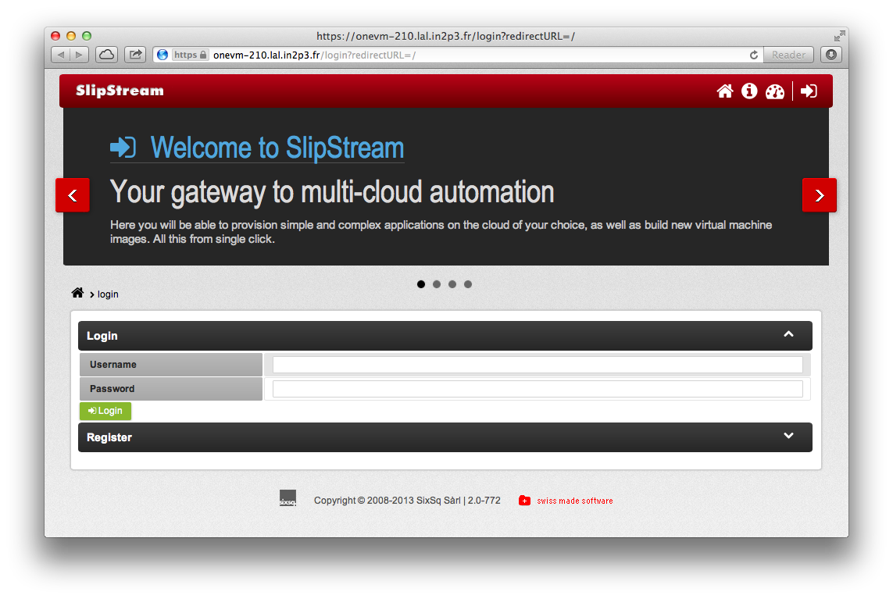

# Installation

Installing the SlipStream server is as simple as installing the binary
packages with `yum`.  After the installation, the services can be
started via standard SysV initialization scripts.

## Yum repository configuration

The yum installer needs to be told where to find the packages.  To do
this download and install the following RPM package:

    $ wget -nd http://yum.sixsq.com/slipstream/centos/6/slipstream-repos-1.0-1.noarch.rpm
    $ yum install -y slipstream-repos-1.0-1.noarch.rpm

This will create the necessary yum configuration file in
`/etc/yum.repos.d`.  If you've built your own SlipStream packages, do
not install this RPM and instead use the yum configuration discussed
in the previous chapter.

You must also configure the machine for the [EPEL 6 repository][epel].
The instructions for doing this can be found in the build chapter.

Once these are in place it is a good idea to clear the cache and
update your system with:

    $ yum clean all
    $ yum update

You can verify that the packages are available by running the command: 

    $ yum search slipstream-server

If this doesn't return an entry with this RPM package, then you need
to correct your yum configuration.

## Install Packages

Once the yum system is setup, just install the package for the
SlipStream server and the underlying database.  These packages will
pull in all of the necessary dependencies.

    $ yum install slipstream-server-nginx-proxy slipstream-server slipstream-hsqldb 

This installs the software for the proxy, SlipStream server, and SQL
database.

The software for SlipStream will be installed in the `/opt/slipstream`
directory and the configuration files will be in `/etc/slipstream`.

The simplest deployment puts the database on the same machine as the
SlipStream server.  However, it is also possible to place it on a
separate server for high-availability deployments.  This is the reason
that the database dependency is not included in the SlipStream
package.

## SSH public/private keys

The SlipStream server uses SSH for secure communication between the
orchestrator and user virtual machines. By default these are the root
private (`$HOME/.ssh/id_rsa`) and public (`$HOME/.ssh/id_rsa.pub`)
keys.  Ensure that these exist, or better, generate a separate key
pair for use with SlipStream.

To generate a new key pair, use the command:

    $ ssh-keygen

The parameters to indicate the key pair to use are found in the
*SlipStream Advanced* configuration section of the web interface.

## Start Database

After this start the database:

    $ service hsqldb start

The database files will be stored eventually in
`/opt/slipstream/SlipStreamDB/`.

**NOTE: The startup script will indicate that the start failed, but
the database is indeed running correctly.**

## Start SlipStream

Next start SlipStream.

    $ service slipstream start

The server will automatically populate the empty database when the
service initializes. 

## Start the Proxy

The SlipStream server runs behind an nginx proxy.  All of the
necessary configuration will have been installed with the above
packages. However you may need to restart nginx after starting
SlipStream.

The nginx configuration package will generate a self-signed
certificate for the server if one doesn't already exist.  For a
production deployment, you should replace the generated certificate
with a commercial one; restarting the nginx server after its
installation.

## Testing the Service

You should now be able to contact the SlipStream server with a web
browser using HTTPS; the URL should be `https://your_machine/`. 
You should be redirected to the login page that looks similar to
the following screenshot.  If so, you are ready to configure the
server.

