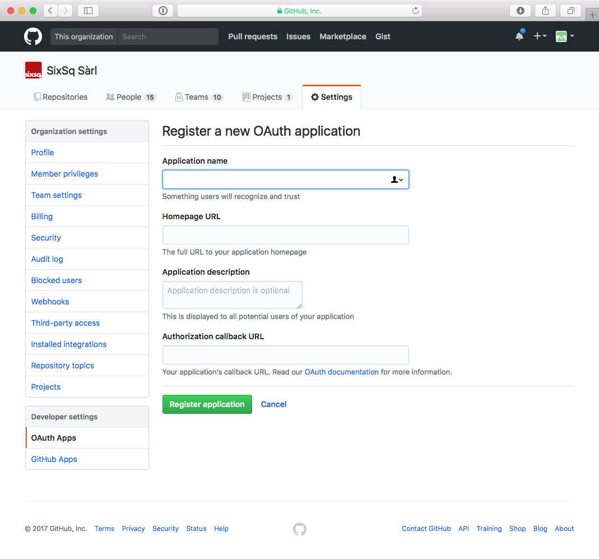

Authentication
==============

By default, SlipStream will be configured to authenticate users
against its internal database using usernames and passwords for
credentials.

SlipStream can also be configured to authenticate users against
external identity providers that use either the OpenID Connect (OIDC_)
or GitHub OAuth_ protocols. Doing so requires:

 - Registration of the SlipStream server with the external identity
   provider, 
 - Creating an appropriate "Session Template" resource within
   SlipStream, and
 - Configuring the server with the parameters of the identity
   provider.

You may configure SlipStream to use any number of compatible external
identity providers.

Internal
--------

When the ``ssclj`` server starts, it will create a Session Template
resource (``session-template/internal``) that allows users to
authenticate with SlipStream via usernames and passwords within its
own database.

.. warning::

   Although the administrator can delete the
   ``session-template/internal`` resource, this is **not**
   recommended.  Deleting this resource will prevent everyone from
   logging in via their usernames and passwords until the server is
   restarted.

The values in this template are used by browser and command line
clients to guide users during the login process.  You may want to
customize the "name" or "description" values to better suit your
SlipStream deployment.

Assuming that you've configured ``ss-curl`` (:ref:`ss-curl`) and that
you've logged into the server as an administrator using ``ss-curl``
(:ref:`ss-curl-login`), you can then download the existing template
with the command:

.. code-block:: bash
                
   ss-curl https://<slipstream_host>/api/session-template/internal

substituting your SlipStream host name.  You can then modify the JSON
document and upload the modified version like so:

.. code-block:: bash
                
   ss-curl -XPUT -H content-type:application/json \
           -d@internal-modified.json \
           https://<slipstream_host>/api/session-template/internal

Your modifications will be persisted in the database and will survive
restarts of the ``ssclj`` service.  You should generally not add or
remove keys, as this will likely result in a document that does not
conform to the defined schema.

GitHub
------

GitHub uses a variant of the OAuth protocol to allow external services
to use GitHub as an identity provider.  To configure SlipStream to use
GitHub as an identity provider you must:

 1. Register an OAuth application within your GitHub organization,
 2. Add an appropriate Session Template resource to your SlipStream
    server, and
 3. Add the associated Configuration resource to your SlipStream
    server.

The following sections provide detailed instructions for each of these
steps.

Register OAuth Application
~~~~~~~~~~~~~~~~~~~~~~~~~~

On GitHub, navigate to the "settings" page for your account or
organization.  On the left of the page, you will see a link to "OAuth
Apps" in the "Developer settings" section. Click on this link.

In the upper-right corner of the page, you will find a "Register a new
application" button.  Click on this button.  You will then see a form
similar to the following screenshot.

   GitHub OAuth Application Registration Form

You must provide an appropriate "Application name".  This will be
presented to the users who try to log in via SlipStream and should be
something that users will recognize and associate with your SlipStream
instance.  You must also provide a "Homepage URL", which will normally
point to your SlipStream installation.  You may provide a more
detailed "Application description" if you want.

The most important field is the "Authorization callback URL".  This
must contain the right value for the full GitHub authentication
workflow to complete correctly.  This field prevents other servers
from spoofing your SlipStream installation.  The value should be::

  https://<slipstream_host>/api/session/

where you replace "<slipstream_host>" with the hostname of your
SlipStream server.

Once you have provided all of this information, you can click on the
"Register application" button.  This will then take you to the
application page that will show you the "Client ID" and "Client
Secret".  **These two values are required for the SlipStream server
configuration.** From this page, you can also supply a service logo
that will be presented to the user during the authentication process.

Upload Session Template
~~~~~~~~~~~~~~~~~~~~~~~

Each available authentication method is associated with a "Session
Template" resource.  You must create one that will use the GitHub
OAuth App that you have defined.  A JSON representation of the Session
Template resource looks like the following:

.. code-block:: json

   {
      "method": "github",
      "instance": "github-test",
      "name": "Sign In with GitHub (Test)",
      "description": "GitHub Authentication Using the Test Application Definition",
      "acl": {
                "owner": {"principal": "ADMIN",
                          "type":      "ROLE"},
                "rules": [{"principal": "ADMIN",
                           "type":      "ROLE",
                           "right":     "ALL"},
                          {"principal": "ANON",
                           "type":      "ROLE",
                           "right":     "VIEW"},
                          {"principal": "USER",
                           "type":      "ROLE",
                           "right":     "VIEW"}]
             }
   }

**For GitHub OAuth Apps, the value for the "method" key must be
"github".** You may set "instance" to any identifier that you would
like; this identifier is used in the server configuration described
below.

The values for the "name" and "description" keys are used by the
clients to present useful information to the users.

The ACL must allow the "ANON" role to view the template; if you do not
allow this, then unauthenticated users will not be able to view and to
use this Session Template for logging into the server.

Assuming that you've configured ``ss-curl`` (:ref:`ss-curl`) that
you've logged into the server as an administrator using ``ss-curl``
(:ref:`ss-curl-login`), you can then **create** a new resource from
your file like so:

.. code-block:: bash

   ss-curl -XPOST \
           -H content-type:application/json \
           -d@github.json \
           https://<slipstream_host>/api/session-template

If this responds with a "201 Created" response, then the resource was
properly created.

If the resource already exists, you'll get a "409 conflict" response.
If you want to modify an existing resource, simply use PUT the entire
modified resource to the resource URL::

  https://<slipstream_host>/api/session-template/<instance>

where the last part corresponds to the "instance" of the resource.

To delete, the session template, just use DELETE on the same URL.

Configure SlipStream
~~~~~~~~~~~~~~~~~~~~

You must provide the configuration parameters for the GitHub OAuth
application to the ``ssclj`` server.  This is done by adding a
Configuration resource to the server.

.. code-block:: json

   {
       "configurationTemplate": {
           "href": "configuration-template/session-github",
           "instance": "github-test",
           "clientID": "<your client id>",
           "clientSecret": "<your client secret>"
       }
   }

Note that the value of the ``href`` attribute must be exactly as above
and the value of the ``instance`` must be the same as in your Session
Template resource.

The "Client ID" and "Client Secret" are the values that you obtained
from your application registration in GitHub.

Like the other resources, this can be added to the server via a POST
request. 

.. code-block:: bash

   ss-curl -XPOST \
           -H content-type:application/json \
           -d@configuration-github.json \
           https://<slipstream_host>/api/configuration

This will create the resource.  Use a PUT or DELETE on the created
resource to modify or delete it, respectively.

OpenID Connect (OIDC)
---------------------

OpenID Connect (OIDC_) is an identity layer built over the OAuth 2.0
protocol. Many services support the OIDC protocol (or variants of it)
and can potentially be used as identity providers for SlipStream, for
example, Google_ and LinkedIn_.

SlipStream has been tested with the Keycloak_ service, which acts as a
federated identity provider and which can be used to access many other
services even if they are not directly supported by SlipStream.

**The deployment and configuration of a Keycloak server is not
described here.  Please see the Keycloak website for that
information.** You take a look at SixSq's `Keycloak
configuration <https://github.com/SixSq/fed-id/blob/master/README.md>`_
for the Nuvla service.

Upload Session Template
~~~~~~~~~~~~~~~~~~~~~~~

Each available authentication method is associated with a "Session
Template" resource.  You must create one that will use the OIDC
protocol with Keycloak (or another compatible OIDC identity provider).
A JSON representation of the Session Template resource looks like the
following:

.. code-block:: json

   {
      "method": "oidc",
      "instance": "keycloak",
      "name": "Sign In with eduGAIN or Elixir AAI",
      "description": "OIDC Authentication Using Nuvla Keycloak Server for eduGAIN or Elixir AAI",
      "acl": {
                "owner": {"principal": "ADMIN",
                          "type":      "ROLE"},
                "rules": [{"principal": "ADMIN",
                           "type":      "ROLE",
                           "right":     "ALL"},
                          {"principal": "ANON",
                           "type":      "ROLE",
                           "right":     "VIEW"},
                          {"principal": "USER",
                           "type":      "ROLE",
                           "right":     "VIEW"}]
             }
   }

**For OIDC-based services, the value for the "method" key must be
"oidc".** You may set "instance" to any identifier that you would
like; this identifier is used in the server configuration described
below.

The values for the "name" and "description" keys are used by the
clients to present useful information to the users.

The ACL must allow the "ANON" role to view the template; if you do not
allow this, then unauthenticated users will not be able to view and to
use this Session Template for logging into the server.

Assuming that you've configured ``ss-curl`` (:ref:`ss-curl`) and that
you've logged into the server as an administrator using ``ss-curl``
(:ref:`ss-curl-login`), you can then upload your template like so:

.. code-block:: bash
                
   ss-curl -XPOST \
           -H content-type:application/json \
           -d@keycloak.json \
           https://<slipstream_host>/api/session-template

If this responds with a "201 Created" response, then the resource was
properly created.

If the resource already exists, you'll get a "409 conflict" response.
If you want to modify an existing resource, simply use PUT the entire
modified resource to the resource URL::

  https://<slipstream_host>/api/session-template/<instance>

where the last part corresponds to the "instance" of the resource.

To delete, the session template, just use DELETE on the same URL.

Configure SlipStream
~~~~~~~~~~~~~~~~~~~~

You must provide the configuration parameters for the OIDC server to
the ``ssclj`` server by adding a Configuration resource.

.. code-block:: json

   {
       "configurationTemplate": {
           "href": "configuration-template/session-oidc",
           "instance": "keycloak",
           "clientID": "<your client ID>",
           "baseURL": "<your base URL>",
           "publicKey": "<your RSA public key>",
       }
   }

Note that the value of the ``href`` attribute must be exactly as above
and the value of the ``instance`` must be the same as in your Session
Template resource.

The "Client ID", "baseURL", and "publicKey" can be obtained from the
administrator of the OIDC service which you are using.

Like the other resources, this can be added to the server via a POST
request. 

.. code-block:: bash

   ss-curl -XPOST \
           -H content-type:application/json \
           -d@configuration-keycloak.json \
           https://<slipstream_host>/api/configuration

This will create the resource.  Use a PUT or DELETE on the created
resource to modify or delete it, respectively.

.. _OIDC: http://openid.net/connect/

.. _OAuth: https://developer.github.com/apps/building-integrations/setting-up-and-registering-oauth-apps/

.. _Keycloak: http://www.keycloak.org

.. _Google: https://developers.google.com/identity/protocols/OpenIDConnect

.. _LinkedIn: https://developer.linkedin.com/docs/oauth2
