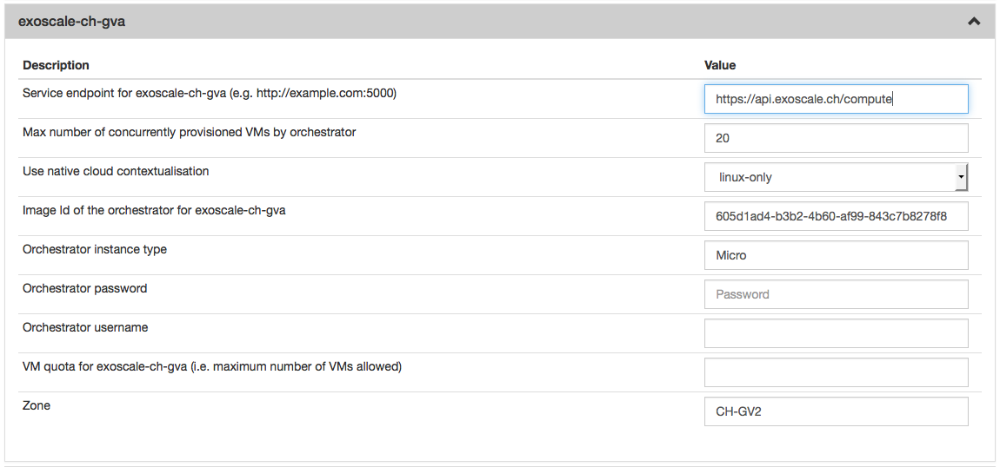

CloudStack
==========

Preparation
-----------

Server-side client (``cloudstack-*`` CLI) requires ``apache-libcloud``.
It can be installed with ``pip``. The version should be the same as
defined in ``slipstream.sixsq.com:SlipStream:pom.xml`` with
``libcloud.version`` property.

Installation
------------

You can install the CloudStack connector with:

::

    $ yum install slipstream-connector-cloudstack

You will need to restart the SlipStream server to make this connector
visible.

Configuration
-------------

To allow users to take advantage of this connector, you must add one or
more instances of this connector by either:

1. Using the `UI <#with-the-ui>`__.
2. Drop a `configuration file <#with-a-configuration-file>`__ and
   restart the service.

With the UI
-----------

Instanciate one or more instances of the connector
~~~~~~~~~~~~~~~~~~~~~~~~~~~~~~~~~~~~~~~~~~~~~~~~~~

Once logged-in with a privileged user (e.g. *super*), open the
configuration page by clicking on *Configuration -> System* at the top
of the page. Then open the *SlipStream Basics* section and define a new
instance of the connector with the following format:

::

    <connector-instance-name>:<connector-name>

Here is an example:

::

    exoscale-ch-gva:cloudstack

You can also instantiate the connector several times (in compliance with
your license) by comma separating the connector string. Here is an
example:

::

    my-cs-1:cloudstack, my-cs-2:cloudstack, ...

Here is a screenshot of the parameter to define:

.. figure:: images/screenshot-cloud-config-param.png
   :alt: SlipStream Configuation - Basics section

   SlipStream Configuation - Basics section

**Don't forget to save the configuration!**

Now that the connector is loaded, you need to configure it.

Configure the connector instance
~~~~~~~~~~~~~~~~~~~~~~~~~~~~~~~~

With the connector loaded in SlipStream, a new section in the
configuration page will appear, allowing you to configure how the
connector is to communicate with the IaaS cloud endpoint.



   SlipStream Configuation - CloudStack section

You can find a detailed description of each parameter as well as an
explaination of how to find the right value of them in the
```Parameters`` <#parameters>`__ paragraph below.

With a Configuration File
-------------------------

Please see `Configuration from
File </documentation/developer_guide/configuration_files.html>`__ for
details about this method of configuration.

Here is an example, which will configure the CloudStack connector to
interact with Exoscale:

::

    > cat /etc/slipstream/connectors/exoscale-ch-gva.conf
    cloud.connector.class = exoscale-ch-gva:cloudstack
    exoscale-ch-gva.endpoint = https://api.exoscale.ch/compute
    exoscale-ch-gva.zone = CH-GV2
    exoscale-ch-gva.quota.vm = 20
    exoscale-ch-gva.orchestrator.imageid = 605d1ad4-b3b2-4b60-af99-843c7b8278f8
    exoscale-ch-gva.orchestrator.instance.type = Micro
    exoscale-ch-gva.orchestrator.ssh.password =
    exoscale-ch-gva.orchestrator.ssh.username =
    exoscale-ch-gva.native-contextualization = linux-only
    exoscale-ch-gva.max.iaas.workers = 20

You can find a detailed description of each parameter as well as an
explaination of how to find the right value of them in the
```Parameters`` <#parameters>`__ paragraph below.

Parameters
----------

*Note: All the CloudStack API examples come from
`cloudmonkey <https://cwiki.apache.org/confluence/display/CLOUDSTACK/CloudStack+cloudmonkey+CLI>`__
configured with `Exoscale Open Cloud
API <https://community.exoscale.ch/api/compute/>`__ endpoint.*

Zone
~~~~

The availability zone where the virtual machines will be provisionned.

Use the ``name`` value from the
`listZones <https://cloudstack.apache.org/docs/api/apidocs-4.0.0/domain_admin/listZones.html>`__
results:

::

    > list zones
    count = 1
    zone:
    name = ch-gva-2
    id = 1128bd56-b4d9-4ac6-a7b9-c715b187ce11
    [...]

Image Id of the Orchestrator
~~~~~~~~~~~~~~~~~~~~~~~~~~~~

The image id of the Orchestrator needs to match a Linux image with
``wget`` and ``python`` installed. An Ubuntu 12.04 will do the job
perfectly.

Use the ``id`` value from the
`listTemplates <https://cloudstack.apache.org/docs/api/apidocs-4.0.0/domain_admin/listTemplates.html>`__
results:

::

    > list templates templatefilter=featured
    count = 37
    template:
    id = 8c7e60ae-3a30-4031-a3e6-29832d85d7cb
    name = Linux Ubuntu 12.04 LTS 64-bit
    [...]

For Exoscale you can browse the `available
templates <https://www.exoscale.ch/open-cloud/templates/>`__ and choose
the one that suits your need.

Flavor of the Orchestrator
~~~~~~~~~~~~~~~~~~~~~~~~~~

The flavor (instance type) is a name which is linked to a hardware
specification defined by the Cloud. The Orchestrator doesn't need a
large amount of resources so you can choose a small flavor (like 1 CPU
and 512 MB of RAM).

Use the ``name`` value from the
`listServiceOfferings <https://cloudstack.apache.org/docs/api/apidocs-4.0.0/domain_admin/listServiceOfferings.html>`__
results:

::

    > list serviceofferings
    count = 7
    serviceoffering:
    name = Micro
    id = 71004023-bb72-4a97-b1e9-bc66dfce9470
    [...]

Quota
~~~~~

The quota is a SlipStream feature which enable the SlipStream
administrator to set a default quota for all users of a specified
connector. You can also override this value per user in the user
profile. If this feature is disabled in the *SlipStream Advanced*
section of this page, you can leave this field blank.

Service endpoint
~~~~~~~~~~~~~~~~

The CloudStack API Endpoint used by SlipStream to communicate with the
CloudStack Cloud.

Example: ``https://api.exoscale.ch/compute``

Configure Native Images for This Connector Instance
---------------------------------------------------

Now you need to update SlipStream native images to add the image id and
some parameters for CloudStack.

This can be done via the UI or via configuration file. Documentation
about how to do it via configuration file can be found here
`Configuration from File - Cloud Identifier configuration
files </documentation/developer_guide/configuration_files.html#unique-cloud-identifier-configuration-files>`__

Please go on a SlipStream base image (e.g. Ubuntu 12.04) and click on
the *Edit* button. Add the image id for CloudStack in the section named
*Cloud Image Identifiers and Image Hierarchy*.

And then configure the default amount of CPU and RAM on the tab
*CloudStack* (or the name you gave your CloudStack connector earlier) of
the section *Cloud Configuration*.

User Credentials
----------------

Now that the connector is configured and the native images updated,
inform your users that they need to configure their credentials for
CloudStack in their user profile to take advantage of your new
connector.
