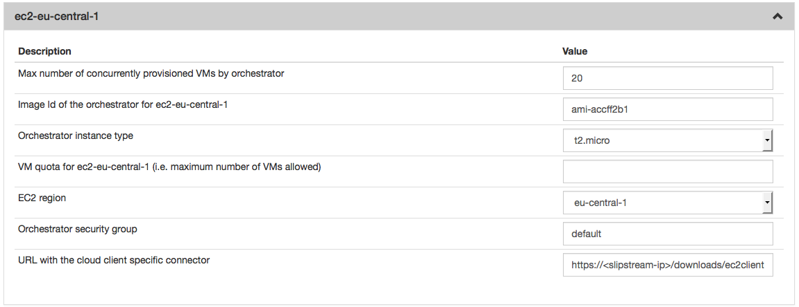

Amazon EC2
==========

License
-------

This connector is distributed by SixSq under a commercial license and is
available via various pricing plans. You can check it out with a
**free** trail via our `SaaS
service <http://sixsq.com/products/slipstream/tryme>`__. Feel free to
contact the `SlipStream Support team <mailto:support@sixsq.com>`__ with
any questions about how the SlipStream Amazon EC2 connector can be
beneficial to you and your business.

Once you have purchased a new commercial connector, SixSq will provide
you with a specific yum configuration.

Installation
------------

Once your yum configuration is in place, you can install the connector
executing the following command:

::

    $ yum install slipstream-connector-ec2-enterprise

With the software installed, you need to restart the SlipStream service
in order for it to take the new connector into account:

::

    $ systemctl restart slipstream

Now we need to configure SlipStream to take advantage of the new
connector.

Configuration
-------------

To allow users to take advantage of this connector, you must add one or
more instances of this connector by either:

1. Using the `UI <#with-the-ui>`__.
2. Add a connector instance defined via `configuration file
   <#with-a-configuration-file>`__ using `ss-config` utility and restart
   the service.

With the UI
-----------

Instanciate one or more instances of the connector
~~~~~~~~~~~~~~~~~~~~~~~~~~~~~~~~~~~~~~~~~~~~~~~~~~

Once logged-in with a privileged user (e.g. *super*), open the
configuration page by clicking on *Configuration -> System* at the top
of the page. Then open the *SlipStream Basics* section and define a new
instance of the connector with the following format:

::

    <connector-instance-name>:<connector-name>

Here is an example:

::

    amazon-ec2:ec2

You can also instantiate the connector several times (in compliance with
your license) by comma separating the connector string. Here is an
example:

::

    ec2-eu-central-1:ec2, ec2-eu-west-1:ec2, ...

Here is a screenshot of the parameter to define:

.. figure:: images/screenshot-cloud-config-param.png
   :alt: SlipStream Configuation - Basics section

   SlipStream Configuation - Basics section

**Don't forget to save the configuration!**

Now that the connector is loaded, you need to configure it.

Configure the connector instance
~~~~~~~~~~~~~~~~~~~~~~~~~~~~~~~~

With the connector loaded in SlipStream, a new section in the
configuration page will appear, allowing you to configure how the
connector is to communicate with the IaaS cloud endpoint.



   SlipStream Configuation - EC2 section

You can find a detailed description of each parameter as well as an
explaination of how to find the right value of them in the
```Parameters`` <#parameters>`__ paragraph below.

With a Configuration File
-------------------------
Please see :ref:`dg-cfg-files` for details about this method of
configuration.

Here is an example, which will configure the EC2 connector to interact
with the region eu-central-1:

::

    {
    :id "connector/ec2-eu-central-1"
    :cloudServiceType "ec2"

    :maxIaasWorkers 20
    :quotaVm "20"
    :orchestratorImageid "ami-accff2b1"

    :securityGroups "default"
    :updateClientURL "https://<SS hostname>/downloads/ec2client.tgz"
    :orchestratorInstanceType "t2.micro"
    :region "eu-central-1"
    }

You can find a detailed description of each parameter as well as an
explaination of how to find the right value of them in the
`Parameters <#parameters>`__ paragraph below.

Parameters
----------

EC2 region
~~~~~~~~~~

The EC2 region defines where your EC2 instances will be deployed. Some
parameters may be different between regions (e.g. image id: ami-...). If
you want to use multiple regions concurrently, you will need to
instantiate this connector multiple times.

Cloud Client Connector
~~~~~~~~~~~~~~~~~~~~~~

This field corresponds to the URL where the Orchestrator will download
the tarball of the connector for the SlipStream Client. In a default
installation the URL will be
``https://ip_or_hostname/downloads/ec2client.tgz`` where
``ip_or_hostname`` corresponds to the IP or the hostname of your
SlipStream Server.

Orchestrator security group
~~~~~~~~~~~~~~~~~~~~~~~~~~~

The EC2 security group should allow TCP connexions from the Orchestrator
itself to the SlipStream server and to the EC2 API. The default security
group named ``default`` should normally work perfectly.

Image Id of the Orchestrator
~~~~~~~~~~~~~~~~~~~~~~~~~~~~

The image id of the Orchestrator needs to match a Linux image with
``wget`` and ``python`` installed. An Ubuntu 12.04 or 14.04 will do the
job perfectly (at the time or writing, for the region ``eu-west-1`` the
image id is ``ami-a0dd3dd7``). EC2 image ids start with ``ami-``. You
can found them in the EC2 web interface.

Quota
~~~~~

The quota is a SlipStream feature which enables the SlipStream
administrator to set a default quota for all users of a specified
connector. You can also override this value for each user in the user
profile. If this feature is disabled in the *SlipStream Advanced*
section of this page, you can leave this field blank.

Orchestrator instance type
~~~~~~~~~~~~~~~~~~~~~~~~~~

The instance type is a name which is linked to a hardware specification
defined by EC2. You can find the list of all possible values
`here <https://aws.amazon.com/ec2/instance-types/>`__. The Orchestrator
doesn't need a big amount of resources so you can choose a small
instance type (like ``t2.micro`` or ``t2.small``).

Configure Native Images for This Connector Instance
---------------------------------------------------

Now you need to update SlipStream native images to add the image id and
some parameters specific to EC2.

This can be done via the UI or via configuration file. Documentation
about how to do it via configuration file can be found here
:ref:`dg-cfg-files-unique-cloud-identifier`.

Please go on a SlipStream base image (e.g. Ubuntu 12.04) and click on
the *Edit* button. Add the image id for EC2 in the section named *Cloud
Image Identifiers and Image Hierarchy*.

And then configure the default amount of CPU and RAM on the tab *ec2*
(or the name you gave your EC2 connector earlier) of the section *Cloud
Configuration*.

User Credentials
----------------

Now that the connector is configured and the native images updated,
inform your users that they need to configure their credentials for EC2
in their user profile to take advantage of your new connector.
