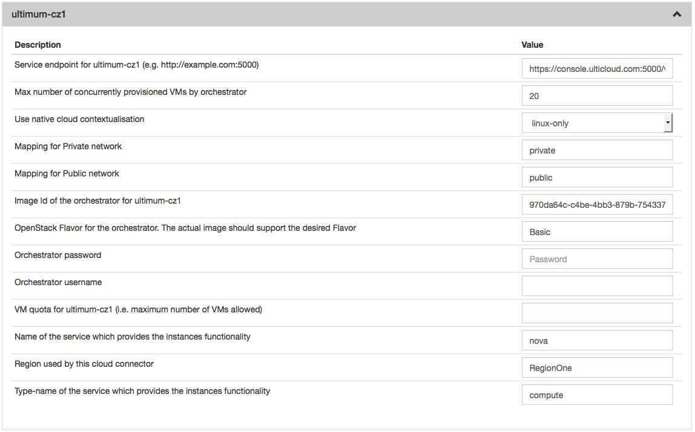
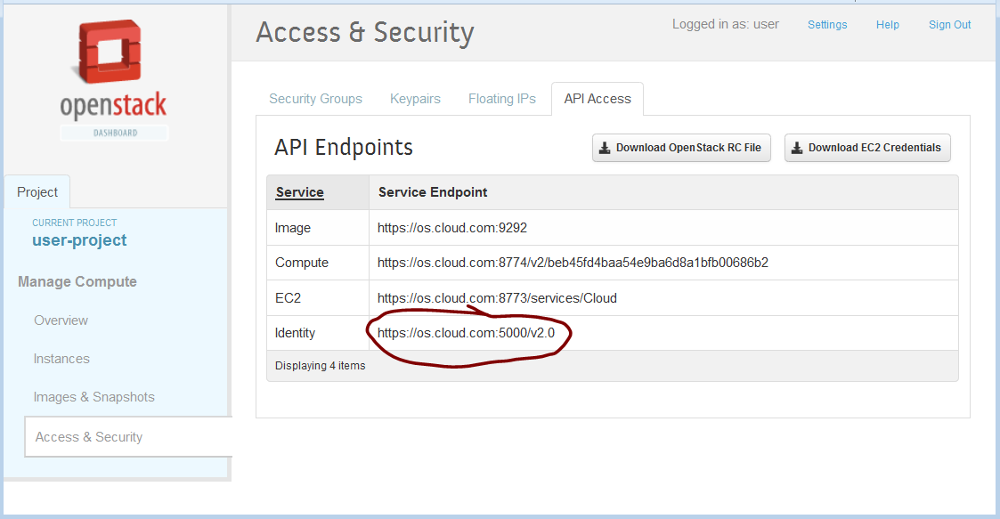
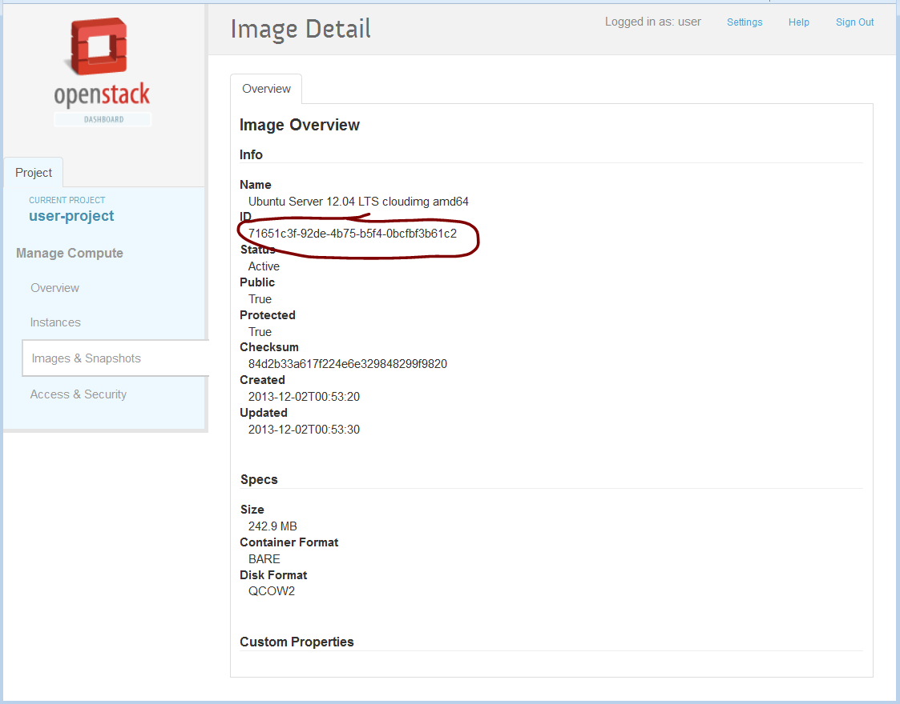
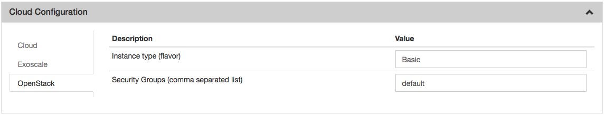

OpenStack
=========

Installation
------------

You can install the OpenStack connector with:

::

    $ yum install slipstream-connector-openstack

You will need to restart the SlipStream server to make this connector
visible.

Configuration
-------------

To allow users to take advantage of this connector, you must add one or
more instances of this connector by either:

1. Using the `UI <#with-the-ui>`__.
2. Drop a `configuration file <#with-a-configuration-file>`__ and
   restart the service.

With the UI
-----------

Instanciate one or more instances of the connector
~~~~~~~~~~~~~~~~~~~~~~~~~~~~~~~~~~~~~~~~~~~~~~~~~~

Once logged-in with a privileged user (e.g. *super*), open the
configuration page by clicking on *Configuration -> System* at the top
of the page. Then open the *SlipStream Basics* section and define a new
instance of the connector with the following format:

::

    <connector-instance-name>:<connector-name>

Here is an example:

::

    ultimum-cz1:openstack

You can also instantiate the connector several times (in compliance with
your license) by comma separating the connector string. Here is an
example:

::

    my-os-1:openstack, my-os-2:openstack, ...

Here is a screenshot of the parameter to define:

.. figure:: images/screenshot-cloud-config-param.png
   :alt: SlipStream Configuation - Basics section

   SlipStream Configuation - Basics section

Don't forget to save the configuration!
~~~~~~~~~~~~~~~~~~~~~~~~~~~~~~~~~~~~~~~

Now that the connector is loaded, you need to configure it.

Configure the connector instance
~~~~~~~~~~~~~~~~~~~~~~~~~~~~~~~~

With the connector loaded in SlipStream, a new section in the
configuration page will appear, allowing you to configure how the
connector is to communicate with the IaaS cloud endpoint.



   SlipStream Configuation - OpenStack section

You can find a detailed description of each parameter as well as an
explaination of how to find the right value of them in the
```Parameters`` <#parameters>`__ paragraph below.

With a Configuration File
-------------------------

Please see `Configuration from
File </documentation/developer_guide/configuration_files.html>`__ for
details about this method of configuration.

Here is an example, which will configure the OpenStack connector to
interact with Ultimum:

::

    $ cat /etc/slipstream/connectors/ultimum-cz1.conf
    cloud.connector.class = ultimum-cz1:openstack
    ultimum-cz1.quota.vm = 
    ultimum-cz1.max.iaas.workers = 20
    ultimum-cz1.service.name = nova
    ultimum-cz1.native-contextualization = linux-only
    ultimum-cz1.service.region = RegionOne
    ultimum-cz1.network.private = private
    ultimum-cz1.orchestrator.instance.type = Basic
    ultimum-cz1.service.type = compute
    ultimum-cz1.orchestrator.ssh.username =
    ultimum-cz1.orchestrator.imageid = 970da64c-c4be-4bb3-879b-75433751e71f
    ultimum-cz1.network.public = public
    ultimum-cz1.endpoint = https://console.ulticloud.com:5000/v2.0/tokens
    ultimum-cz1.orchestrator.ssh.password = 

You can find a detailed description of each parameter as well as an
explaination of how to find the right value of them in the
```Parameters`` <#parameters>`__ paragraph below.

Parameters
----------

Type name of the service which provides the instances functionality
~~~~~~~~~~~~~~~~~~~~~~~~~~~~~~~~~~~~~~~~~~~~~~~~~~~~~~~~~~~~~~~~~~~

This field should always be ``compute``. If it doesn't work with this
value, please ask your OpenStack provider/administrator for the correct
value.

Service endpoint
~~~~~~~~~~~~~~~~

The service endpoint is the URL SlipStream will use to communicate with
the OpenStack. This url needs to match the OpenStack identity service
(Keystone). You can find it in the OpenStack dashboard under *Access &
Security* in the tab *API Access*. Most of the time this value will
match the following pattern: ``https://OpenStack_ip:5000/v2.0``



   Openstack web interface - Access & Security - API Access

Quota
~~~~~

The quota is SlipStream feature which enable the SlipStream
administrator to set a default quota for all users of a specified
connector. You can also override this value per user in the user
profile. If this feature is disabled in the *SlipStream Advanced*
section of this page, you can leave this field blank.

Image Id of the Orchestrator
~~~~~~~~~~~~~~~~~~~~~~~~~~~~

The image id of the Orchestrator needs to match a Linux image with
``wget`` and ``python`` installed. An Ubuntu 12.04 or 14.04 will do the
job perfectly.

To find an image id go on the OpenStack web interface and click on the
link named *Images & Snapshots* and then click on the image you want.
The *ID* value is what you need to paste in.



   Openstack web interface - Image details

Region
~~~~~~

Check this value in the OpenStack documentation or ask your OpenStack
administrator. The default region is ``RegionOne`` or ``regionOne``
depending of the OpenStack version.

Name of the service which provides the instances functionality
~~~~~~~~~~~~~~~~~~~~~~~~~~~~~~~~~~~~~~~~~~~~~~~~~~~~~~~~~~~~~~

Most of time the value of this field will be ``nova`` and sometime
``compute``. If it doesn't work with these values, please ask your
OpenStack administrator for the correct value.

Flavor of the Orchestrator
~~~~~~~~~~~~~~~~~~~~~~~~~~

The flavor (instance type) is a name which is linked to a hardware
specification defined by the Cloud. To find the list of all possible
values, please go on the OpenStack web interface and find a link called
*Flavor* or *Instance type*. The Orchestrator doesn't need a big amount
of resources so you can choose a small flavor (like 1 CPU and 512 MB of
RAM).

Configure Native Images for This Connector Instance
---------------------------------------------------

Now you need to update SlipStream native images to add the image id and
some parameters for OpenStack.

This can be done via the UI or via configuration file. Documentation
about how to do it via configuration file can be found here
`Configuration from File - Cloud Identifier configuration
files </documentation/developer_guide/configuration_files.html#unique-cloud-identifier-configuration-files>`__

Please go on a SlipStream base image (e.g. Ubuntu 14.04) and click on
the *Edit* button. Add the image id for OpenStack in the section named
*Cloud Image Identifiers and Image Hierarchy*.

And then configure the default *instance type* and the default *security
groups* on the tab *OpenStack* (or the name you gave your OpenStack
connector earlier) of the section *Cloud Configuration*.



   SlipStream Image - edit mode OpenStack

User Credentials
----------------

Now that the connector is configured and the native images updated,
inform your users that they need to configure their credentials for
OpenStack in their user profile to take advantage of your new connector.
