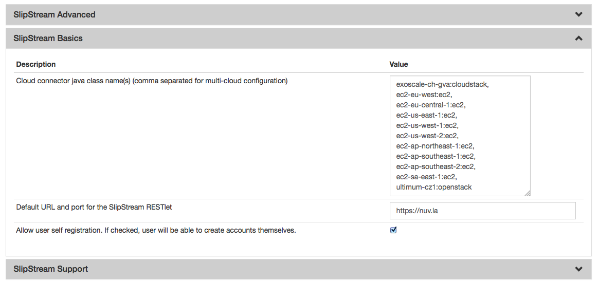

StratusLab
==========

Preparation
-----------

The StratusLab connector requires packages from the StratusLab cloud
distribution (notably the python API). Configure your server to use the
StratusLab yum repository.

::

    $ cat > /etc/yum.repos.d/stratuslab.repo <<EOF
    [StratusLab-Releases]
    name=StratusLab-Releases
    baseurl=http://yum.stratuslab.eu/releases/centos-6/
    gpgcheck=0
    EOF

NB! It's OK to use StratusLab's CentOS 6 YUM repo on CentOS 7 SlipStream host.

If the configuration was successful, a ``yum search`` for "stratuslab"
should provide a list of all of the StratusLab packages.

Installation
------------

Once the StratusLab packages are available, you install the SlipStream
connector for StratusLab:

::

    $ yum install slipstream-connector-stratuslab

You will need to restart the SlipStream server to make this connector
visible.

Configuration
-------------

To allow users to take advantage of this connector, you must add one or
more instances of this connector by either:

1. Using the `UI <#with-the-ui>`__.
2. Drop a `configuration file <#with-a-configuration-file>`__ and
   restart the service.

With the UI
-----------

Instanciate one or more instances of the connector
~~~~~~~~~~~~~~~~~~~~~~~~~~~~~~~~~~~~~~~~~~~~~~~~~~

Once logged-in with a privileged user (e.g. *super*), open the
configuration page by clicking on *Configuration -> System* at the top
of the page. Then open the *SlipStream Basics* section and define a new
instance of the connector with the following format:

::

    <connector-instance-name>:<connector-name>

Here is an example:

::

    stratuslab:stratuslab

You can also instantiate the connector several times (in compliance with
your license) by comma separating the connector string. Here is an
example:

::

    stratuslab-1:stratuslab, stratuslab-2:stratuslab, ...

Here is a screenshot of the parameter to define:

   SlipStream Configuation - Basics section

Don't forget to save the configuration!
~~~~~~~~~~~~~~~~~~~~~~~~~~~~~~~~~~~~~~~

Now that the connector is loaded, you need to configure it.

Configure the connector instance
~~~~~~~~~~~~~~~~~~~~~~~~~~~~~~~~

With the connector loaded in SlipStream, a new section in the
configuration page will appear, allowing you to configure how the
connector is to communicate with the IaaS cloud endpoint.

With a Configuration File
-------------------------

Please see :ref:`dg-cfg-files` for details about this method of
configuration.

Here is an example, which will configure the StratusLab connector to
interact with the "demo" SL infrastructure provided by the StratusLab
project:

::

    $ cat /etc/slipstream/connectors/stratuslab.conf
    cloud.connector.class = stratuslab:stratuslab
    stratuslab.max.iaas.workers = 20
    stratuslab.update.clienturl = http://<slipstream-ip>/downloads/stratuslabclient.tgz
    stratuslab.messaging.endpoint = https://pdisk.lal.stratuslab.eu/pdisk
    stratuslab.pdisk.endpoint = https://pdisk.lal.stratuslab.eu/pdisk
    stratuslab.orchestrator.imageid = N-Bu1h1jt3K8ODnCTw4JiyPaH5k
    stratuslab.quota.vm = 10
    stratuslab.endpoint = https://cloud.lal.stratuslab.eu/one-proxy/xmlrpc
    stratuslab.marketplace.endpoint = https://marketplace.stratuslab.eu/marketplace
    stratuslab.orchestrator.instance.type = m1.small

Configure Native Images for This Connector Instance
---------------------------------------------------

Now you need to update SlipStream native images to add the image id and
some parameters for StratusLab.

This can be done via the UI or via configuration file. Documentation
about how to do it via configuration file can be found here
:ref:`dg-cfg-files-unique-cloud-identifier`.

Please go on a SlipStream base image (e.g. Ubuntu 14.04) and click on
the *Edit* button. Add the image id for StratusLab in the section named
*Cloud Image Identifiers and Image Hierarchy*.

And then configure the default *instance type* on the tab *StratusLab*
(or the name you gave your StratusLab connector earlier) of the section
*Cloud Configuration*.

User Credentials
----------------

Now that the connector is configured and the native images updated,
inform your users that they need to configure their credentials for
StratusLab in their user profile to take advantage of your new
connector.
