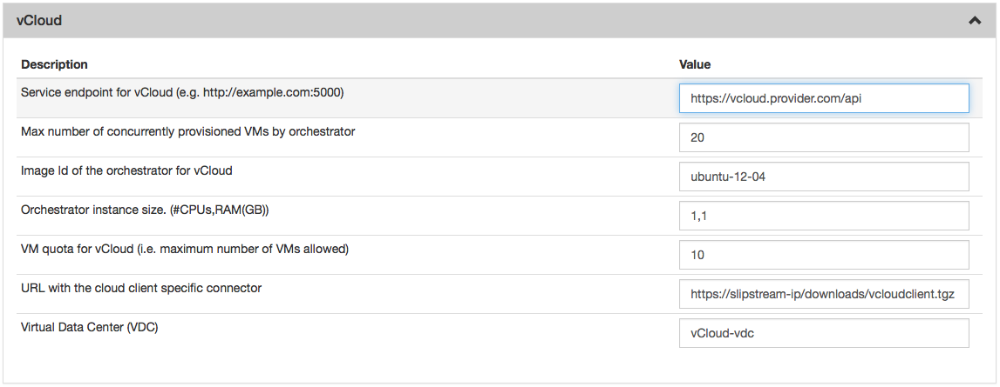
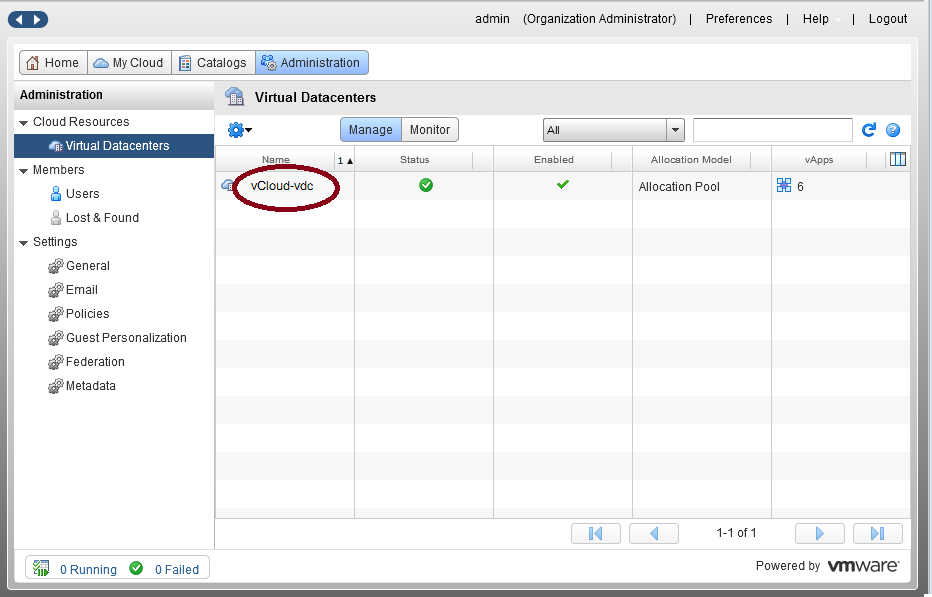
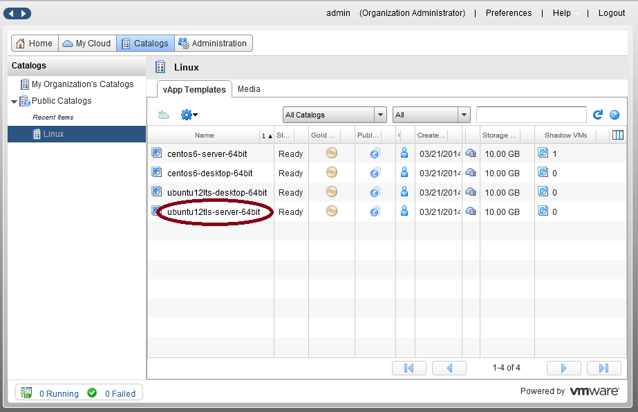
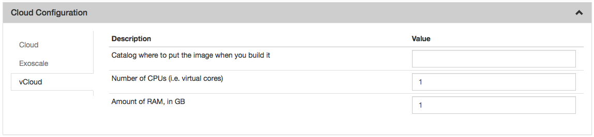

vCloud
======

License
-------

The connector is distributed by SixSq under a commercial license and is
available via various pricing plans. Feel free to contact the
`SlipStream Support team <mailto:support@sixsq.com>`__ with any
questions about the SlipStream vCloud connector can be beneficial.

Installation
------------

With each new commercial connector purchased, SixSq will provide you
with a specific yum configuration. Once your yum configuration is in
place, you can install the connector by executing the following command:

::

    $ yum install slipstream-connector-vcloud-enterprise

With the software installed, you need to restart the SlipStream service
in order for it to take the new connector into account:

::

    $ systemctl restart slipstream

Now we need to configure SlipStream to take advantage of the new
connector.

Configuration
-------------

To allow users to take advantage of this connector, you must add one or
more instances of this connector by either:

1. Using the `UI <#with-the-ui>`__.
2. Drop a `configuration file <#with-a-configuration-file>`__ and
   restart the service.

With the UI
-----------

Instanciate one or more instances of the connector
~~~~~~~~~~~~~~~~~~~~~~~~~~~~~~~~~~~~~~~~~~~~~~~~~~

Once logged-in with a privileged user (e.g. *super*), open the
configuration page by clicking on *Configuration -> System* at the top
of the page. Then open the *SlipStream Basics* section and define a new
instance of the connector with the following format:

::

    <connector-instance-name>:<connector-name>

Here is an example:

::

    my-vcloud:vcloud

You can also instantiate the connector several times (in compliance with
your license) by comma separating the connector string. Here is an
example:

::

    my-vcloud-1:vcloud, my-vcloud-2:vcloud, ...

Here is a screenshot of the parameter to define:

.. figure:: images/screenshot-cloud-config-param.png
   :alt: SlipStream Configuation - Basics section

   SlipStream Configuation - Basics section

Don't forget to save the configuration!
~~~~~~~~~~~~~~~~~~~~~~~~~~~~~~~~~~~~~~~

Now that the connector is loaded, you need to configure it.

Configure the connector instance
~~~~~~~~~~~~~~~~~~~~~~~~~~~~~~~~

With the connector loaded in SlipStream, a new section in the
configuration page will appear, allowing you to configure how the
connector is to communicate with the IaaS cloud endpoint.



   SlipStream Configuation - vCloud section

You can find a detailed description of each parameter as well as an
explaination of how to find the right value of them in the
```Parameters`` <#parameters>`__ paragraph below.

With a Configuration File
-------------------------

Please see :ref:`dg-cfg-files` for details about this method of
configuration.

Here is an example, which will configure the vCloud connector to
interact with a vCloud provider:

::

    $ cat /etc/slipstream/connectors/my-vcloud.conf
    cloud.connector.class = my-vcloud:vcloud
    deac-lv1.quota.vm = 
    deac-lv1.orchestrator.instance.type = 1,1
    deac-lv1.virtual.datacenter.name = VDC-01
    deac-lv1.orchestrator.imageid = Ubuntu_12_04
    deac-lv1.update.clienturl = https://<slipstream-ip>/downloads/vcloudclient.tgz
    deac-lv1.endpoint = https://vcloud.provider.com/api
    deac-lv1.max.iaas.workers = 1

You can find a detailed description of each parameter as well as an
explaination of how to find the right value of them in the
```Parameters`` <#parameters>`__ paragraph below.

Parameters
----------

Service endpoint
~~~~~~~~~~~~~~~~

The service endpoint is the URL SlipStream will use to communicate with
vCloud. You should ask your vCloud adminitrator to give you this value.
But most of time this value corresponds to the root part of the URL you
are using to access vCloud web interface with ``/api`` appended.

Virtual Cata Center
~~~~~~~~~~~~~~~~~~~

The VDC name can be found on the vCloud web interface (please see the
image below). First click on the *Administration* tab and on *Virtual
Datacenters*. Then you will see a list with all VDC your account has
access to. If you need to configure multiple VDC, you will have to
instantiate multiple connectors.



   vCloud web interface - Virtual Datacenters

Quota
~~~~~

The quota is a SlipStream feature which enables the SlipStream
administrator to set a default quota for all users of a specified
connector. You can also override this value for each user in the user
profile. If this feature is disabled in the *SlipStream Advanced*
section of this page, you can leave this field blank.

Cloud Client Connector
~~~~~~~~~~~~~~~~~~~~~~

This field corresponds to the URL where the Orchestrator will download
the tarball of the connector for the SlipStream Client. In a default
installation the URL will be
``https://ip_or_hostname/downloads/vcloudclient.tgz`` where
``ip_or_hostname`` corresponds to the IP or the hostname of your
SlipStream Server.

Image Id of the Orchestrator
~~~~~~~~~~~~~~~~~~~~~~~~~~~~

For vCloud an image id corresponds to the (unique) name of a vApp with
only one VM inside. The image id of the Orchestrator needs to match a
Linux image with ``wget`` and ``python`` installed. An Ubuntu 12.04 will
do the job perfectly.

To find the image id go on the vCloud web interface and click on the
*Catalogs* tab and then browse catalogs to find an appropriate image.



   vCloud web interface - Catalog

Orchestrator instance size
~~~~~~~~~~~~~~~~~~~~~~~~~~

The instance size is a coma separated list of two elements. The first is
the number of CPU cores the Orchestrator instance will have. The second
is the amount of RAM in GB the Orchestrator will have. The Orchestrator
doesn't need a big amount of resources so 1 CPU and 1 GB of RAM should
be enough - e.g. ``(1,1)``.

Configure Native Images for This Connector Instances
----------------------------------------------------

Now you need to update SlipStream native images to add the image id and
some parameters for vCloud.

This can be done via the UI or via configuration file. Documentation
about how to do it via configuration file can be found here
:ref:`dg-cfg-files-unique-cloud-identifier`.

Please go on a SlipStream base image (e.g. Ubuntu 12.04) and click on
the *Edit* button. Add the image id for vCloud in the section named
*Cloud Image Identifiers and Image Hierarchy*.

And then configure the default amount of CPU and RAM on the tab *vCloud*
(or the name you gave your vCloud connector earlier) of the section
*Cloud Configuration*.



   SlipStream Image - edit mode vCloud

User credentials
----------------

Now that the connector is configured and the native images updated,
inform your users that they need to configure their credentials for
vCloud in their user profile to take advantage of your new connector.
