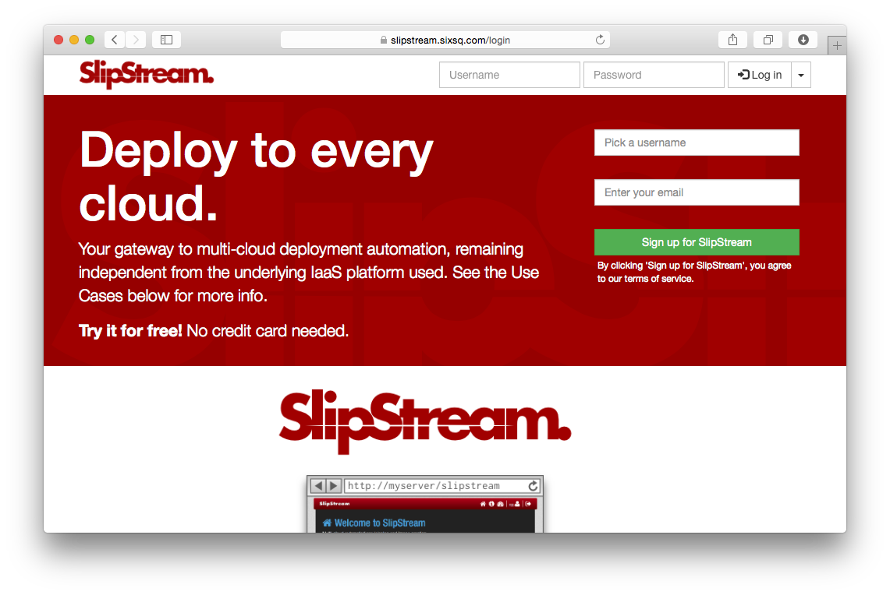

Quick Installation
==================

An automated installation script is available to install SlipStream and
all of its dependencies on a CentOS 7 machine.

Node Preparation
----------------

Deploy the machine that you'll be using for your SlipStream server
with the CentOS 7 operating system.  (See the prerequisites in the
previous section for sizing information.  A machine with 4 CPU cores,
8 GB of RAM and 20 GB of disk space is recommended as a minimum.)

The installation script will **not** perform a general upgrade of your
CentOS 7 system. You may want to run::

  $ yum upgrade -y

to ensure your system has the latest software and security patches.

Installation Overview
---------------------

This installation script will run through the following phases:

- Prepares the node:
   - Adds YUM repositories (EPEL, Nginx, Elasticstack, SlipStream)
   - Installs global dependencies (unzip, curl, wget, ...)
   - Configures the firewall
      - Allow all outgoing packets
      - Allow loopback connections
      - Allow incoming ICMP requests
      - Allow incoming SSH connections (port 22)
      - Allow incoming HTTP connections (port 80)
      - Allow incoming HTTPS connections (port 443)
      - Deny all other incoming connections
      - Deny forwarding
   - Disables SELinux

- Installs SlipStream dependencies:
   - Elasticsearch
   - HSQLDB
   - Graphite
   - Zookeeper

- Installs the SlipStream client

- Installs the SlipStream servers
   - Stops running services
   - Installs and configures packages
   - Starts SlipStream services
   - Installs and configures nginx proxy
    
- Installs and configures time synchronization service
   - Required for checking validity of certificates, etc.
- Install SlipStream in /opt/slipstream
- Install HSQLDB in /opt/hsqldb
- Install nginx
- Install some other dependencies with yum and python-pip
- Configure nginx, HSQLDB and SlipStream
- Start nginx, HSQLDB and SlipStream

These instructions assume that you will be using the prebuilt binary
packages for SlipStream. If you want to build your own packages from
source, refer to the Developer Guide.

Run the Installation Script
---------------------------

.. note::

   If you are installing the **Enterprise Edition** you must install
   the certificates (``yum-client.crt`` and ``yum-client.key``)
   provided by SixSq into ``/etc/slipstream/`` before starting the
   SlipStream installation process.

.. warning::

    If you're behind a web proxy, see the `Installation via Web
    Proxy <#proxy_section>`__ section before starting.

This command will take care of the full SlipStream installation process::

    $ curl -sSfL https://raw.githubusercontent.com/slipstream/SlipStream/master/install/slipstream-install.sh | bash -s {edition} {repokind}

Replace the placeholders with the values for your installation.  The
possible values are provided in the following table.

+----------------+--------------------------------------------+
+ placeholder    + values                                     +
+================+============================================+
+ ``{edition}``  + ``community`` or ``enterprise``            +
+----------------+--------------------------------------------+
+ ``{repokind}`` + ``snapshot``, ``candidate`` or ``release`` +
+----------------+--------------------------------------------+

The logs of the installation are available in the file
``/tmp/slipstream-install.log`` and
``/tmp/slipstream-connectors-install.log``.  These can be consulted to
understand the details of the installation process or to debug
problems.

SSL Certificate
---------------

The SlipStream installation script will generate a self-signed
certificate for the server. If you want to avoid browser warnings
about insecure certificate, install a certificate signed by a widely
accepted certificate authority.

Place your server certificate (formatted as an X509 certificate and
key) in the files ``/etc/nginx/ssl/server.crt`` and
``/etc/nginx/ssl/server.key``.  You must restart the server to have
SlipStream use the new certificate.

Cloud Connectors
----------------

If you have installed Community Edition of SlipStream, the quick
install script will have already installed all the open-source
connectors.

If you have installed the Enterprise Edition, you have to install all
connectors you have a license for.

To install connectors, simply execute::

    $ curl -sSfL https://raw.githubusercontent.com/slipstream/SlipStream/master/install/ss-install-connectors.sh | bash -s -- -r {repokind} {connector names}

+------------------------+--------------------------------------------+
+ placeholder            + values                                     +
+========================+============================================+
+ ``{connector names}``  + space-separated list of connectors         +
+------------------------+--------------------------------------------+
+ ``{repokind}``         + ``snapshot``, ``candidate`` or ``release`` +
+------------------------+--------------------------------------------+

Once all needed connectors are installed, restart SlipStream::

    $ systemctl restart slipstream

You will then be able to configure the cloud connectors that you have
installed.

Testing the Service
-------------------

You should now be able to contact the SlipStream server with a web
browser using HTTPS; the URL should be ``https://your_machine/``. You
should be redirected to the login page that looks similar to the
following screenshot.

If everything looks good, you are ready to configure the server and
cloud connectors.

   SlipStream Login Page

Configuration
-------------

To configure your SlipStream server, log into the server as ``super``
and use the pages found under the "Configuration" menu item.  Use the
information in the Authentication, Cloud Connectors, and Connector
Installation and Configuration sections.

Installation via Web Proxy
--------------------------

If you are installing SlipStream from behind a web proxy, you'll need
some additional configuration to ensure that the scripts and packages
can be downloaded through the proxy. Set the following environmental
variables::

    http_proxy=http://user:password@ip_addr:3128/
    HTTPS_PROXY=https://user:password@ip_addr:3128/
    HTTP_PROXY=http://user:password@ip_addr:3128/

replacing the ``user``, ``password``, and ``ip_addr`` with the
appropriate values. This allows the commands ``curl`` and ``rpm`` to
access everything.

In addition, you need to add the following lines to ``/etc/yum.conf``::

    # The proxy server - proxy server:port number
    proxy=http://xxx.xxx.xxx.xxx:3128
    # The account details for yum connections
    proxy_username=xxx
    proxy_password=yyy

again replacing the values as appropriate.
