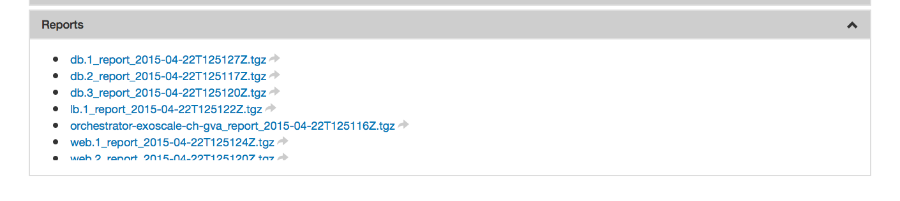

SlipStream Client
=================

The "parameter database" that is maintained for the deployment of an
application is a critical feature that allows information to be passed
to the user and that permits the reliable, coordinated configuration of
multiple machines in an application.

In this section you'll learn how to:

-  Use the major commands of the SlipStream client
-  Setup the environment to access the client
-  Find the scripts used to install and configure a machine
-  Reset the abort status for a failed deployment

Installation
------------

The SlipStream client is installed by default on all machines started
through SlipStream. If you want to install it on your local machine, it
can be installed with ``pip``, the python installer.

Just running the following should work:

::

    $ pip install slipstream-client

You will need to have python (v2.6+, not v3.x) installed on the machine.

To interact with a SlipStream run from your local machine, you can
create a configuration file called ``slipstream.context`` as follows,
which will mimic the contextualisation that takes place in the VM (see
section: `Modifying the Environment <#env>`__ below):

::

    $ cat slipstream.context
    [contextualization]
    diid = 8d7c3727-77f1-4e0a-aca1-32bc4a9db83a
    username = alice
    password = 12341234
    serviceurl = https://nuv.la
    node_instance_name = node99.1

Note that the ``diid`` key correspond to the run id.

Major Client Commands
---------------------

There are actually just a few commands in the SlipStream client that are
used in deployment scripts and in debugging. The following table
summarizes them.

+----------------+------------------------------------------------------+
| ``ss-get``     | Retrieves a named parameter, waiting if the          |
|                | parameter has not yet been set.                      |
+----------------+------------------------------------------------------+
| ``ss-set``     | Sets the value of a named parameter.                 |
+----------------+------------------------------------------------------+
| ``ss-random``  | Generates a random string value and optionally sets  |
|                | a named parameter with this value.                   |
+----------------+------------------------------------------------------+
| ``ss-abort``   | Use to set (or to clear with the ``--cancel`` option)|
|                | the deployment abort flag.                           |
+----------------+------------------------------------------------------+
| ``ss-display`` | Use to set a string in the run for display purposes. |
+----------------+------------------------------------------------------+

All of the parameters used in the deployment must have been defined in
the images used in the deployment. Trying to set or get an undefined
parameter will cause the command to raise an error.

Although the "parameter database" and the associated commands are quite
simple, the fact that ``ss-get`` will wait for a value to be set allows
it to act as a semaphore to coordinate the configuration scripts on
different machines in a multi-node deployment.

Modifying the Environment
-------------------------

SlipStream minimizes its footprint within the machines it deploys to
avoid any unintended interference with the deployed applications.
Because of this, you must specifically setup the environment to make the
SlipStream client commands accessible.

Usually you will want to do the following:

::

    $ source /tmp/slipstream.setenv

or alternatively, if the above file is not present (e.g., after the VM
reboot it can be deleted by the system)

::

    $ source /opt/slipstream/client/sbin/slipstream.setenv

You should then have all of the SlipStream client commands (all prefixed
with ``ss-``) in your path. All of the commands support the ``--help``
option to give you information about the command.

Debugging
---------

Log Files
---------

When SlipStream has finished the deployment of an application, it
recovers the log files generated by the deployment scripts. (And will
also collect any files specified by the user in the image description.)

These log files are always found in the last section, labeled "Reports",
of the "Run" page. They can be downloaded from the server and examined
in the case of deployment errors.

   Report Section

Interactive Debugging
---------------------

When creating a new application, very often there are bugs in the
deployment scripts. Iteratively modifying the scripts through SlipStream
and redeploying the machines can cause unnecessary delays. Instead, you
can:

1. Log into a failed deployment
2. Setup the environment for the SlipStream client
3. Reset the abort flag (if any)
4. Update and rerun the deployment script(s)

This allows for a much faster development cycle. The deployment scripts
can be found in the files ``/tmp/tmp*`` and the logs from the initial
execution of these scripts are below

-  ``/var/log/slipstream/client`` on Linux
-  ``%TMP%\slipstream\reports`` on Windows.

Once the problems in the deployment scripts have been ironed out, just
copy them back into SlipStream.

Exercises
---------

1. Log into a machine that has been deployed via SlipStream and setup
   the environment to access the SlipStream client.
2. Understand the options and behavior of the major commands by looking
   through the ``--help`` text.
3. Find the deployment scripts for the machine that you've deployed. Try
   executing them by hand to see what happens.
4. Set and clear the abort flag for your deployment. How does the
   behavior of ``ss-set`` and ``ss-get`` change when the abort flag is
   set?
5. Optionally install the client on your laptop.
