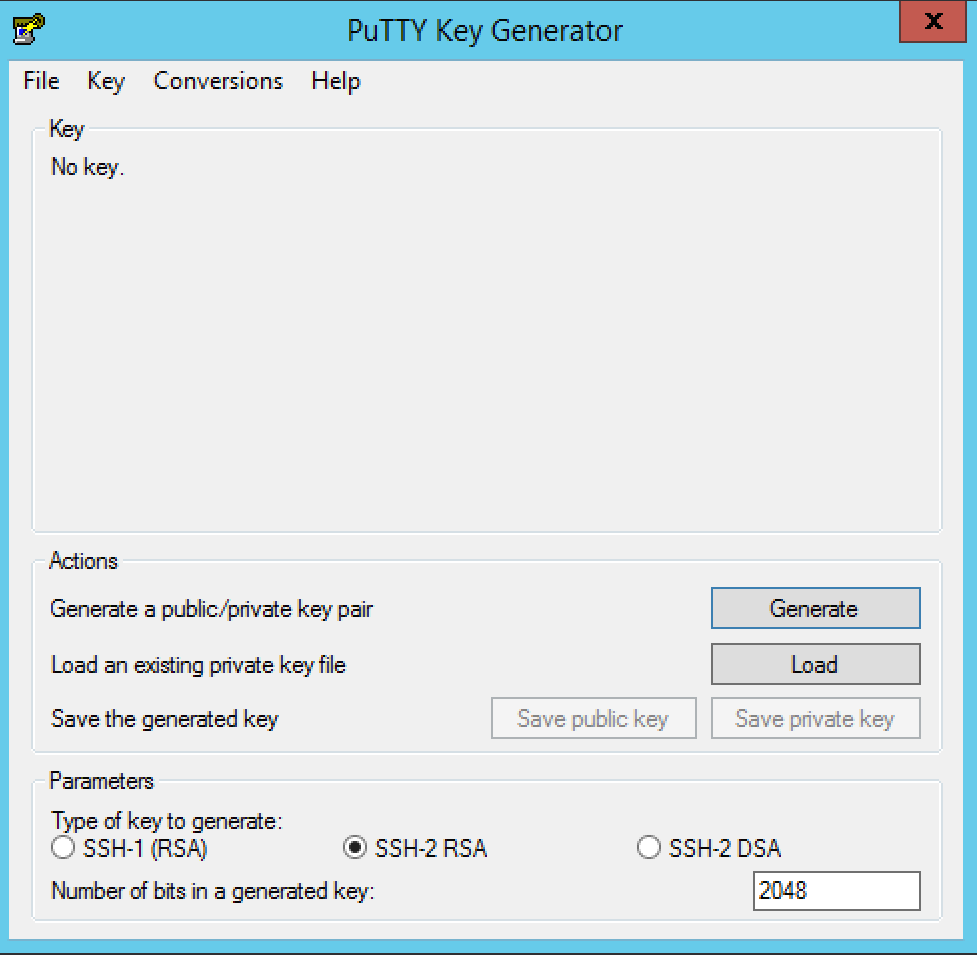
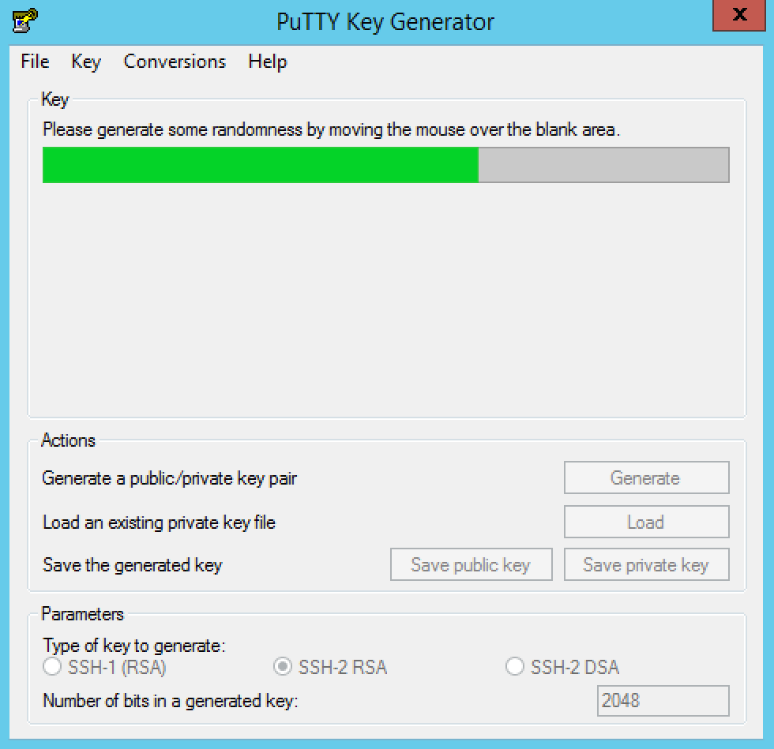
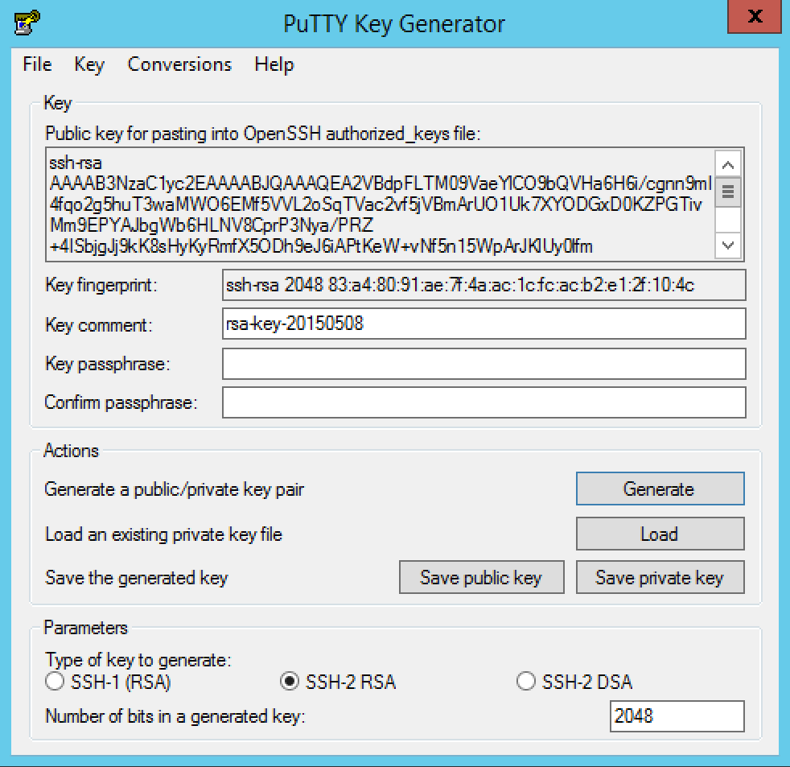
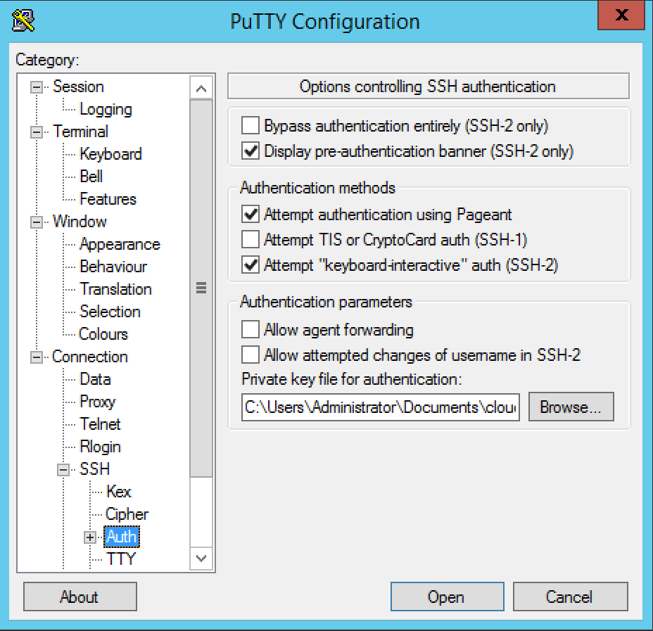

Appendix
========

Remote Machine Access
---------------------

If the deployment of an application works correctly, then you can just
use the public interfaces for the service (e.g. a web browser interface)
without having to directly access the deployed virtual machines.
Unfortunately, especially when developing new application deployments,
failures do happen. In these cases **it is extremely useful to be able
to log into a remote virtual machine for debugging**.

Access via SSH (secure shell) is nearly universally supported for
Unix-like systems. Although Windows can be configured to support SSH,
this is rarely done. Instead use of the "Remote Desktop Protocol" is
more typical for Windows machines.

Secure Shell (SSH) Access
-------------------------

Providing a public SSH (secure shell) key to SlipStream will allow you
to log into the virtual machine instances you create through SlipStream.
Although this is optional, it is **strongly recommended that you provide
such a key**. It makes debugging cloud and application failures much
easier.

To use SSH you must have:

-  A valid SSH key pair (public and private key) and
-  An SSH client installed on your machine (laptop).

The procedure for meeting these requirements depends on the operating
system you're using on your laptop.

Creating SSH Key Pair
---------------------

Linux and Mac OS X
------------------

For Linux and Mac OS X machines (and in general Unix-like environments),
all of the software to run an SSH client and to generate an SSH key pair
is normally pre-installed.

From the command line on your machine, you can generate a new key pair
with the following command:

::

    $ ssh-keygen

This will then prompt for information. The default location is usually
fine. You can use a private key with a password, but this often requires
typing the password repeatedly. It is often more convenient to create
the **SSH private key without a password**; provide nothing for the
password value when prompted to do this.

The public key you will need to give to SlipStream will then usually be
in the file ``~/.ssh/id_rsa.pub``. (The exact path will be indicated in
the prompts from the ``ssh-keygen`` command.) See below for how to
configure your user profile with this information.

Windows
-------

The standard SSH client to use on Windows is
`PuTTY <http://www.chiark.greenend.org.uk/~sgtatham/putty/>`__. You will
need both the ``putty.exe`` and ``puttygen.exe`` executables. Download
these executables and put them in a convenient location.

Key Pair
~~~~~~~~

The SSH protocol requires a pair of cryptographic keys; one private and
the other public. You will need to generate a key pair to use with
SlipStream and the underlying cloud infrastructures.

Launch PuTTyGen. You should see a screenshot like the following.

   PuTTyGen Start Page

Launch PuTTyGen and then click on the "Generate" button. Move your mouse
around in the empty rectangle to generate some randomness for the key
generation process.

   PuTTyGen Key Generation

When the process is finished. You will see a window like the following.

   PuTTyGen Key

The value you want to copy and paste into the SlipStream SSH key
configuration is given in the box entitled "Public key for pasting into
OpenSSH authorized\_keys file". Ensure that you copy the **entire
value** and that the pasted value is **entirely on one line**.

You must save the public and private keys to use when you want to
connect to a virtual machine. Click on the "Save public key" and "Save
private key" buttons to do so. You can answer "Yes" when asked whether
to save the private key without a password.

Using the Key Pair
~~~~~~~~~~~~~~~~~~

To access a remote machine running the SSH daemon, you will need to use
the key pair that you've generated. Start ``putty.exe`` and then
navigate in the tree on the left to "SSH -> Auth". You can then add the
private key to use by clicking on the "Browse" button and selecting the
private key that you saved earlier.

   PuTTyGen Key

You may want to download and configure ``paegent.exe`` with your private
key to avoid having to specify the private key for each session. See the
PuTTy documentation for how to do this.

Adding SSH Key to User Profile
------------------------------

To allow SlipStream to configure your virtual machines for remote
access, you must provide your SSH public key in your user profile:

1. Open your user profile and click on the "Edit" button.
2. Open the "General" section by clicking on the section header.
3. In the "SSH Public Key(s)" field, provide the contents of your SSH
   public key file (usually ``~/.ssh/id_rsa.pub``).
4. Save your profile.

Changes to your SSH key will only affect virtual machines started after
the change has been saved; it will not affect virtual machines that are
already running.

.. warning::

    Your SSH public key must be on a single line in the OpenSSH format.
    If you have more than one key, then each must appear on a separate
    line.

Remote Desktop Protocol
-----------------------

Windows machines rarely support SSH for remote access. Instead Windows
uses its own protocol (Remote Desktop Protocol) to provide remote
graphical access to a Windows machine. You must have a "Remote Desktop
Connection" client installed on your laptop to access Windows machines.

Mac OS X
--------

The "Remote Desktop Connection" application by Microsoft is available in
the Mac App Store. Simply search for the application in the App Store
and install it.

Linux
-----

Several "Remote Desktop Protocol" clients exist for Linux operating
systems. Use the package installer of your operating system to search
and to install one of these clients.

Windows
-------

The "Remote Desktop Connection" functionality is integrated into all
recent (and not so recent) releases of Windows. The client should
already be available on your machine.

VNC (Virtual Network Computing)
-------------------------------

The VNC software allows the graphical console of a Linux machine to be
used across the network from another machine; this is essentially the
equivalent to the "Remote Desktop Protocol" for Windows.

**If the VNC software has been installed and configured on the virtual
machine, a VNC client can be used to connect to it.** A client can be
easily downloaded and installed for all operating systems. Use your
package manager (or Google) to find and to install a VNC client.

.. important::

    Many machines do not have VNC installed. Before trying to connect
    with a VNC client, verify that the machine supports VNC and that the
    necessary ports (5900-5902) are open in the cloud's firewall.

Exercises
---------

1. Ensure you have an SSH client installed on your machine
2. Ensure you have an SSH key pair, generating one if necessary
3. Configure your user profile with your SSH public key
