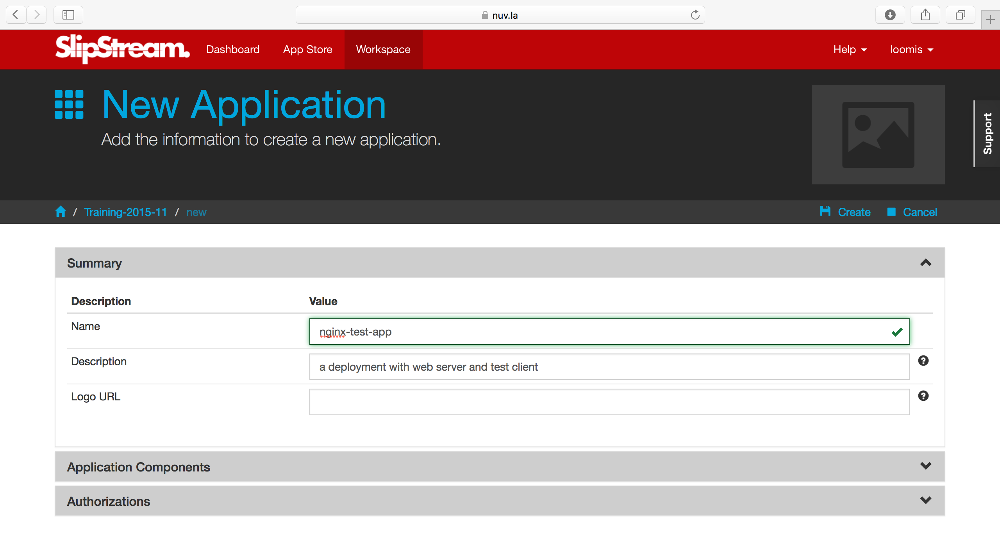
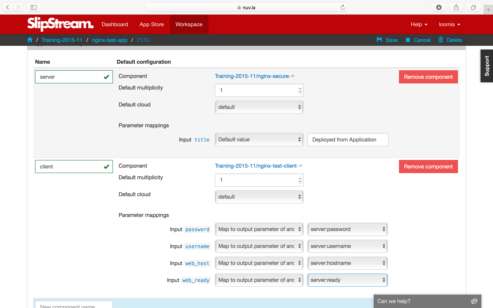
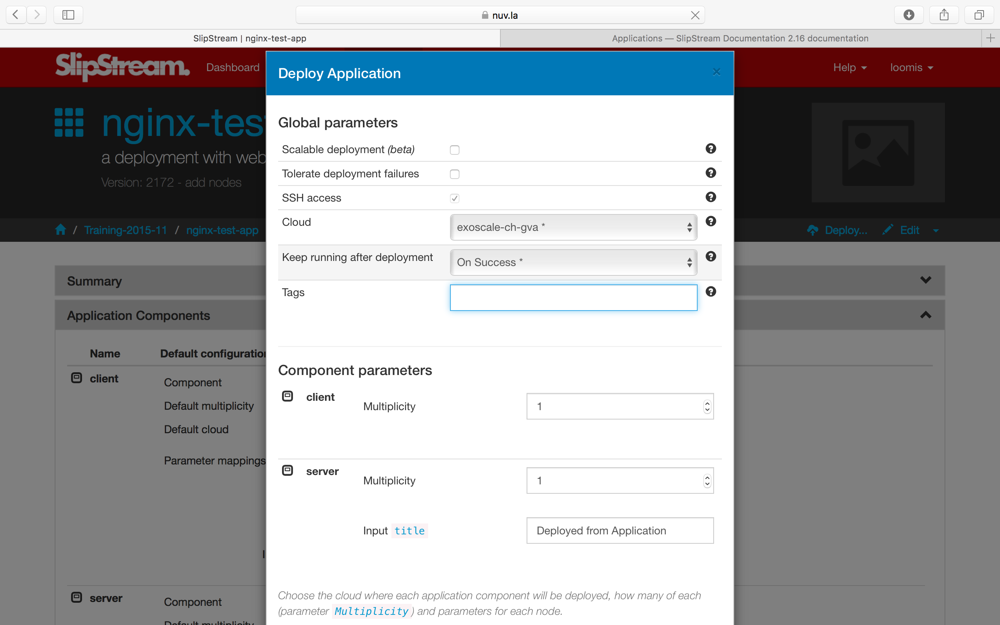
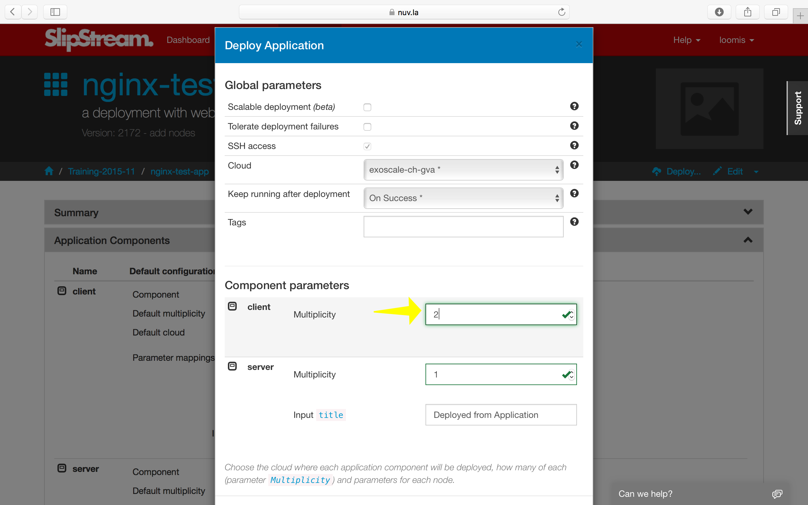
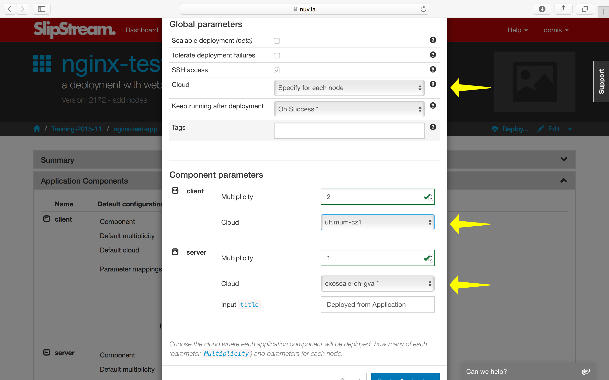

Applications
============

Although some useful applications can be deployed as single machines,
most applications nowadays are large, multilayer beasts with several
different functional blocks. The typical 3-tiered web application
falls into this category with its load balancer, application
front-ends, and database, usually all with redundancy and failover.

In this section, we will take a small step in this direction.  You
will learn how to:

- Combine your components into multi-machine deployment
- Connect parameters between application components
- Coordinate the configuration of the components
- Change the number of machines deployed
- Spread a deployment between clouds

Application Definition
----------------------

An application is a set of nodes (that are tied to component
definitions) that will be deployed together. The application will also
define the mapping between the input/output parameters of the nodes
that are tied together as well as the multiplicity of each node.

Create a new application definition in your home project.  
The first section of the new application page just asks for generic
information.

The second section provides information about the nodes that will
comprise the full application deployment. If there are input parameters
for a node, then you can set the values here or provide a link to
another node's output parameter.

Add two nodes for this deployment, the web server and the test client.

There are several important things to notice about the application
definition.  You can:

- Add any number of different components to the application. 
- Define the default multiplicity for each node (default is 1).
- Define the cloud to use for the node (although you usually want to
  use "default").
- Tie output parameters from one node to the input parameters of
  another.

Deploying the Application
-------------------------

Now that the application has been defined, you can deploy the full
application with a single click of the "Deploy..." button.  Doing so
will bring up the usual run dialog.

Verify that all of the input parameter values are OK and then run the
application.  As usual you will be redirected to the dashboard.  You
can view the advancement of the application from there or from the run
page. 

When the application completes the deployment, review the reports to
ensure that everything worked correctly. 

Advanced Deployments
--------------------

From the run dialog you can make a number of significant changes to
the application deployment without having to change the application
definition itself. 

Changing Multiplicity
~~~~~~~~~~~~~~~~~~~~~

You can change the multiplicity of the nodes in a particular
deployment.  The default is to have one web server and one test
client.  It doesn't make much sense for this application to have more
than one server, but having more than one client could be interesting.

You can do this by changing the client multiplicity in the run
dialog. 

This will then deploy three machines in total.  You can check that the
reports for each of the clients shows successful results. 

Multi-Cloud Deployments
~~~~~~~~~~~~~~~~~~~~~~~

You can also deploy the nodes of the application into different
clouds, creating a real multi-cloud deployment.  

To do this, choose the option to set the cloud for each node
separately.  Then do so for each node type.  In the above screenshot,
I'm running the server in Exoscale and the client in Ultimum.

Orchestrators
-------------

You may have noticed that during the deployment of an application, an
additional machine is deployed per cloud.  This machine is called the
orchestrator and is created and deployed by SlipStream to handle the
deployment of multi-machine applications.

The orchestrators remain active only when the application can go
through a "provisioning" stage.  For the types of deployments that
we've done up to this point, the orchestrators will be terminated
after all of the reports have been sent back to the SlipStream
server. 

Although very lightweight, the orchestrator does represent a small
overhead when deploying applications through SlipStream. 

.. admonition:: EXERCISES

   1. Deploy your application and verify from the reports that
      everything worked correctly.
   2. Change the number of clients and then verify from the reports
      that all of the clients had the correct responses from the
      server. 
   3. Deploy the client node and server nodes in different clouds and
      verify that the deployment works.
   4. Can you modify the application so that you can put clients in
      different clouds?  Verify that your solution works.
