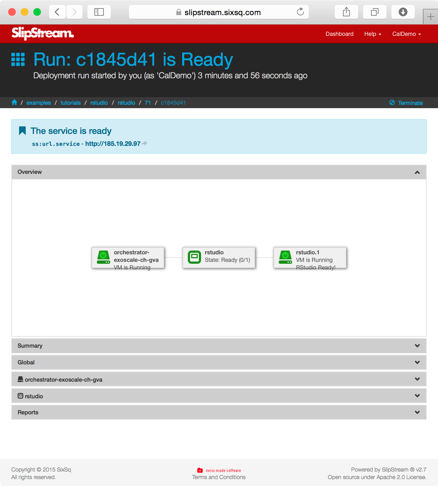

Components Part I
=================

Many common applications require only a single node to run. These simple
can also usually be easily parameterized so that a single application
definition can be used to start many customized instances.

In this section you'll learn how to:

-  Parameterize an application
-  Understand how installation and configuration is automated
-  Pass information between the application and the user
-  Share a deployment with other users

Installing a Web Server
-----------------------

Once you have 'root' access to the machine, you can install and
configure it as you'd like. For example, let's install a web server by
hand and show that it works.

To install the web server, just use the standard ``apt-get`` command.

::

    $ # become root to avoid lots of 'sudo' commands
    $ sudo su -
    $
    $ # update the OS just to make sure all's OK
    $ apt-get update
    Get:1 http://security.ubuntu.com precise-security Release.gpg [198 B]
    ...

    $ # now install the Apache web server
    $ apt-get -y install apache2
    ...
    Unpacking apache2 (from .../apache2_2.2.22-1ubuntu1_amd64.deb) ...
    ...
    Setting up apache2-mpm-worker (2.2.22-1ubuntu1) ...
     * Starting web server apache2
    Setting up apache2 (2.2.22-1ubuntu1) ...
    Setting up ssl-cert (1.0.28) ...
    Processing triggers for libc-bin ...
    ldconfig deferred processing now taking place
    $ 

Then provide a customized front page and start the server.

::

    $ cat > /var/www/index.html <<EOF
    <html><body><h1>SlipStream!</h1>
    
My virtual machine deployed by SlipStream.

    </body></html>
    EOF

You can then view the page via a web browser and verify that the server
is running and serves up the correct file.

   Deployed with SlipStream

You can stop the machine directly through the SlipStream interface. On
the run page, just click on the "Terminate" button. This will shutdown
the virtual machine and release the associated resources.

Wordpress
---------

One example of a simple application is Wordpress, a common blogging
platform. To deploy an instance of Wordpress, just click on the "Deploy"
button from the App Store. You will presented with a run dialog that
requests the values for a few parameters.

   Wordpress Run Dialog

Filling in those parameters and then clicking on the "Run Image" button
will launch the image and bring up the usual "Run" page where you can
follow the status of the application.

   Wordpress Run Dialog

If you look at the definition of the ``wordpress`` image, you will see
where the parameters for the image are defined.

   Wordpress Parameters

When creating a new image, you are free to define any parameters that
make sense for your application. Note however, that the values are all
string values and any validation must be handled by the deployment
script.

Under the "Execute" tab on this same page, you can see the deployment
script that is used. The parameters can be controlled via the SlipStream
client's ``ss-set`` and ``ss-get`` commands. More on this later.

You'll also notice that this configuration uses the Puppet configuration
management system. SlipStream is agnostic concerning what tools are used
for installation and configuration; you are free to use your existing
tools and knowledge when importing applications into SlipStream.

R-Studio
--------

R-Studio is a data analysis platform that provides a web-based interface
to the R statistical analysis software. The actual deployment is similar
to that from Wordpress, although it uses just a bash script for
installation rather than a configuration management system like Puppet.

   R-Studio Deployment

Because there may be many instances of a given application running, it
is necessary to ensure that only the person deploying the application
has access to it. If you deploy R-Studio from the App Store, you will be
faced with a login page when accessing the instance.

.. figure:: images/screenshots/rstudio-login.png
   :alt: R-Studio Login Page

   R-Studio Login Page

Where can this information be found? In the deployment parameters. The
username and password can be found in the ``machine:rstudio_user`` and
``machine:rstudio_pswd`` parameters. The password was generated with the
``ss-random`` command from the deployment script and communicated
through SlipStream to the user.

Exercises
---------

For these exercises, you'll need to use the SlipStream client commands
that are discussed in detail in the next section. Use the R-Studio and
Wordpress deployments to guess how these commands work.

1. Modify your image, to install and configure a web server.
2. Do the installation directly with a command in the deployment script
   and also via a package definition.
3. Create an input parameter that provides text on the home page of the
   web site. Use this value to update the home page.
4. Make the image public. Run the image of another person in the class.
5. Protect the web server with a randomly generated password. Define the
   parameters to pass this information to the user.
