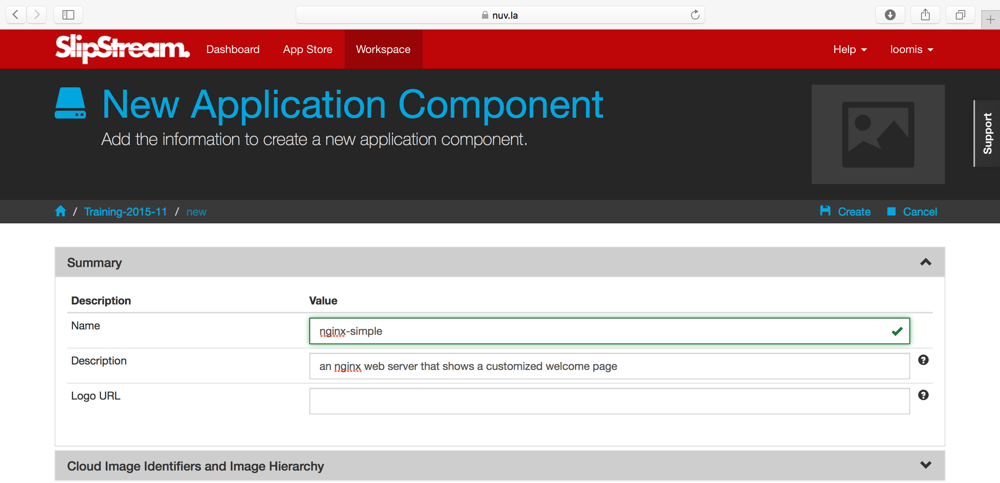
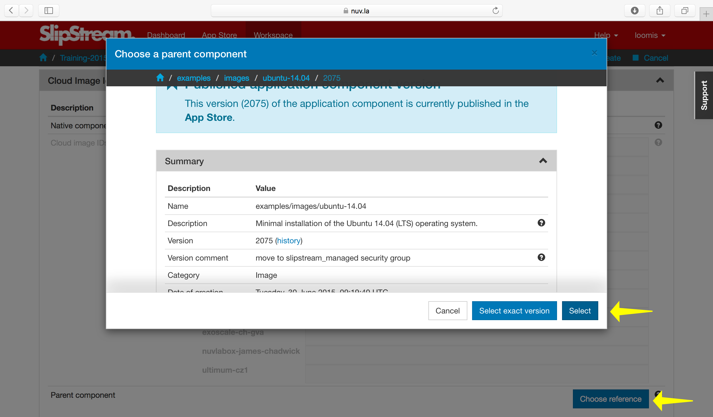
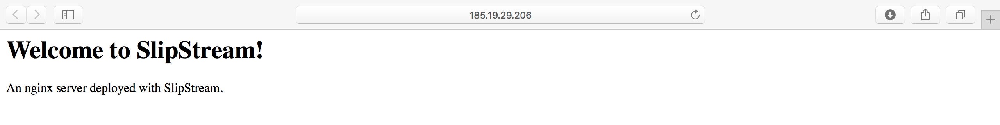
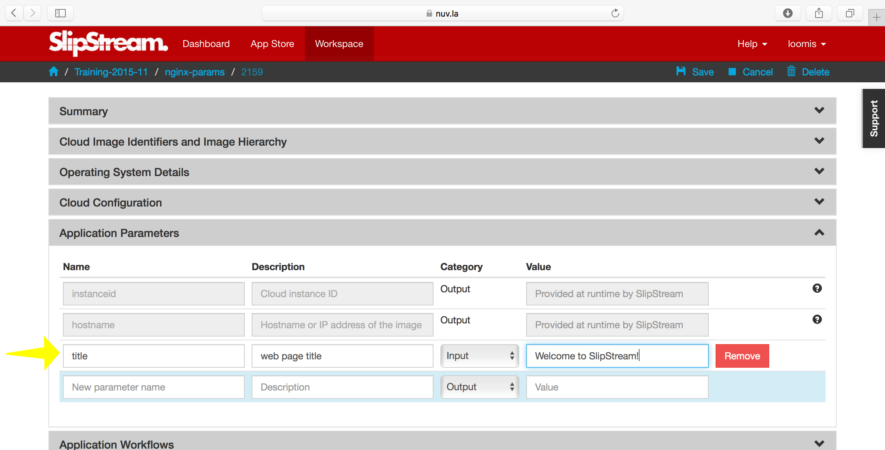
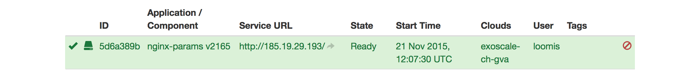
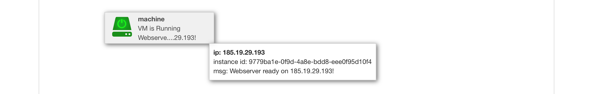
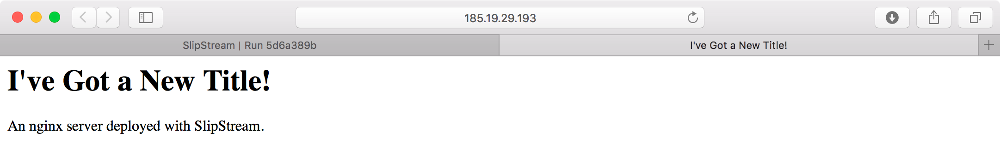

Components Part I
=================

A minimal operating system isn't very useful by itself.  We want to
transform such a simple image into a component running services that
we need for our cloud application. 

In this section you'll learn how to:

- Automate the installation and configuration of services,
- Parameterize the component to allow deploy-time configuration, and
- Pass information from the application back to the user.

In doing this you'll also understand:

- How to reference images from components,
- The purpose of the various SlipStream "recipes", and 
- When those recipes are executed.

In this chapter, we'll create a web server component that can be
customized when deployed and that protects a "secret" with basic
authentication. 

Web Server Component
--------------------

It wouldn't be practical to have to log into every deployed virtual
machine to install software and to configure it.  This process needs
to be automated to allow people to concentrate on less tedious tasks
and to ensure that the process is consistent and error-free.

Let's start by creating a new web server component that will
automatically install and configure nginx, a standard web server. 

Create Component
~~~~~~~~~~~~~~~~

Navigate to your home project and then click on the menu item to
create a "New component".  You should then see a page that looks like
the following screenshot.

Provide values for the name and description, but don't save the
component yet.

Reference Native Image
~~~~~~~~~~~~~~~~~~~~~~

Open the "Cloud Image Identifiers and Image Hierarchy" section.  At
the bottom of this section we want to click on the button that says
"Choose reference".  This allows us to choose the native image that we
want to use for our component.  When you click the button, you will
see a "chooser" dialog, like in the following screenshot.

Navigate to the ``examples/images/ubuntu-14.04`` and click on the
"Select" button.  This will add the reference to the image
description.  **Do not yet click on "Create".** 

.. warning::

   There are two buttons to choose from in the chooser.  What's the
   difference?

   - "Select": Chooses the given image and will use the **latest**
     version of the image when the component is deployed. 

   - "Select exact version": Chooses the given image and will always
     use this exact version when deploying the component. 

   With the floating version, the component will always take advantage
   of improvements to the referenced image, with a slight possiblity
   of running into breaking changes.  Locking the version avoids this
   problem, but you may run into the case where the referenced image
   has been removed by the provider.  Generally, you will almost
   always want to choose "Select"!

Add Nginx
~~~~~~~~~

To get our web server installed and running, we need to:

- Install the nginx software
- Configure the nginx server to start automatically, and
- Add our customized web page

To accomplish these tasks we want to add the appropriate "recipes" or
"hooks" to the component definition.  Open the "Application Workflows"
section of the component.  Along the left edge you'll see the set of
recipes that you can add.  They are essentially run in the order that
they are listed. 

What type of information do you add to each recipe?  Here is the
general guide:

- Pre-install
   This is the first recipe to be executed.  It will be run before
   SlipStream installs anything else on the machine (either the
   SlipStream client or specified packages).  This can be used, for
   instance, to update the package manager configuration on the
   machine or to upgrade the system.

- Install packages
   This recipe is a list of packages to be installed on the
   machine. SlipStream will use the appropriate package manager for
   the operating system, which normally will also install any
   dependencies.  This only supports Debian and RedHat families of
   operating systems.  If you're using something else, install
   packages manually with the "Post-install" recipe. 

- Post-install
   This recipe should be used for any **static** configuration of the
   machine.  That is configuration that will never need to be changed
   during the deployment or operation of the machine.

- Deployment
   Dynamic configuration of the machine should be handled in this
   recipe.  This includes configuration based on the component's
   parameters.

- On VM add
   A recipe which is executed when an application containing the
   component is "scaling up", that is adding new resources. 

- On VM remove
   A recipe which is executed when an application containing the
   component is "scaling down", that is removing existing resources.

Using the recipe for installing the nginx server from before, we'll
add the following to the "Pre-install" recipe::

    #!/bin/bash -xe
    apt-get update

which will update the configuration of the package manager. 

We will then add the package "nginx" to the "Install packages"
recipe. 

In the "Post-install" recipe, we want to create our customized welcome
page, ensure that the nginx server is started, and that nginx always
starts when the machine boots.  Add the following::

    #!/bin/bash -xe

    # remove default site and create our own
    rm -f /etc/nginx/sites-enabled/default
    cat > /etc/nginx/sites-enabled/mysite <<EOF
    server {
      listen 80 default_server;

      root /var/www/html;
      index index.html;
    }
    EOF

    # customize the welcome page
    mkdir -p /var/www/html
    cat > /var/www/html/index.html <<EOF
    <html>
      <head>
        <title>Welcome to SlipStream!</title>
      </head>

      <body>
        <h1>Welcome to SlipStream!</h1>
        
An nginx server deployed with SlipStream.

      </body>
    </html>
    EOF

With these definitions you can now click on the "Create" button to
create the component.

.. warning::

   All of the recipes must be executable by the underlying operating
   system.  Make sure that you've added the shebang line to all of the
   recipes ``#!/bin/bash -xe`` (or similar)!  Note that the "-xe"
   options help with debugging when there are problems. 

You can then click on the "Deploy..." button to deploy the web server
and ensure that it works as expected.  When visiting the URL for the
machine: http://host_ip/, you should see something like the following
screenshot.

Parameterized Web Server
------------------------

It wouldn't be very useful if we had to create a new component
definition every time we wanted to change some behavior.  In the case
of our web server example, we may want to customize the title of the
page without having to remake the entire configuration. 

Also the integration with SlipStream itself isn't great.  To find the
location of the server we have to dig through the parameters on the
run page.  Let's also improve this in the next version of the
component. 

Title Parameter
~~~~~~~~~~~~~~~

Let's begin by defining an input parameter that allows the title to be
specified.  You can copy your previous component or just modify the
old one directly.  Click "Edit" and then go to the "Application
Parameters" section and add an input parameter called "title".

Now we need to modify the recipes to use the value of this parameter
in the configuration.  Change the welcome page definition in the
"Post-install" recipe to this::

    <html>
      <head>
        <title>__TITLE__</title>
      </head>

      <body>
        <h1>__TITLE__</h1>
        
An nginx server deployed with SlipStream.

      </body>
    </html>

We will then replace "__TITLE__" with the actual parameter value. 

Deployment Configuration
~~~~~~~~~~~~~~~~~~~~~~~~

And now we will must add some deployment-time configuration in the
"Deployment" recipe to take into account the parameter's value.  In
the deployment recipe add the following::

    #!/bin/bash -xe

    # get the value from slipstream
    title="`ss-get title`"

    # replace the title in the welcome page
    sed -i "s/__TITLE__/${title}/g" /var/www/html/index.html

    # provide a link to the webserver through slipstream
    hostname=`ss-get hostname`
    link=http://${hostname}/
    ss-set ss:url.service ${link}

    # provide status information through web UI
    ss-display "Webserver ready on ${hostname}!"

Now you can save the component and deploy it.  When deploying it, you
should see an input parameter in the run dialog.  Change the value so
that you can be sure that it was used in the configuration.  Verify
that it shows up in the welcome page. 

In the dashboard, you should see that a service URL has been provided
for the web server.  This makes accessing the service much easier. 

You can also see that an informative message has been displayed on the
run page.

And finally, you should also see that the value of your title
parameter has been taken into account. 

We'll explain some of the magic in these scripts in the next section.

Run Database
------------

When you deploy a component (or later an application), SlipStream
creates a mini-database of parameters which can be used to pass
information into or out of the running component.

In this run database, there are some global variables that are always
defined.  One of these is the ``ss:url.service`` parameter, which is
the service URL for the deployed component.  The web interface picks
up this value and displays it as a link in the dashboard and run
page.  All of the global variables are prefixed with ``ss:``.  

.. note::

   In general, any parameter that starts with "url." will be
   interpreted by the web interface as a link and rendered as such.
   In addition to the service URL, there are also similar ones
   generated by default for SSH.

The ``ss-display`` command is a shortcut to set the ``statecustom``
parameter on a particular machine.  You'll find this in the section
for the machine on the run page.  Notice that the input parameter we
defined for the title, also shows up in the parameters of the machine.

The commands such as ``ss-set``, ``ss-get``, etc. are installed
automatically by SlipStream on the machine and can be used in the
deployment recipe.  They are installed at the end of the post-install
recipe, so can't be used in the recipes that are executed earlier. 

Secured Web Server
------------------

TO BE COMPLETED!!!

.. admonition:: EXERCISES

   For these exercises, you'll need to use the SlipStream client
   commands that are discussed in detail in the next section. Use the
   R-Studio and Wordpress deployments to guess how these commands
   work.

   1. Modify your image, to install and configure a web server.
   2. Do the installation directly with a command in the deployment
      script and also via a package definition.
   3. Create an input parameter that provides text on the home page of
      the web site. Use this value to update the home page.
   4. Make the image public. Run the image of another person in the
      class.
   5. Protect the web server with a randomly generated
      password. Define the parameters to pass this information to the
      user.
