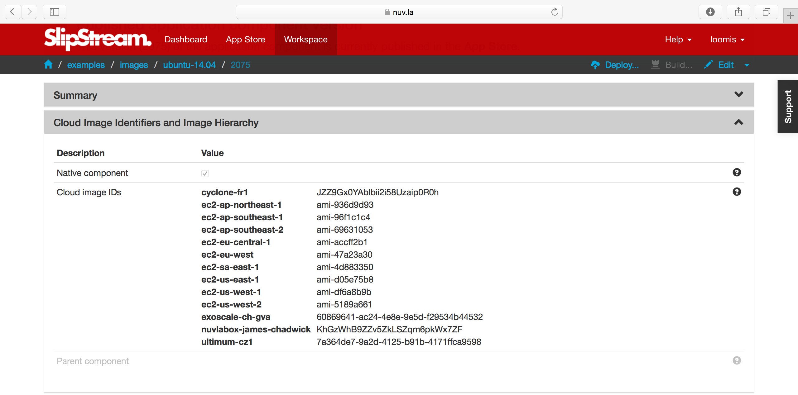
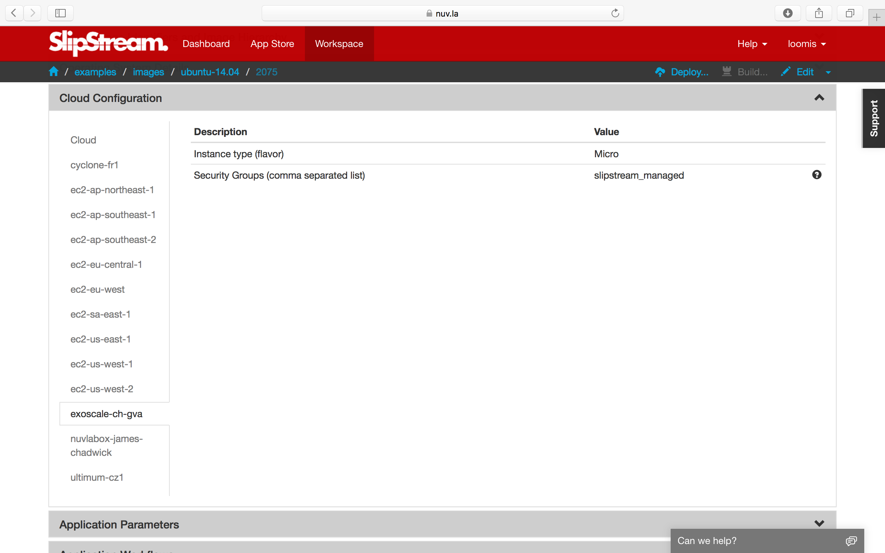
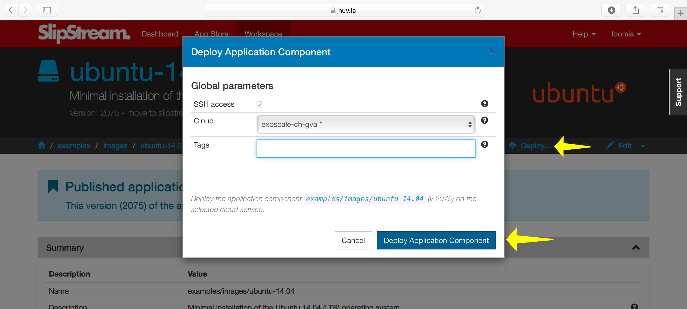
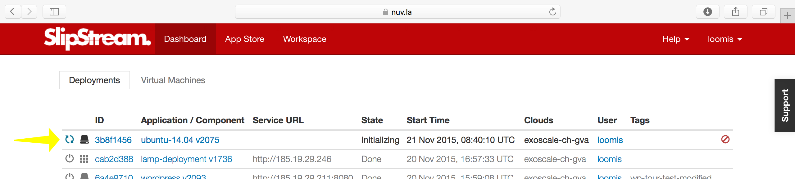
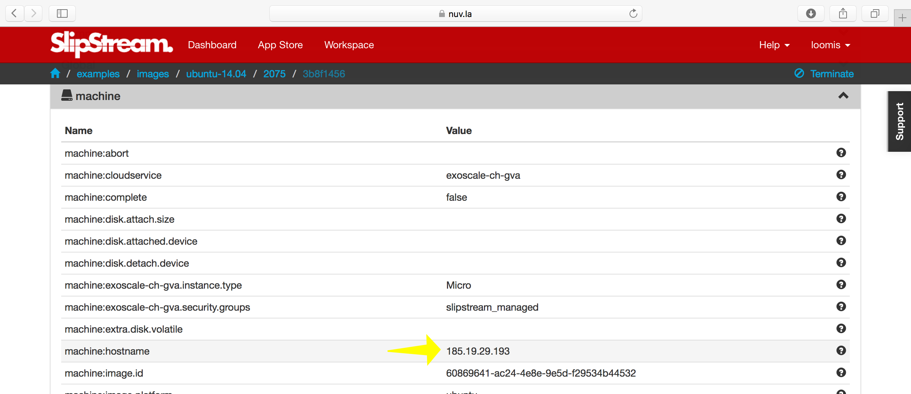

Images
======

An image defines a virtual machine image that encapsulates
cloud-specific information.  **All** application components must
eventually reference an image that can be provisioned in the selected
cloud(s).

In this section you'll learn how to:

- Reference cloud-specific images,
- Change the resource allocations,
- Define the security group, and
- Deploy an image through SlipStream.

"Native" Images
---------------

To have full application portability between clouds, you must have
identical or functionally equivalent virtual machine images available
in each of the clouds.

Identical Images
~~~~~~~~~~~~~~~~

One possibility is to create your own virtual machine images and
upload them into every cloud you want to use. In theory, this is the
best approach.  In practice as with so many ideas, it doesn't work
well because:

- Some cloud providers do not allow user-created images,
- Other cloud providers modify uploaded images (e.g. by changing the
  kernel), and
- Maintaining images for every cloud becomes a significant burden.

The last point is particularly troublesome because making images
(often tens of Gigabytes in size) and uploading them is
time-consuming.  By doing this, we'd lose the dynamicity that is a
fundamental for switching to cloud technologies.

Identical Recipes
~~~~~~~~~~~~~~~~~

SlipStream's approach overcomes these problems by reusing existing,
functionally equivalent images supplied by the cloud providers, then
maintaining common recipes for customizing them.

A SlipStream image definition references existing ("native") virtual
machine images in each cloud, creating a group of functionally
equivalent images (e.g. a "minimal Ubuntu 14.04" image).  The slight
differences between the images in various clouds rarely (if ever) have
noticable effects on the cloud application and we free ourselves
maintaining our own images.

.. note:

   You might say that this only works for simple images like minimal
   distributions of common operating systems.  You are right!  We will
   see in the coming chapters how SlipStream components allow you to
   customize the virtual machines that you use.

If you look at the definition of the |ubuntu-14.04| image, you'll see
the list of native image identifiers in each cloud in the "Cloud Image
Identifiers and Image Hierarchy" section.

When creating a new image, you'll need to find the appropriate image
identifiers through the cloud provider's interface.  On Ultimum, you
can find the identifiers through the "Images" tab in their
|ultimum-console|.
For Exoscale, the
identifiers are available from a |exoscale-images|.

VM Size
-------

Very often you will want to tailor the CPU, RAM, and other resources
allocated to the machine.  Specifying the "size" of a virtual machine
is another area where the cloud providers differ.  Within an image,
the size is defined, per-cloud, in the "Cloud Configuration" section
(see |ubuntu-14.04-cloud-params|).

Some providers allow you to specify the CPU and RAM resources
explicitly; others only allow you to specify a "t-shirt" size.  **You
will have to consult documentation from the cloud providers to
understand the allowed values and their meanings.** The following
table shows the differing sizes for Exoscale and Ultimum.

============ ============= === ========
Exoscale     Ultimum       CPU RAM (GB)
============ ============= === ========
Micro        --             1      0.5
Tiny         Basic          1        1
Small        Standard       2        2
Medium       --             2        4
--           Standard Plus  4        4
Large        --             4        8
Extra-large  --             4       16
--           Large          8        8
Huge         --             8       32
--           Large Plus    16       16
--           Extra Large   32       32
============ ============= === ========

You will not be able to change the resource allocation for image
definitions for the shared images (or more generally for any image not
owned by you).  However you can get around this by:

- Making a copy of the image within SlipStream and modifying your
  copy, or
- Updating the size in the components you create that reference a
  shared image.

We will see how values can be inherited or changed when we see what
can be done with components.

Networking
----------

Currently SlipStream takes a very simple approach to managing network
connectivity to virtual machines.  On clouds that support it,
SlipStream will create a security group (set of firewall rules) called
"slipstream_managed" that allows access on any port from anywhere.

When you use the standard shared image definitions, the
"slipstream_managed" security group will be used, allowing the
services on the machine to be accessed through the network.  Note on
the previous screenshot that there is a parameter to specify what
security group(s) to use.

You can more tightly secure your deployed applications by:

- Running a firewall within your images (and components) and/or
- Specifying a different security group in your image definitions

In production, you should take every opportunity to secure your
running systems.  In the interests of simplicity, this tutorial does
not follow best practices in this respect.

.. important::

   If you do specify your own security group in your images, you
   need to maintain the same security group on all the clouds you use
   to ensure that you can switch between clouds easily.

.. important::

   For clouds that do not support security groups (or their
   equivalent), you must manually adjust the networking parameters for
   the machines that are deployed.

Deploy a VM
-----------

At its simplest, SlipStream can be used as a multi-cloud VM management
console.  To show how this is done, navigate to the ``examples/images``
project, which contains a set of minimal images you can use.

Clicking on the ``ubuntu-14.04`` module and then on "Deploy...", you
should see a screenshot like the following.

From the run dialog you can choose the cloud to use and then deploy
the image by clicking on the dialog's "Deploy..." button.  This will
redirect you to the dashboard, where you will see a new entry for the
image.

You can either follow the progress of the machine from the dashboard
or click on the "ID" to see the more detailed run page.  On the run
page, you can find the IP address of the machine and an SSH link in
the "machine" section.

Or you can log in manually from the command line, using the username and
IP address on the run page::

    advanced_tutorial> ssh root@185.19.29.193
    [...]
    Welcome to Ubuntu 14.04.2 LTS (GNU/Linux 3.13.0-49-generic x86_64)
    [...]
    root@machine3b8f1456-cb5d-49ba-b7d5-430f97642850:~#

Or if your browser is configured for SSH links, you can click on the
link for the parameter "machine:url.ssh".

.. important::

    Note that the username may change depending on the underlying
    native image being used. The usernames "root" and "ubuntu" are
    common.  The username may not be correct in the parameters as they
    are not always uniform across cloud providers.

Running simple virtual machines in this way is often useful for quick
debugging or developing service installation recipes.

.. admonition:: EXERCISES

   1. Create a copy of the Ubuntu 14.04 image and change the size
      for either Exoscale or Ultimum.  Leave the other unchanged.
   2. Deploy the copy on both Exoscale and Ultimum. Note the
      deployment times.
   3. Verify that you can log into both machines with SSH.
   4. Verify that the number of CPUs (``/proc/cpuinfo``) and the RAM
      (``/proc/meminfo``) are the values expected from the size.
   5. Try to deploy and access a web server on the deployed machine.
      The commands to use are::

          $ apt-get update
          $ apt-get install -y nginx
          $ service nginx start

      You should then be able to navigate to "http\://*ip_address*/"
      and see an nginx welcome page.  You may have to add ``sudo``
      before these commands, if you had to log in with the "ubuntu"
      account rather than "root".

.. |ubuntu-14.04| raw:: html

   <a href="https://nuv.la/module/examples/images/ubuntu-14.04/2724#cloud-image-identifiers-and-image-hierarchy" target="_blank">examples/images/ubuntu-14.04</a>

.. |ultimum-console| raw:: html

   <a href="https://console.ultimum-cloud.com" target="_blank">web console</a>

.. |exoscale-images| raw:: html

   <a href="https://www.exoscale.ch/open-cloud/templates/" target="_blank">separate web
   page </a>

.. |ubuntu-14.04-cloud-params| raw:: html

   <a href="https://nuv.la/module/examples/images/ubuntu-14.04/2724#cloud-configuration+exoscale-ch-gva" target="_blank">examples/images/ubuntu-14.04</a>
