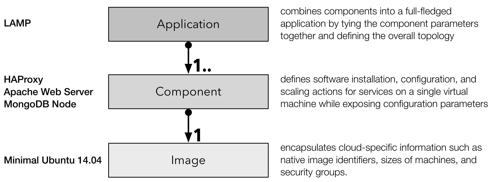

Key Concepts
============

There are a few key concepts that are important to understand how the
various resources are put together to define and to manage cloud
applications.

Application Model
-----------------

SlipStream uses a hierarchical description of applications to allow
for the maximum portability and easy scaling of applications when they
are deployed.  Applications are composed of parameterized components
which reference generic virtual machine images.  The following diagram
shows this composition.

By isolating the cloud-specific information in the images, SlipStream
enhances the portability of the applications.  Similarly by defining
the application topology separate from the components, it makes it
easier to scale the various functional parts of the application as
needed.

As a concrete example consider a 3-tier web application: the LAMP
(Linux, Apache, MongoDB, and PHP) stack.  The components are the
individual HAProxy (load balancer), Apache Web Server (front-end), and
MongoDB worker (database).  Each of these are built over a minimal
Ubuntu 14.04 virtual machine image that exists in the cloud
infrastructure being used.

Vocabulary
----------

We have recently updated the vocabulary we use to describe the various
resources within SlipStream to make the concepts more intuitive.  This
new vocabulary hasn't made it through all of the code and
documentation, so you may come across some of the old terms.  The
older terms are shown in parentheses. 

Image (base or native image)
    A virtual machine image that encapsulates cloud-specific
    information, such as image identifiers, sizes of a machine, and
    associated security groups.  The referenced, native images in each
    cloud are expected to be effectively identical.

Component (machine image, node)
    A single virtual machine definition that references an Image and
    may contain scripts for the installation and configuration of
    additional services.  These components can be parameterized and
    can often be run as standalone applications. 

Application (deployment)
    An application brings together one or more components into a
    coordinated deployment of cooperating virtual machines.  This
    allows complex (potentially multi-cloud) applications to be
    defined and managed as a single entity.

Project
    A "folder" that allows Image, Component, and Application
    definitions to be organized hierarchically. 

Module
    A generic name for Image, Component, Application, and Project
    definitions.

Run
    A deployed (running) application or application component. A "run"
    encapsulates all of the runtime information of the application and
    acts as a resource by which the application is managed.
