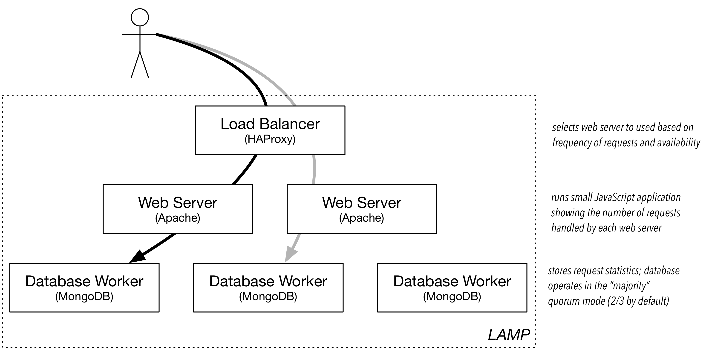

3-Tier Web App (LAMP)
=====================

SlipStream can efficiently manage simple applications like Wordpress,
but it really shines when trying to deploy large, multi-machine
applications.

Deployment of those types of applications, for example 3-tiered web
applications, can be complex and error prone. SlipStream automates
these deployments, ensuring both consistency and reliability.

Description
-----------

The LAMP++ (Linux, Apache, MongoDB, and PHP) application is an example
3-tier web application that uses a load balancer to distribute
requests through multiple web front-ends and a distributed MongoDB
database. (The definition can be found in the |lamp| module.)

The previous diagram shows the components of the LAMP application.
The web application simply displays the current request statistics.

Operation
---------

The run page for this application shows its deployment topology.

.. image:: images/screenshots/lamp-run-ready.png
   :alt: LAMP Run Page
   :width: 70%
   :align: center

Following the link to the deployed application, one can see which
database node is being accessed and the distribution of write requests
between the two front-end servers. The requests are roughly distributed
uniformly between the front end servers.

Robustness
----------

This LAMP application is resiliant to failure. This can be shown for
instance by logging into one of the front-end nodes and turning off
the apache server. In this case all of the requests will go through a
single front end.

The same test can be done with the MongoDB nodes. If one is removed, the
system should still function normally. However, since the system is
running with a quorum of 2, the service will fail if two of the MongoDB
nodes are stopped.

.. admonition:: EXERCISES

   1. Deploy the LAMP example and make sure that the application shows
      the request statistics and that the load balancer switches
      between nodes.
   2. Turn off the Apache server on one of the web front ends.  The
      command is ``service apache2 stop``.  Then click the read/write
      buttons to verify that only one web front-end is responding.
   3. Kill one of the MongoDB nodes and verify that writes to the
      database will work correctly. 
   4. Kill a second MongoDB node.  In this case, the database should
      stop responding because it has fallen below its configured
      quorum of two nodes.

.. |lamp| raw:: html

   <a href="https://nuv.la/module/apps/LAMP/lamp-deployment" target="_blank">apps/LAMP/lamp-deployment</a>
