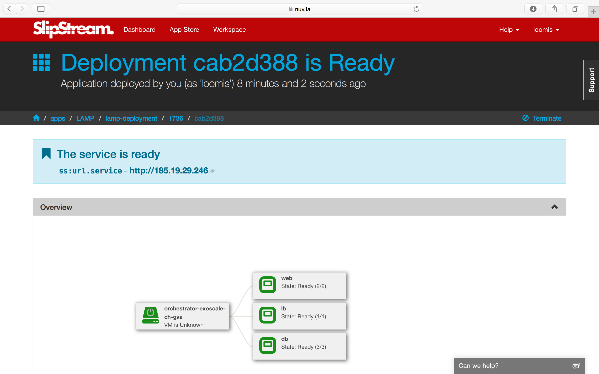

3-Tier Web App (LAMP)
=====================

SlipStream can efficiently manage simple applications like Wordpress,
but it really shines when trying to deploy large, multi-machine
applications.

Those types of applications, for example 3-tiered web applications,
can be complex and error prone. SlipStream automates the deployment of
such applications, ensuring both consistency and reliability of the
deployment.

Description
-----------

The LAMP++ (Linux, Apache, MongoDB, and PHP) application is an example
3-tier web application that uses a load balancer to distribute requests
through multiple web front-ends and a distributed MongoDB database.

By default, the application has:

-  1 HAProxy node for load-balancing the web front-ends
-  2 web front-ends running Apache
-  3 MongoDB nodes running with a quorum of 2

The web front-end contains an application page that calls PHP scripts to
read and write data in the MongoDB database. The information about how
many requests have gone through each server shows how data flows through
the front-ends.

Operation
---------

The run page for this application shows its deployment topology.

Following the link to the deployed application, one can see which
database node is being accessed and the distribution of write requests
between the two front-end servers. The requests are roughly distributed
uniformly between the front end servers.

.. figure:: images/screenshots/lamp-webui.png
   :alt: LAMP Web UI
   :width: 70%
   :align: center

Robustness
----------

This LAMP application is resiliant to failure. This can be shown for
instance by logging into one of the front-end nodes and turning off
the apache server. In this case all of the requests will go through a
single front end.

The same test can be done with the MongoDB nodes. If one is removed, the
system should still function normally. However, since the system is
running with a quorum of 2, the service will fail if two of the MongoDB
nodes are stopped.

.. admonition:: EXERCISES

   1. Turn off the Apache server on one of the web front ends.  The
      command is "service apache2 stop".  Then click the read/write
      buttons to verify that only one web front-end is responding.
   2. Kill one of the MongoDB nodes and verify that writes to the
      database will work correctly. 
   3. Kill a second MongoDB node.  In this case, the database should
      stop responding because it has fallen below its configured
      quorum of two nodes.
