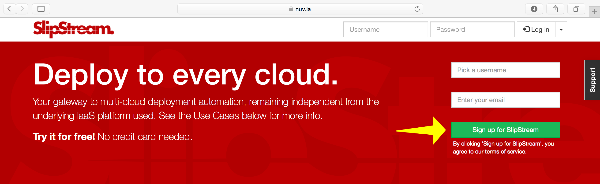
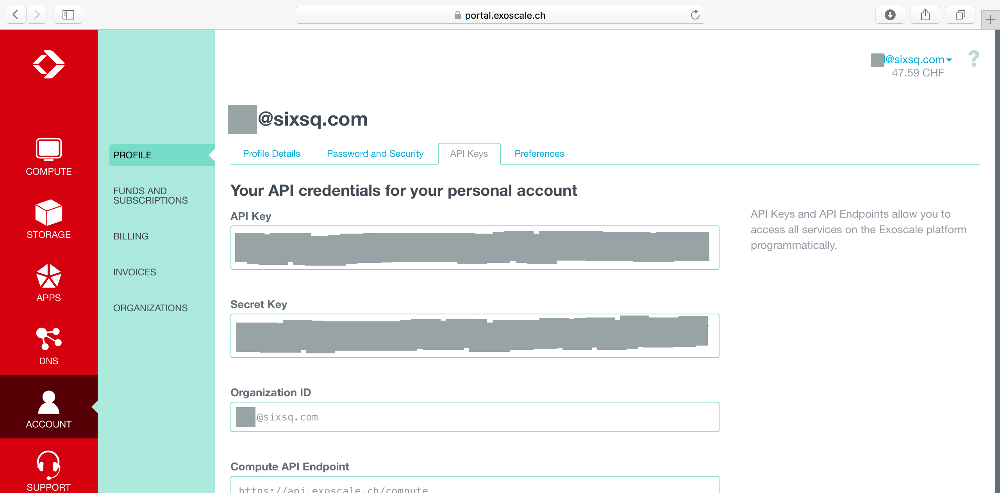

Prerequisites
=============

Before starting the tutorial, you must have:

- An account on Nuvla (or another SlipStream installation),
- Accounts on two [#]_ different cloud infrastructures, and
- A properly configured workstation.

Instructions on how to obtain accounts and how to configure your
workstation are below.

Nuvla Account
-------------

SlipStream allows people to use multiple cloud infrastructures
transparently and easily. Individual accounts allow users to keep
their work private and to protect their cloud credentials.

This tutorial assumes that you're using Nuvla_, a free SlipStream
server operated by SixSq.  You can register for a Nuvla account
directly through the service.

The registration procedure follows the usual pattern for web
applications and should be familiar.  Nonetheless, the detailed
instructions for creating an account on Nuvla are:

1. Fill in the registration form on the Nuvla `login page
   <https://nuv.la>`__, providing a username and an email address.
2. Next you will receive an email with a link that is used to verify 
   your email address.
3. Visit the URL provided in that email, either by clicking on the link
   or copying it into your browser.
4. You should then see a page that says that your email address was 
   validated. 
5. A second email, containing a temporary password,  will then be sent. 
6. Visit the Nuvla `login page <https://nuv.la>`__ again and log in
   with your username and temporary password.  **For now, close the
   splash screen offering a tour of SlipStream.  We'll get back to
   that!** 
7. View your user profile by clicking on "Profile" under your username
   at the top, right side of the page.
8. Change your temporary password by clicking on "Edit", updating the
   password fields in the "Summary" secton and then clicking on "Save".

In your profile, you will also need to provide cloud credentials and
optionally an SSH public key to make full use of SlipStream. The
configuration steps are provided below.

.. tip::

    If you're using your own SlipStream installation, replace the
    Nuvla endpoint with the endpoint of your server.  Note that the
    administrator of the SlipStream service may *not* allow open
    registration of users.

.. admonition:: EXERCISES

   1. Follow the Nuvla registration procedure to obtain an account.
   2. Change the temporary password and logout/login to verify that
      it works.

Cloud Infrastructure Accounts
-----------------------------

You will also need to provide the credentials for at least one cloud
infrastructure before being able to use SlipStream to deploy cloud
applications.  To complete the **multi-cloud** examples in this
tutorial, you will need access to **two cloud infrastructures**.

SlipStream supports nearly all major cloud service providers and open
source cloud solutions.  The registration procedure is similar for all
cloud services, but you may need to contact your cloud administrator
for all of the necessary configuration parameters.

The detailed procedure is provided for Exoscale_ and Ultimum_ below.

Exoscale
~~~~~~~~

If you need to create an account at Exoscale, you can visit their
`registration page <https://exoscale.ch/register>`__.  **If you have a
promotional card with an initial credit, be sure to use it when you
first sign up.**

Once you've obtained your account with Exoscale, then you'll need to
provide your Exoscale credentials to Nuvla. To find the information
you need in the Exoscale portal:

1. Click on the "Account" icon on the left after logging into the
   Exoscale portal.
2. Click to open the "API Keys" tab.
3. You will need the values of the "API Key" and "Secret Key" fields
   for the SlipStream configuration.

Add your Exoscale credential to your Nuvla account:

1. Open your user profile (top-right, under your username).
2. Click on "Edit".
3. Open the section "exoscale-ch-gva" by clicking on the section header.
4. Provide the "API Key" value in the "Key" field and the "Secret Key"
   value in the "Secret" field.
5. Click on "Save".

You will now be able to use the Exoscale cloud with your account through
Nuvla.

.. admonition:: EXERCISES

   1. Follow the Exoscale registration procedure to obtain an account.
   2. Add your Exoscale credentials to your user profile.
   3. Set the "Default cloud" parameter to Exoscale in your user
      profile. 

Ultimum
~~~~~~~

If you need to create an account at Ultimum, you can visit their
`registration page <https://console.ulticloud.com/registration/>`__.
**For the paid training events, we will already have obtained an
Ultimum account for you; so no need to register separately.**

Once you've obtained your account with Ultimum, then you'll need to
provide your Ultimum credentials (username and password) to SlipStream.
The username is your email address.

To add your Ultimum credentials to your SlipStream account:

1. Open your user profile (top-right, under your username).
2. Click on "Edit".
3. Open the section "ultimum-cz1" by clicking on the section header.
4. Provide values for your username (email), password, and "Project
   name (Tenant name). **Your "Project name" is the same as your
   username.**
5. Click on "Save".

You will now be able to use the Ultimum cloud with your account through
Nuvla.

.. admonition:: EXERCISES

   1. Follow the Ultimum registration procedure to obtain an account.
   2. Add your Ultimum credentials to your user profile.

Workstation Configuration
-------------------------

You will need to have the following software/tools installed and
configured on your workstation to follow the exercises in this
tutorial.

- Modern web browser: any recent version of one of the major browsers
  will be fine.  **You must have Javascript enabled.**
- Advanced REST client: Install the latest version of Chrome and
  install the "Advanced REST client" extension.
- Secure Shell (SSH) client: This comes by default on most operating
  systems.  With Windows, you'll need to install PuTTY. 
- SSH Key: For the SSH connections, you'll need to have an SSH
  public/private keypair.

**See the appendix of this tutorial for more detailed information for
the installation and configuration of these tools.**

.. admonition:: EXERCISES

   1. Configure your workstation with an SSH client and update your
      SlipStream user profile with your SSH key.
   2. Verify that you can start the Advanced REST client on Chrome.

.. _Nuvla: http://nuv.la

.. _SixSq: http://sixsq.com 

.. _Exoscale: https://www.exoscale.ch

.. _Ultimum: https://ulticloud.com

.. [#] The tutorial can be followed with only one account.  However
       you won't be able to complete the exercises demonstrating the
       multi-cloud features of SlipStream in this case.
