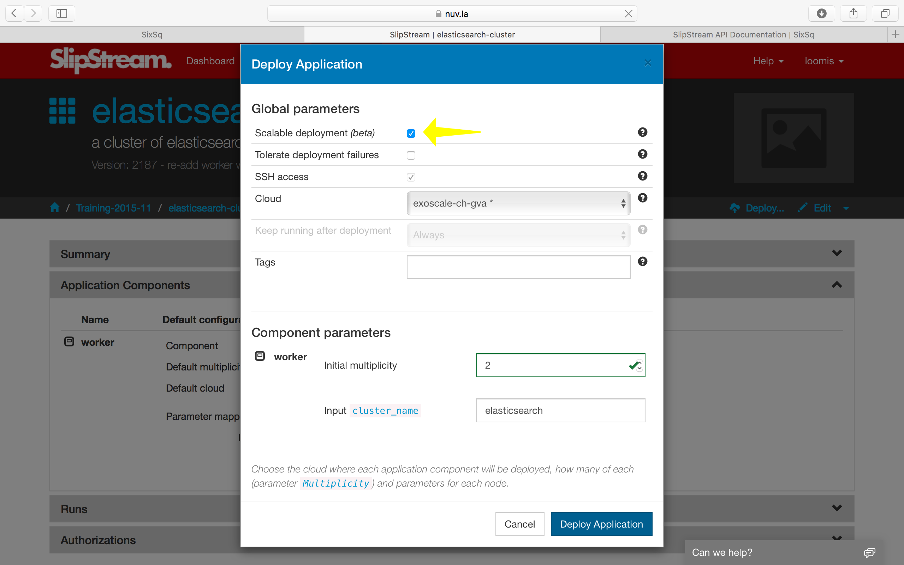
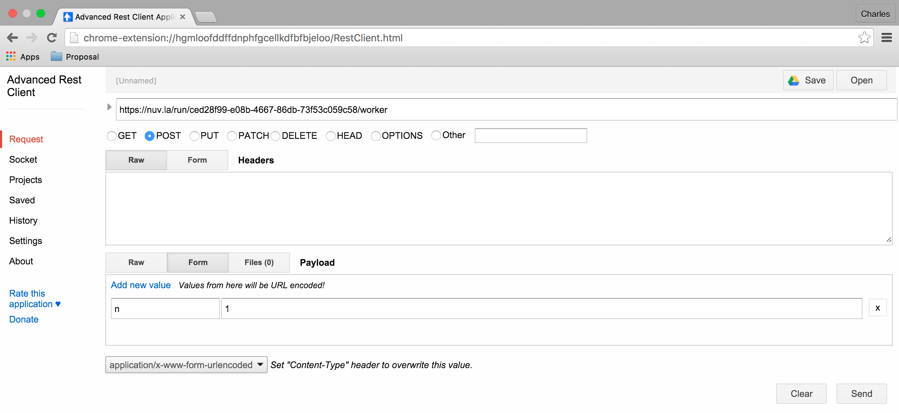
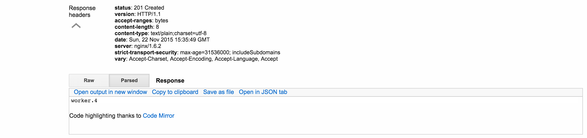
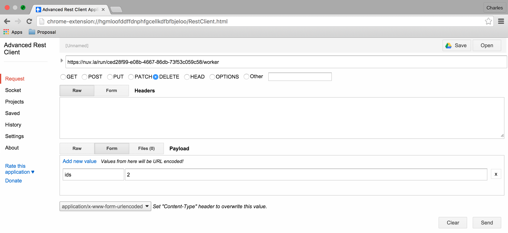

Scalable Applications
=====================

Very few, if any, applications experience a constant load. Most
experience large fluctuations that require adjustments to the
allocated resources to maintain responsiveness at peak demand and to
avoid wasting resources when demand declines.

In this section you will learn how to:

- Deploy an application that can be scaled horizontally and vertically
- Scale the application through the API
- Respond to resource changes to update configurations

Types of Scaling
----------------

By default, the resource allocation of a deployment is fixed when the
deployment is started. However clicking on the "Scalable deployment"
option in run dialog will allow the deployment to be vertically and
horizontally scaled through the SlipStream API. The following scaling
actions are possible:

- **Horizontal Scaling**
   - add VM (scale up)
   - remove VM (scale down)

- **Vertical Scaling**
   - change VM in size (CPU/RAM or instance type)
   - attach/detach extra disk to/from VM

When a run of a deployment is declared as scalable, the orchestrator VM
will not be terminated when the initial deployment finishes. This
necessary overhead allows the SlipStream to respond to requests to scale
the deployment.

Triggering Scaling Actions
--------------------------

For a running application, the scaling actions can be triggered
through the SlipStream REST API or through the command line
client. **Scaling actions are not yet supported in the web
interface.**

The API calls to trigger the scaling actions are available under the
`Run section <http://ssapi.sixsq.com/#create-a-mutable-run>`__ of the
SlipStream API documentation.

The SlipStream CLI comes with the following commands that trigger the
scaling actions on deployments and VMs::

    ss-node-add [options] <run> <node-name> [<number>]
    ss-node-remove [options] <run> <node-name> <ids> [<ids> ...]
    ss-scale-resize [options] [--cpu <num>, --ram <num>]|[--instance-type <type>] <run> <node-name> <ids> [<ids> ...]
    ss-scale-disk [options] [--attach <GB> | --detach <device>] <run> <node-name> <ids> [<ids> ...]

Scalability Workflow Hooks (Scripts)
------------------------------------

Hooks that define application-specific scaling actions are available
for running before, after and during the respective scalability
actions.  These scripts are required so that the application
components can be correctly reconfigured when scaling actions happen.

The available hooks are defined in the following table.

============== ========================== =================================================== 
Script         Action                     When Executed                                       
============== ========================== =================================================== 
"On VM Add"    *horizontal scale up*      | after addition of new VMs on all the VMs of the    
                                          | deployment except the ones that were just added.   
-------------- -------------------------- --------------------------------------------------- 
"On VM Remove" *horizontal scale down*    | after the removal of the requested VMs on all      
                                          | the VMs left in the deployment.                    
-------------- -------------------------- --------------------------------------------------- 
"Pre-Scale"    *horizontal scale down*    | before VMs removal action, on the VMs targeted     
                                          | for the removal, and therefore, before the         
                                          | "On VM Remove" script                              
-------------- -------------------------- --------------------------------------------------- 
"Pre-Scale"    *vertical scale up/down*   | before any vertical scaling action (VM resizing    
                                          | or attaching/detaching of extra disk) on the
                                          | VMs that are subject to the scaling action.            
-------------- -------------------------- --------------------------------------------------- 
"Post-Scale"   *vertical scale up/down*   | after any vertical scaling action (VM resizing
                                          | or attaching/detaching of extra disk) on the 
                                          | VMs that are subject to the scaling action.
============== ========================== =================================================== 

Detailed information about `how to write those scripts
<https://github.com/slipstream/SlipStreamClient/tree/master/client>`__
is available from the SixSq GitHub repository.

Horizontal Scaling - Add or Remove VMs
--------------------------------------

When adding a node instance (VM), you must specify the node type of the
machine that you want to add. The server (and then orchestrator) will
mutate the deployment, provisioning the new node instance and then
notifying all of the machines in the application.

The notification takes place by running the "On VM Add" script (if it
exists) on all VMs, except the ones that were just added. On the newly
added VMs only the deployment target script is executed.

As an example, look at the Elasticsearch Cluster application.  Because
Elasticsearch has its own discovery service and was designed for
horizontal scaling it doesn't need elaborate hook scripts in the
SlipStream configuration.

In the "Deployment" script, we can allow Elasticsearch to discover
other members of the cluster by listing its peers in the
configuration.  The code to do this is the following::

    # discover all of the workers
    workers=$(echo `ss-get worker:ids` | tr ',' "\n")

    # create list of their hostnames for discovery
    hosts=""
    for w in $workers; do
      h=`ss-get worker.${w}:hostname`
      hosts="${hosts} \"${h}\""
    done
    hosts=$(echo ${hosts} | tr ' ' ',')

    # rewrite the elasticsearch configuration file
    # this will allow all hosts to discover each other
    cat > /etc/elasticsearch/elasticsearch.yml <<EOF
    network.host: 0.0.0.0
    discovery.zen.ping.unicast.hosts: [${hosts}]
    EOF

The interesting part for this tutorial is the special variable
"worker:ids" that lists all of the identifiers of the machines in the
"worker" class.  These identifiers can then be used to recover the
host names of all of the machines.  Those parameters look like
"worker.2:hostname".  

After the configuration of the service, we restart Elasticsearch to
take into account the configuration changes.  Look in the application
and component definition for details. 

To see how the scaling works, deploy the elasticsearch-cluster
application.

To be able to scale the application later, **it is very important to
tick the checkbox indicating that this is a scalable deployment!**  By
default, this will deploy a cluster with two nodes.  

When the deployment is complete, it will provide a URL that gives the
health of the cluster.  The important thing to look at is the number
of nodes in the cluster.  It should initially be 2.  This is the
result:: 

    {
      "cluster_name" : "elasticsearch",
      "status" : "green",
      "timed_out" : false,
      "number_of_nodes" : 2,
      "number_of_data_nodes" : 2,
      "active_primary_shards" : 0,
      "active_shards" : 0,
      "relocating_shards" : 0,
      "initializing_shards" : 0,
      "unassigned_shards" : 0,
      "delayed_unassigned_shards" : 0,
      "number_of_pending_tasks" : 0,
      "number_of_in_flight_fetch" : 0,
      "task_max_waiting_in_queue_millis" : 0,
      "active_shards_percent_as_number" : 100.0
    }

The deployment worked correctly: the status is green and there are 2
nodes. 

To scale the run via the command line, use the `ss-node-add` command.
It takes the run ID the type of node to scale ("worker" in our case)
and the number of nodes to add::

    $ ss-node-add ced28f99-e08b-4667-86db-73f53c059c58 worker 1

This will drive the application through another provisioning phase for
the new worker.  When the provisioning and configuration is complete,
the application will return to the "Ready" state. 

.. note::

   Only one scaling action, on one type of node, can be done at any
   one time.  Previous scaling actions must complete before a new one
   can be started. 

To do the same thing from the REST API, send a POST request to the
URL::

    https://nuv.la/run/ced28f99-e08b-4667-86db-73f53c059c58/worker

the body of the request should be a form with the parameter "n" and
the number of nodes to add. 

Note that the response gives the created node(s). 

Just to verify that both of the add requests worked, look again at the
health output from the service URL::

    {
      "cluster_name" : "elasticsearch",
      "status" : "green",
      "timed_out" : false,
      "number_of_nodes" : 4,
      "number_of_data_nodes" : 4,
      "active_primary_shards" : 0,
      "active_shards" : 0,
      "relocating_shards" : 0,
      "initializing_shards" : 0,
      "unassigned_shards" : 0,
      "delayed_unassigned_shards" : 0,
      "number_of_pending_tasks" : 0,
      "number_of_in_flight_fetch" : 0,
      "task_max_waiting_in_queue_millis" : 0,
      "active_shards_percent_as_number" : 100.0
    }

A heathy green with 4 nodes!  Perfect. 

We can also remove nodes in nearly the same way.  The only difference
is that you must specify exactly which node(s) you want to remove.
From the command line, do the following::

    $ ss-node-remove ced28f99-e08b-4667-86db-73f53c059c58 worker 1 

Before the removal of the node instances, the "Pre-scale" script gets
run on them. This allows to execute any application related pre-removal
actions on the targeted node instance.

Similarly, the "On VM Remove" script will be run on each node instance
after the given node instance(s) have been removed.

None of those scripts are necessary for the Elasticsearch cluster. 

Again, after the (un-)provisioning cycle, the removed node instances
will disappear from the deployment.

Doing the same with the REST API, requires sending a DELETE request to
the URL::

    https://nuv.la/run/ced28f99-e08b-4667-86db-73f53c059c58/worker

with a form body containing the "ids" parameter.  The values of "ids"
must be a comma-separated list of machines to remove. 

After these actions, check the health and make sure it is green with 2
nodes::

    {
      "cluster_name" : "elasticsearch",
      "status" : "green",
      "timed_out" : false,
      "number_of_nodes" : 2,
      "number_of_data_nodes" : 2,
      "active_primary_shards" : 0,
      "active_shards" : 0,
      "relocating_shards" : 0,
      "initializing_shards" : 0,
      "unassigned_shards" : 0,
      "delayed_unassigned_shards" : 0,
      "number_of_pending_tasks" : 0,
      "number_of_in_flight_fetch" : 0,
      "task_max_waiting_in_queue_millis" : 0,
      "active_shards_percent_as_number" : 100.0
    }

Everything looks to have worked correctly!

Vertical Scaling
----------------

.. important:: 
   
   Vertical scalability is not available for all clouds.  It requires
   the availability of the feature in the underlying cloud as well as
   in the SlipStream cloud connector.

Change the VM Size
------------------

An application manager may discover that a running application would
be more efficient if certain virtual machines were allocated
additional CPU, RAM, or disk space. To request the resizing of the VM
from the command line, run the following command, providing the desired new
size of the VM::

    $ ss-scale-resize --cpu 8 --ram 16 \
        f9390d34-10b1-4621-bd05-f4d8c7557754 db 1 3

The size specification depends on the cloud being used.  Only CPU or
RAM can be specified.

The same way one can scale down the size of the VM(s) by simply defining
the required size of the VM(s).

.. note::

   Virtual machines that are vertically scaled, will go through a
   reboot cycle to force the new resource values to be taken into
   account.

Attach and Detach Disks
-----------------------

To add an extra disk, the following command should be used::

    $ ss-scale-disk --attach 75 \
        f9390d34-10b1-4621-bd05-f4d8c7557754 db 1 3

The extra disk is attached as a block device and on Linux systems should
appear as block device under the ``/dev`` folder usually as ``/dev/sd*``
or ``/dev/vd*``. The block device name depends on the virtualization
driver used and this should be checked with the cloud provider.

Detaching an extra disk requires either the block device name (e.g.,
``/dev/vdc``) or its cloud ID (usually in the form of a UUID). Here is the
example of detaching of the extra disk by the block device name::

    $ ss-scale-disk --detach /dev/vbc \
        f9390d34-10b1-4621-bd05-f4d8c7557754 db 1 3

In all the above cases the **"Pre-Scale"** and **"Post-Scale"** scripts
will be run respectively right before and after the IaaS scaling action
is requested from the Cloud by the orchestrator. On most of the clouds
the resizing of VMs requires their reboot. The scripts allow the user to
do the needful to prepare for the scaling action and later to account
for the changes made to the VM.

The examples of the **"Pre-Scale"** and **"Post-Scale"** can be found
`here <https://github.com/slipstream/SlipStreamClient/tree/master/client>`__.

.. admonition:: EXERCISES

   1. Deploy an Elasticsearch cluster.
   2. Add nodes through the command line or REST API.
   3. Remove nodes through the command line or REST API. 

