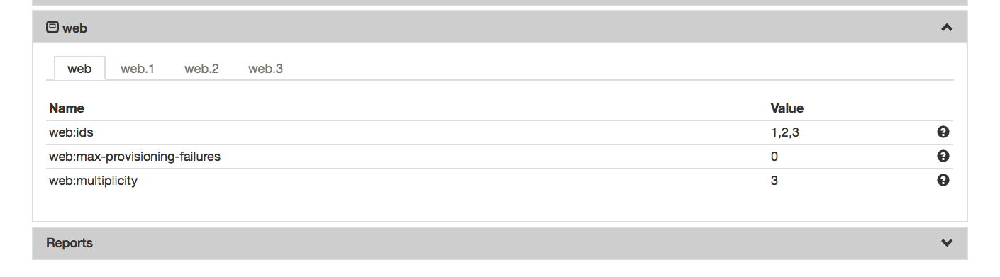
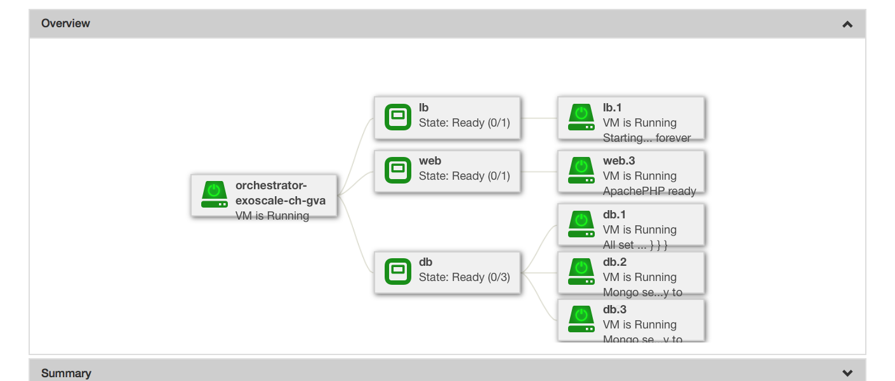

Scalable Applications
=====================

Very few, if any, applications experience a constant load. Most
experience large fluctuations that require adjustments to the
allocated resources to maintain responsiveness at peak demand and to
avoid wasting resources when demand declines.

In this section you will learn how to:

- Deploy an application that can be scaled horizontally and vertically
- Scale the application through the API
- Respond to resource changes to update configurations

Types of Scaling
----------------

By default, the resource allocation of a deployment is fixed when the
deployment is started. However clicking on the "Scalable deployment"
option in run dialog will allow the deployment to be vertically and
horizontally scaled through the SlipStream API. The following scaling
actions are possible:

- **Horizontal Scaling**
   - add VM (scale up)
   - remove VM (scale down)

- **Vertical Scaling**
   - change VM in size (CPU/RAM or instance type)
   - attach/detach extra disk to/from VM

When a run of a deployment is declared as scalable, the orchestrator VM
will not be terminated when the initial deployment finishes. This
necessary overhead allows the SlipStream to respond to requests to scale
the deployment.

Triggering Scaling Actions
--------------------------

For a running application, the scaling actions can be triggered
through the SlipStream REST API or through the command line
client. **Scaling actions are not yet supported in the web
interface.**

The API calls to trigger the scaling actions are available under the
`Run section <http://ssapi.sixsq.com/#create-a-mutable-run>`__ of the
SlipStream API documentation.

The SlipStream CLI comes with the following commands that trigger the
scaling actions on deployments and VMs.

::

    ss-node-add [options] <run> <node-name> [<number>]
    ss-node-remove [options] <run> <node-name> <ids> [<ids> ...]
    ss-scale-resize [options] [--cpu <num>, --ram <num>]|[--instance-type <type>] <run> <node-name> <ids> [<ids> ...]
    ss-scale-disk [options] [--attach <GB> | --detach <device>] <run> <node-name> <ids> [<ids> ...]

Scalability Workflow Hooks (Scripts)
------------------------------------

Hooks that define application-specific scaling actions are available
for running before, after and during the respective scalability
actions.  These scripts are required so that the application
components can be correctly reconfigured when scaling actions happen.

The available hooks are defined in the following table.

============== ========================== =================================================== 
Script         Action                     When Executed                                       
============== ========================== =================================================== 
"On VM Add"    *horizontal scale up*      | after addition of new VMs on all the VMs of the    
                                          | deployment except the ones that were just added.   
-------------- -------------------------- --------------------------------------------------- 
"On VM Remove" *horizontal scale down*    | after the removal of the requested VMs on all      
                                          | the VMs left in the deployment.                    
-------------- -------------------------- --------------------------------------------------- 
"Pre-Scale"    *horizontal scale down*    | before VMs removal action, on the VMs targeted     
                                          | for the removal, and therefore, before the         
                                          | "On VM Remove" script                              
-------------- -------------------------- --------------------------------------------------- 
"Pre-Scale"    *vertical scale up/down*   | before any vertical scaling action (VM resizing    
                                          | or attaching/detaching of extra disk) on the
                                          | VMs that are subject to the scaling action.            
-------------- -------------------------- --------------------------------------------------- 
"Post-Scale"   *vertical scale up/down*   | after any vertical scaling action (VM resizing
                                          | or attaching/detaching of extra disk) on the 
                                          | VMs that are subject to the scaling action.
============== ========================== =================================================== 

Some information about `how to write those
scripts <https://github.com/slipstream/SlipStreamClient/tree/master/client>`__
is available from the SixSq GitHub repository.

Horizontal Scaling - Add or Remove VMs
--------------------------------------

When adding a node instance (VM), you must specify the node type of the
machine that you want to add. The server (and then orchestrator) will
mutate the deployment, provisioning the new node instance and then
notifying all of the machines in the application.

The notification takes place by running the "On VM Add" script (if it
exists) on all VMs, except the ones that were just added. On the newly
added VMs only the deployment target script is executed.

As an example, we can deploy the LAMP++ application with its default
configuration, but marking it as a scalable deployment. This will result
in a deployment with 6 node instances initially (1 load balancer, 2 web
front-ends, and 3 MongoDB nodes).

The command to add one node instance of a particular node type to a
deployment is:

::

    $ ss-node-add f9390d34-10b1-4621-bd05-f4d8c7557754 web 1

After the VM is booted, SlipStream executes the standard execution
script on it.

After the provisioning cycle, you will see the additional node instance
in the deployment.

When removing node instances, you must specify exactly which node
instance(s) you want to remove by providing their node instance ID(s).
The command for doing this is:

::

    $ ss-node-remove f9390d34-10b1-4621-bd05-f4d8c7557754 web 1 2

Before the removal of the node instances, the "Pre-scale" script gets
run on them. This allows to execute any application related pre-removal
actions on the targeted node instance.

Similarly, the "On VM Remove" script will be run on each node instance
after the given node instance(s) have been removed.

Again, after the (un-)provisioning cycle, the removed node instances
will disappear from the deployment.

.. warning:: 

    Note that the current LAMP++ deployment is not designed for
    scalability. Although the node instances were added and removed from
    the system, there are not any scalability scripts that handle a
    reconfiguration of the overall system.

Vertical Scaling
----------------

.. important:: 
   
   Vertical scalability is not available for all clouds.  It requires
   the availability of the feature in the underlying cloud as well as
   in the SlipStream cloud connector.

Change the VM Size
------------------

An application manager may discover that a running application would
be more efficient if certain virtual machines were allocated
additional CPU, RAM, or disk space. To request the resizing of the VM
from the command line, run the following command, providing the desired new
size of the VM::

    $ ss-scale-resize --cpu 8 --ram 16 \
        f9390d34-10b1-4621-bd05-f4d8c7557754 db 1 3

The size specification depends on the cloud being used.  Only CPU or
RAM can be specified.

The same way one can scale down the size of the VM(s) by simply defining
the required size of the VM(s).

.. note::

   Virtual machines that are vertically scaled, will go through a
   reboot cycle to force the new resource values to be taken into
   account.

Attach and Detach Disks
-----------------------

To add an extra disk, the following command should be used::

    $ ss-scale-disk --attach 75 \
        f9390d34-10b1-4621-bd05-f4d8c7557754 db 1 3

The extra disk is attached as a block device and on Linux systems should
appear as block device under the ``/dev`` folder usually as ``/dev/sd*``
or ``/dev/vd*``. The block device name depends on the virtualization
driver used and this should be checked with the cloud provider.

Detaching an extra disk requires either the block device name (e.g.,
``/dev/vdc``) or its cloud ID (usually in the form of a UUID). Here is the
example of detaching of the extra disk by the block device name::

    $ ss-scale-disk --detach /dev/vbc \
        f9390d34-10b1-4621-bd05-f4d8c7557754 db 1 3

In all the above cases the **"Pre-Scale"** and **"Post-Scale"** scripts
will be run respectively right before and after the IaaS scaling action
is requested from the Cloud by the orchestrator. On most of the clouds
the resizing of VMs requires their reboot. The scripts allow the user to
do the needful to prepare for the scaling action and later to account
for the changes made to the VM.

The examples of the **"Pre-Scale"** and **"Post-Scale"** can be found
`here <https://github.com/slipstream/SlipStreamClient/tree/master/client>`__.

.. warning::

   Provide Elasticsearch example to show scaling.  Provide the
   "health" check as part of the endpoint to be shown.

.. admonition:: EXERCISES

   1. Deploy your web server and client as a mutable run.
   2. Use the SlipStream client to add another client to the system,
      verifying that it sees the web server correctly.
   3. Use the SlipStream client to remove one of the clients from the
      system, verifying that the machine has indeed disappeared.
   4. Deploy a mutable run, giving 0 as the number of machines for the
      clients. Does this work? Can you add these types of machines later?
   5. Define the mutation scripts for your deployment and ensure that they
      are called when machines are added or removed.
   6. How would you collect information from the application to
      automatically scale an application?
