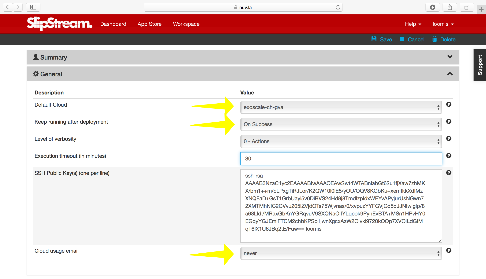
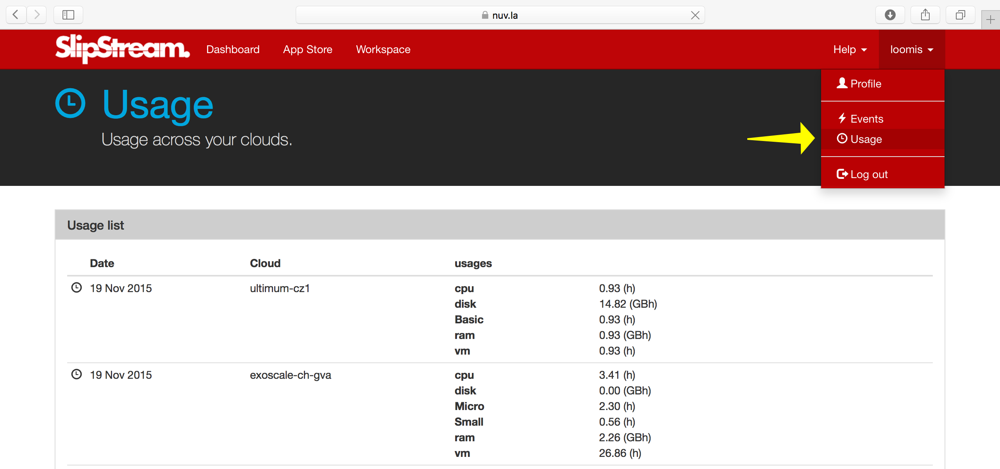

Web Interface
=============

Inline Tour
-----------

We postponed going through the inline tour of the SlipStream interface
to allow us to concentrate on the configuration of our cloud
credentials.   We will go through that tour now because it:

- Provides a good overview of the major sections of the SlipStream web
  interface and
- Verifies that our user profile and cloud accounts have been
  configured correctly.

To activate the tour, choose the "Start guided tour" option below the
"Help" menu.  You should see a splash screen like the following:

Click on the "Yes, go for the tour!" button to follow the tour.  This
will lead you through the interface and show you how to deploy a
simple application from the App Store.

The tour is aimed at "Alice", but it is useful also for developers
("Clara") to see how the App Store can simplify the deployment of
cloud applications for end-users.

.. note::

   In the tour workflow, you were redirected to the run page after you
   started an application.  In the normal workflow, you are redirected
   to the dashboard instead.

.. admonition:: EXERCISES

   1. Follow the tour and verify that the Wordpress deployment works
      for your account.  If you have any problems, be sure to correct
      them before going on. 

User Profile
------------

You already saw and updated your user profile when you were
configuring your account earlier.  This page contains all of your user
parameters, several of which are worth pointing out explicitly.

The "Keep running after deployment" indicates what SlipStream will do
by default when it is finished deploying an application onto a cloud
infrastructure.  The default is "On success".  The possible values
are: 

- "On success"
    Leave the application running until you explicitly terminate it.

- "On error"
    Leave the application running only in the case of an error to
    allow you to debug the problems.

- "Never"
    Always terminate the application.

- "Always"
    Always leave the application running.

Pay attention to values that leave the applications running.  They
will continue to use cloud resources (and incur charges) until you
explicitly terminate them. 

The second parameter of interest is the "Cloud usage email"
option. You can choose either "daily" or "never".  If you choose
daily, you'll receive a daily reminder of your cloud resource usage.
This can be useful reminder to stop applications that you've forgotten
about! 

Usage
-----

In the menu under your username, you can also find the "Usage" page.
This page gives you a summary of your cloud usage (per day) over
time.  This is the information that will be emailed to you if you
activated that option. 

The usage is calculated each morning, so it will initially be empty.
It should show some activity tomorrow!

Events
------

SlipStream records events for important changes in the application
lifecycle.  These events can be used to understand the timeline of a
given application deployment.  All of the events related to your
account can be seen on the "Events" page, which can be found in the
menu under your username.

The page will look like the following screenshot.  You should have
events in the list related to the deployment of Wordpress from the web
interface tour. 

.. image:: images/screenshots/events.png
   :alt: Events Page
   :width: 70%
   :align: center

When trying to see events related to a particular application
deployment (run), visit the run page.  It contains a section with just
the events for that application. 

.. image:: images/screenshots/events-run.png
   :alt: Events Page
   :width: 70%
   :align: center

This page is also instructive because is shows the complete list of
application states.  From the events, you can also understand how much
time is spent in each state.
