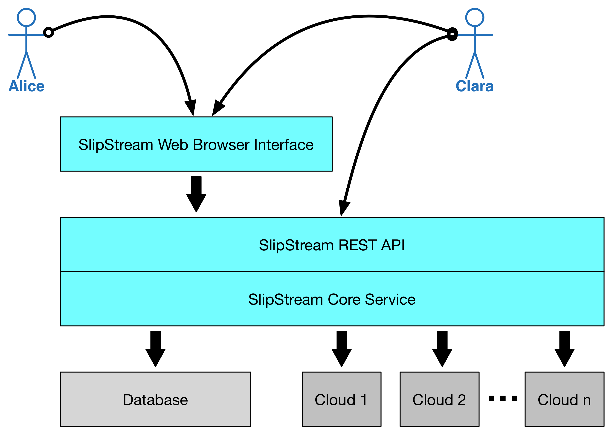

SlipStream's Role
=================

TO BE COMPLETED!!!

 - What are the primary problems with IaaS cloud platforms?

 - How does SlipStream address these?

 - Where does SlipStream fit into this?  Allows people to combine all
   types of IaaS clouds to build a customized cloud platform. 

ORIGINAL MATERIAL
-----------------

Although cloud technologies provide real benefits to their users, they
can also pose challenges. At the IaaS level for instance:

-  Cloud service providers use a variety of incompatible APIs
-  Virtual machine configurations are opaque making it hard to
   understand the actual state of an application
-  Users must manage individual virtual machines rather than an
   application as a whole which is tedious and error-prone

SlipStream is designed to overcome these challenges to make the

-  SlipStream is a **Multi-cloud Application Management Platform**.
-  SlipStream remains **neutral** with respect to different cloud
   infrastructures.
-  SlipStream captures **application knowledge** and **manages
   changes**.
-  SlipStream permits optimization of applications through **VM
   placement**, **minimizing start-up latencies**, and **resource
   scaling**.

Users and Benefits
------------------

A number of different types of people within an organization can benefit
from SlipStream. We're created personas to describe those people and how
they benefit.

+---------+--------------------------------------------------------------+
| |alice| |   **Alice** is busy working on different projects. She needs |
|         |   IT applications and resources, but has little patience for |
|         |   IT related issues. She benefits from the SlipStream App    |
|         |   Store where she can start the applications she needs with  |
|         |   one click.                                                 |
+---------+--------------------------------------------------------------+
| |bob|   | **Bob** manages a number of workers taking advantage of      |
|         | cloud resources. He wants an overview of their use of        |
|         | those resources to understand costs and their evolving       |
|         | needs. SlipStream provides the ability to monitor resource   |
|         | utilization.                                                 |
+---------+--------------------------------------------------------------+
| |clara| | **Clara** develops cloud applications for people within      |
|         | her organization. She benefits from SlipStream be creating   |
|         | a rich catalog of services that can be automatically and     |
|         | reliably deployed.                                           |
+---------+--------------------------------------------------------------+
| |dave|  | **Dave** manages the SlipStream installation. He's able to   |
|         | integrate his own cloud infrastructure into SlipStream and   |
|         | control what external cloud resources are available to his   |
|         | users.                                                       |
+---------+--------------------------------------------------------------+

Interacting with SlipStream
---------------------------

This tutorial focuses primarily on "Clara", showing how applications can
be brought into SlipStream and made available to the "Alices" in her
organization.

Most of the time, the SlipStream users will interact with the service
through the web browser interface. This provides a graphical view of the
user's applications and makes it easy to control those applications.

However the core of SlipStream is its REST API. SlipStream and its API
are resource-oriented and uses the standard HTTP verbs to implement
SCRUD (search, create, read, update, delete) actions for those
resources. The REST API exposes the complete functionality of the
service and in fact, the web browser interface is built on top of the
API.

Clara may use the REST API directly to incorporate SlipStream in the
deployment and operation processes of the organization or to add or
remove machines from a running application.

   ss-blocks

.. |bob| image:: media/bob.png
   :height: 115
   :width: 100

.. |clara| image:: media/clara.png
   :height: 115
   :width: 100

