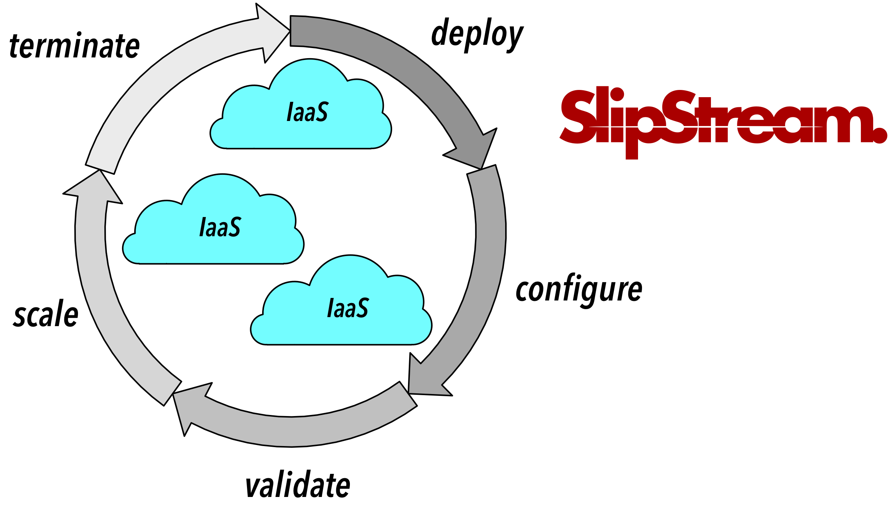

What is SlipStream?
===================

**SlipStream**, developed by SixSq_, is a **multi-cloud application
management platform**.

Using resources from **Infrastructure as a Service (IaaS)** cloud
infrastructures, SlipStream manages cloud application through the full
lifecycle: deployment, configuration, validation, scaling, and
termination.

.. _SixSq: http://sixsq.com
