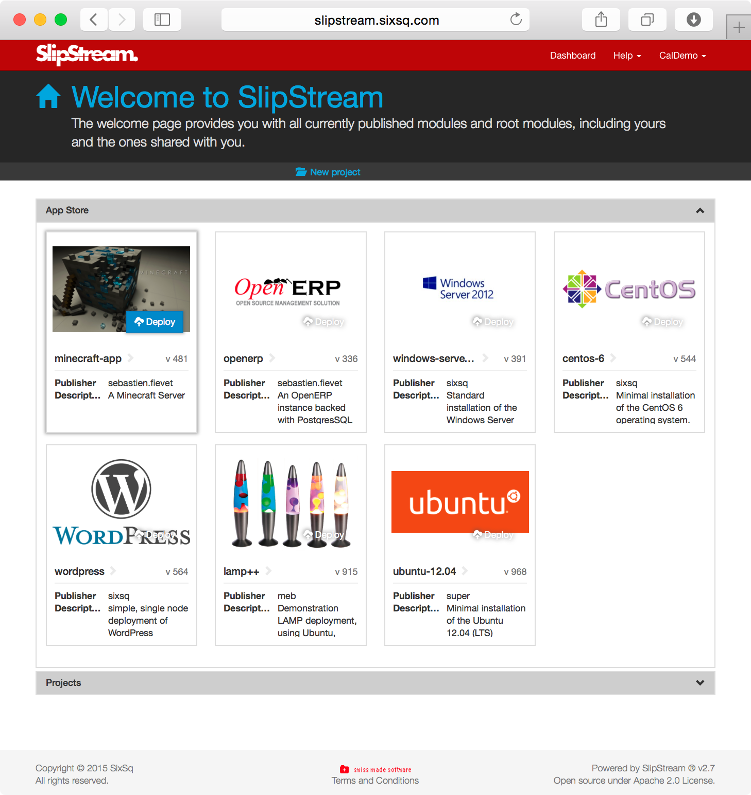
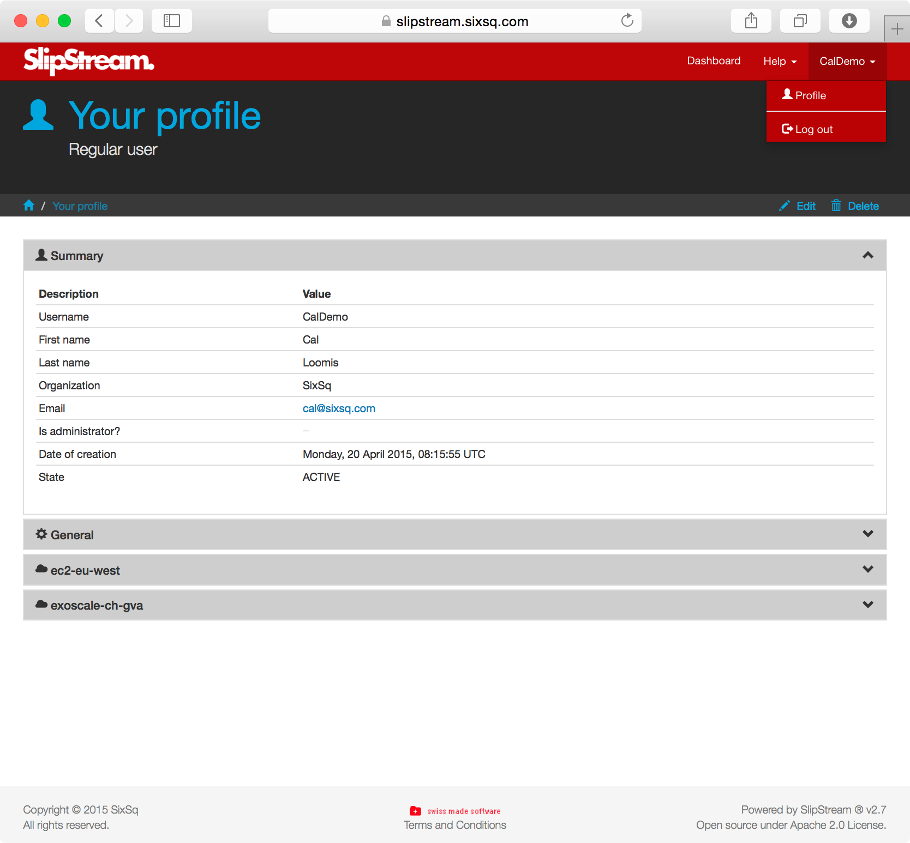
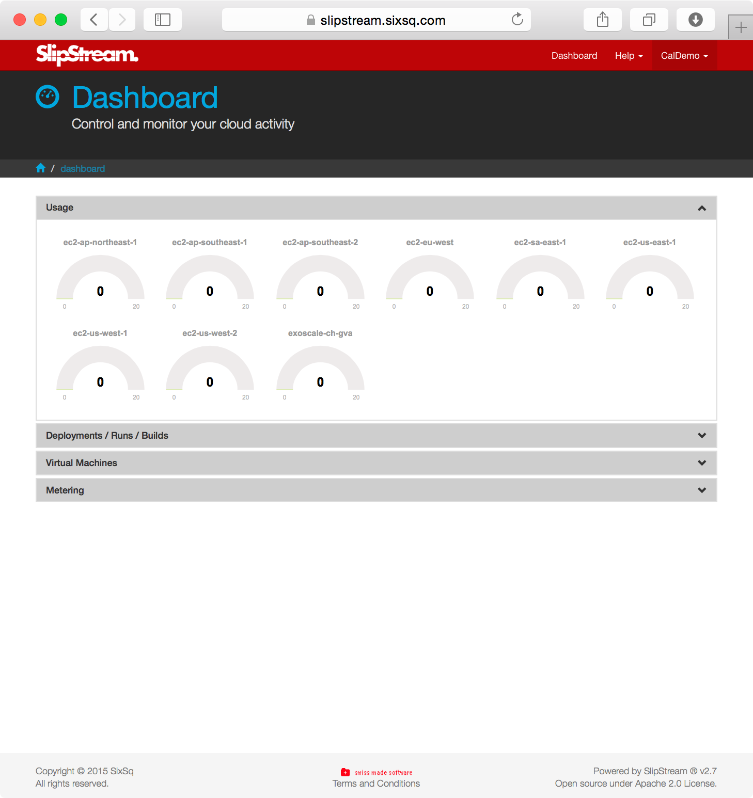
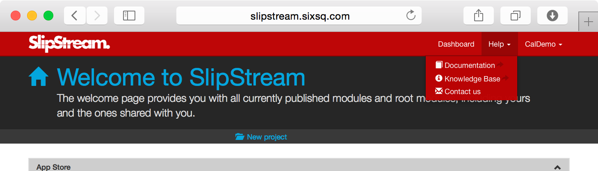

Web Interface Tour
==================

Home Page
---------

The home page is the first page you will see after logging into the
server. The main components of this page are:

-  The menu bar at the top of the page (and all pages) provides links to
   the other major pages within the application, notably the dashboard
   and user profile.
-  The first accordian section of the page is the SlipStream App Store,
   containing predefined applications that can be launced at the click
   of a button.
-  The second accordian section contains a hierarchy of your own modules
   and those that have been shared with you.
-  The footer contains information about the version of SlipStream being
   used and legal information.

   home\_page

User Profile
------------

Your user profile can be opened by hovering over your name in the menu
bar and clicking on "Profile". This submenu also allows you to log out
of the application. The main components are:

-  The first accordian section ("Summary") contains your personal
   information, including your password.
-  The second section ("General") contains your SlipStream preferences,
   most importantly the default behavior when running applications and
   your SSH key.
-  The remaining sections contain your credentials for individual cloud
   services.

To change the information in your profile, you click on the "Edit"
button, make your changes, and then click on "Save".

   user\_profile

Dashboard
---------

The dashboard contains an overview of your activity on all of the
configured clouds. The sections are:

-  The "Usage" section gives a quick visual overview of the number of
   your machines running on each cloud service.
-  The "Deployments/Runs/Builds" section gives a full list of recent
   applications, with links to a detailed "Run" page and the module
   definition.
-  The "Virtual Machines" section provides a detailed list of the
   virtual machines that are running on each cloud and the associated
   SlipStream "Run" (if any).
-  The last section "Metering" provides a time-based overview of your
   activity on the clouds.

   dashboard

Sources of Documentation
------------------------

From the main menu bar, you can also find links to relevant
documentation resources and access to the SlipStream support address.

   help
