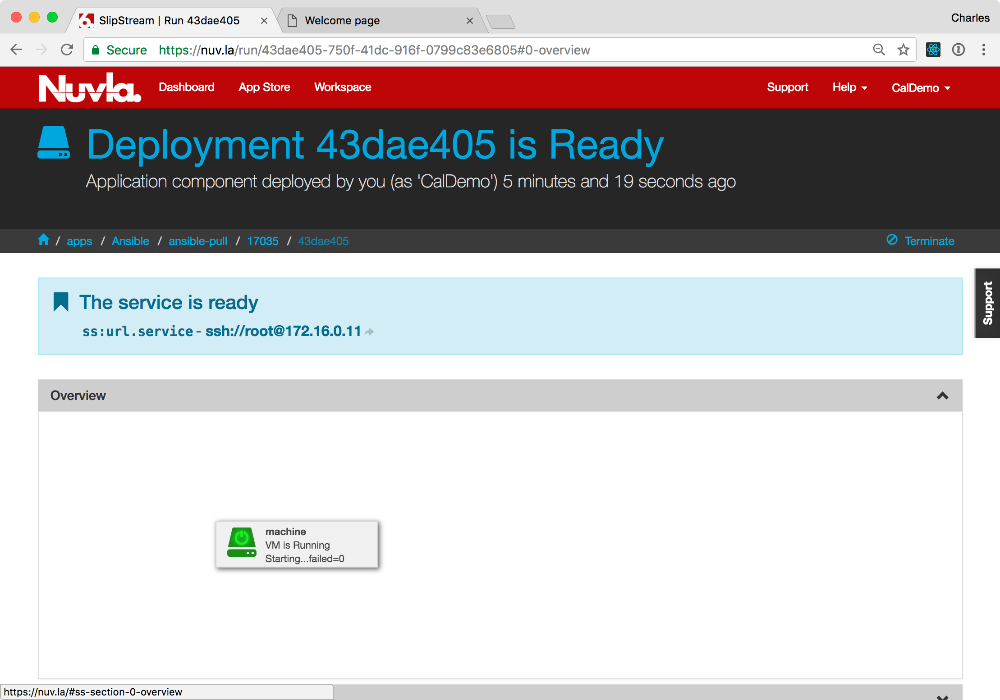
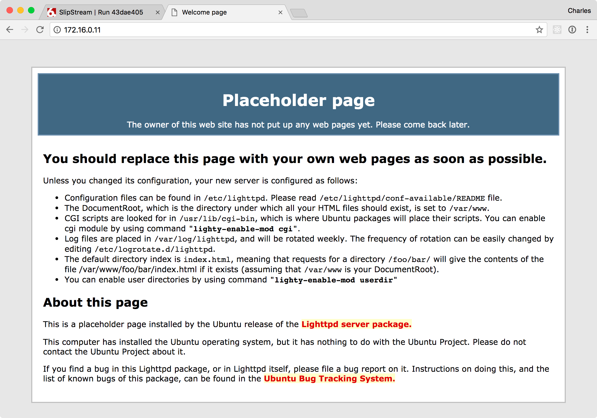
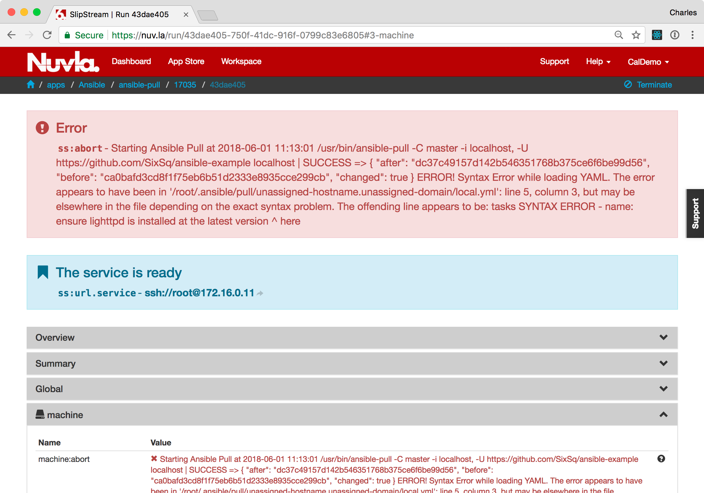
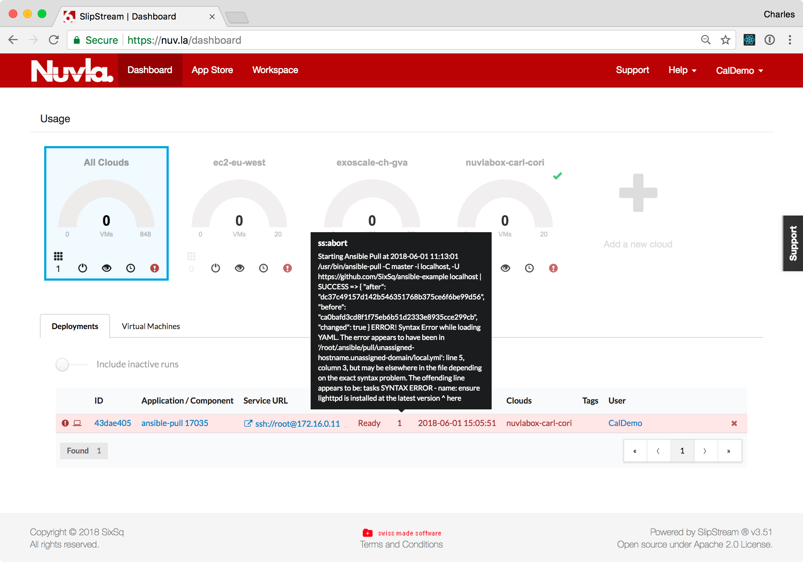

Configuration Management
========================

Although cloud-based systems encourage the upgrades via redeployment
of services, many scenarios still call for the use of traditional
configuration management systems.  These systems, for example, may
minimize network traffic to the edge during the update cycle or may be
deeply embedded in your business' operations processes.

Ansible_, Puppet_, Chef_, Salt_, and Quattor_ are just a few of the
available configuration management systems.  Given the large number of
these systems, NuvlaCity, by design, remains independent of them,
allowing you to leverage the knowledge in your existing configuration
management platform, whatever it is.

To demonstrate how configuration management systems can be integrated
with the NuvlaCity management workflows, we will walk through a simple
deployment that uses Ansible.

Ansible Component
-----------------

A generic `Ansible Pull`_ SlipStream component has been developed to
show how easily configuration management systems can be integrated
with the NuvlaCity platform.  The example builds on Ubuntu 16.04,
installs git and ansible, and uses a short (40 line) shell script to
integrate with NuvlaCity.

Ansible Repository
------------------

As the example runs in "pull" mode, a repository of Ansible playbooks
must be available.  We use a public GitHub repository,
`ansible-example <https://github.com/SixSq/ansible-example>`_, for the
demonstration.

Scenario Overview
-----------------

During the demonstration, we will perform the following actions:

 - Deployment of the "ansible pull" component,
 - Verification that the deployment starts a machine with the lighttpd
   web server,
 - Make an invalid modification to the playbook and verify that Nuvla
   raises the abort flag,
 - Correct the playbook and verify that the abort flag is cleared,
 - Switch from lighttpd to nginx for the web server,
 - Verify that the nginx server is now available on the machine.

The demonstration provides a complete overview of how configuration
management systems can be easily integrated with NuvlaCity.

Deploy Ansible Pull
-------------------

When logged into your account on Nuvla:

 - Navigate to the `Ansible Pull`_ component and
 - Click "Deploy...".

You should see a deployment dialog similar to the following
screenshot.

On the deployment dialog:
   
 - Choose the target NuvlaBox,
 - Adjust the cron schedule to every minute,
 - Provide the URL of a Git repository that contains the demonstration
   playbook and **that you can update**, and
 - Click "Deploy Application Component".

This will take you to the deployment page.

Click on the deployment ID to see the details of the deployment.  Wait
for this component to start on the NuvlaBox that you have chosen.
   

Verify Correct Deployment
-------------------------

If the deployment worked correctly, the deployment should have ended
in a "Ready" state and a successful Ansible update result should be
available from the ``machine:statecustom`` parameter.

To see the ansible result, open the "Machine" section by clicking on
the header. Look for the ``machine:statecustom`` parameter.  The value
should be similar to the one in the following screenshot.

The message should contain "SUCCESS" and the Git hash values related
to the change. 

The playbook should have started the lighttpd HTTP server on
port 80. Browse to the deployed machine, to verify that you see the
lighttpd welcome page.

If everything's gone according to plan, you will see the welcome
page.  Moreover, Ansible is still active, checking for updates every
minute.

Invalid Playbook
----------------

To show that Ansible is indeed polling for configuration changes and
that the component will make errors visible through the Nuvla
interface, we will modify the playbook with an **invalid
configuration**. 

When Ansible next tries to update the machine, the component will
enter the "abort" state and will display the Ansible error.  In this
case, it should complain about the syntax of the YAML file.

This status can also be seen from the dashboard.

Corrected Playbook
------------------

We will now correct the playbook and switch from lighttpd to nginx as
the web server. To do this:

 - Fix the syntax error that was introduced,
 - For lighttpd, set "enabled" to "no",
 - For lighttpd, set "state" to "stopped",
 - Uncomment the nginx section.

The resulting playbook should look like the following screenshot.

Once this playbook is saved, Ansible should update the machine with
the changes and the abort status should be cleared.

Visiting the same web server URL should now show the nginx welcome
page instead of the lighttpd page that was seen before.

As before, the machine will continue to check for configuration
changes and apply them as necessary.

Terminating the Deployment
--------------------------

The machine can be terminated by either clicking on the "x" next to
the deployment on the Dashboard or on the "Terminate..." action on the
deployment detail page.

Summary
-------

The demonstration showed how easy it is to use configuration
management systems with NuvlaCity.  You only need to create a "shell"
SlipStream component that references your preferred operating system
and provide a short script to inform Nuvla about the success or
failure of updates. 

.. _Ansible: https://www.ansible.com/

.. _Puppet: https://puppet.com/

.. _Chef: https://www.chef.io/chef/

.. _Salt: https://saltstack.com/community/

.. _Quattor: https://www.quattor.org/

.. _Ansible Pull: https://nuv.la/module/apps/Ansible/ansible-pull

