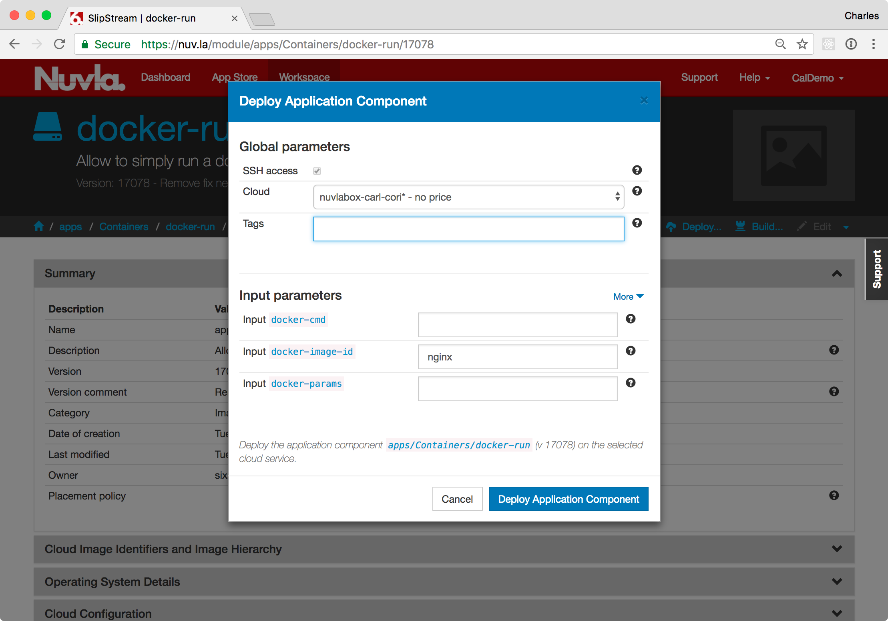
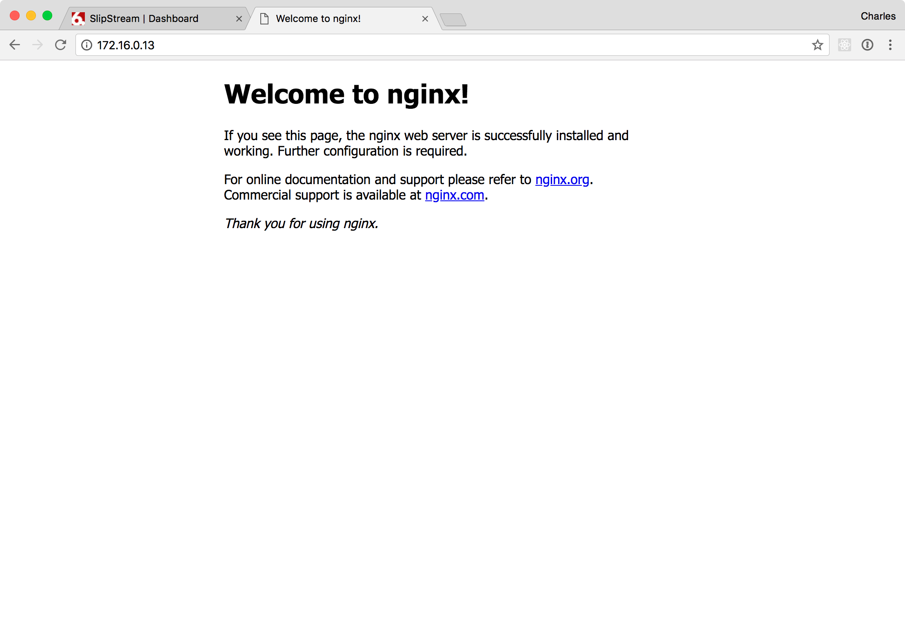
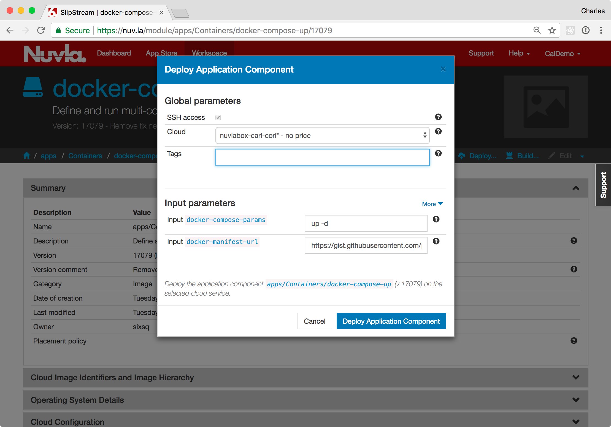

Container Management
====================

Docker_ and `Docker Hub`_ have popularized containers as a way to
conveniently package and distribute applications.  In addition, they
start up rapidly and consume less resources than hypervisor-based
virtual environments.

NuvlaCity targets container technologies to allow users to take
advantage of their benefits, especially on resource-constrained
hardware that is common in edge-computing environments. Although
planned, NuvlaCity does not yet treat containers as first-class
entities, instead deploying containers with virtual machines. This
technique allows containers to be exploited now with NuvlaCity.

Single Container Deployment
---------------------------

Nuvla contains an application component called docker-run_ that allows
you to deploy a named container from the Docker Hub.  To deploy this
component:

 - Navigate to the docker-run_ module,
 - Click on the "Deploy..." action,
 - Choose the NuvlaBox to target,
 - Select the container to run,
 - Provide the command and parameters (if any), and
 - Click the "Deploy Application Component" button.

By default, the component will run the nginx web server.  The
component exposes all ports from the container on the host virtual
machine.  In the case of nginx, the web server will be visible on
port 80.  The dialog you see should be similar to the following
screenshot.

You can follow the progress of the deployment either from the
Dashboard or from the deployment detail page (by clicking on the
deployment ID link).

Once the deployment reaches the "Ready" state, you can browse to port
80 on the deployed machine to verify that the nginx welcome page
appears.

.. image:: images/screenshots/docker-run-ready.png
   :width: 60%
   :align: center

From the deployment dialog you can choose any other image from the
Docker Hub by specifying its name and providing any necessary command
and/or parameters.

Docker Compose Deployment
-------------------------

Many times an application consists of a number of services working
together. For example, a Wordpress deployment needs to have a MySQL
database backing it. Within the Docker ecosystem, composite
applications like this are defined by Docker Compose files. The
``docker-compose`` command can be used to start/stop the entire
ensemble.

Nuvla contains an application component called docker-compose-up_ that
makes deployments of Docker Compose applications easy.  Similar to
what was done previously: 

 - Navigate to the docker-compose-up_ module,
 - Click on the "Deploy..." action,
 - Choose the NuvlaBox to target,
 - Provide the URL for the Docker Compose manifest,
 - Provide the ``docker-compose`` parameters, and 
 - Click the "Deploy Application Component" button.

The dialog you see should be similar to the following screenshot.

The default URL references a Docker Compose manifest that runs an
instance of Wordpress with a backing MySQL database. As before, the
component exposes all ports from the container on the host virtual
machine.  In this case, the Wordpress instance will be visible on port
80.

After the deployment reaches the "Ready" state, navigate to port 80 on
this machine with your web browser. You will have to do the initial
configuration of the Wordpress application.  Afterwards, you can click
on the "View Site" link from the Wordpress dashboard to see the list
of blogs.  The welcome page of Wordpress should look like the
following screenshot. 

Summary
-------

This section has shown you how to run containerized applications on
the NuvlaCity platform. Tighter integration of containers will be
offered in the future, but already containers can be an effective
mechanism for deploying applications on the NuvlaCity platform.

Support for private repositories or other customizations can be done
easily by copying the existing docker-run_ and docker-compose-up_
components and modifying them to suit your needs.

.. _Docker: https://www.docker.com/

.. _Docker Hub: https://hub.docker.com/

.. _docker-run: https://nuv.la/module/apps/Containers/docker-run

.. _docker-compose-up: https://nuv.la/module/apps/Containers/docker-compose-up

