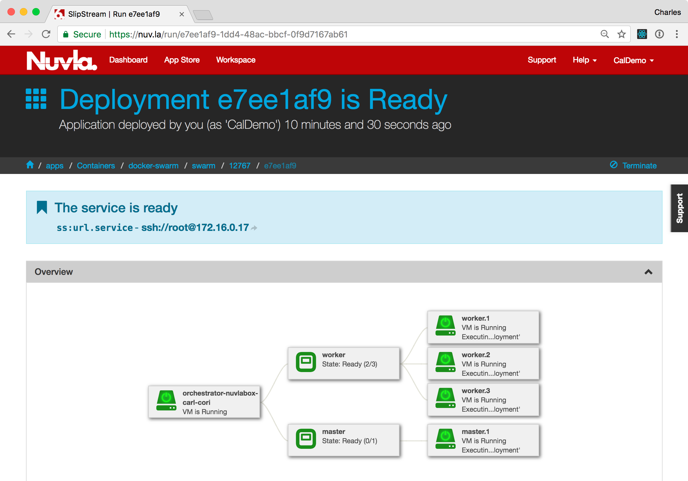

Container Orchestration
=======================

For production, container-based services, you will often want to take
advantage of a container orchestration engine to provide automated
fail-over, load balancing, replication, and other high-level
features.  The most popular container orchestration engines are
Kubernetes_, Mesos_, and `Docker Swarm`_.

Docker Swarm
------------

For resource-constrained environments like the NuvlaBox, we prefer to
use Docker Swarm as a container orchestration engine. It is simpler to
manage, more lightweight, and compatible with the standard Docker API.

Similar to the SlipStream components you have seen so far, Docker
Swarm is available in the Nuvla App Store. Unlike the other examples
however, this will be the first that involves multiple virtual
machines.  A Docker Swarm deployment consists of one master node and
one or more worker nodes.  Despite the additional complexity, a Docker
Swarm cluster can be deployed as easily as the other examples.

Find the Docker Swarm tile in the App Store and click the ``Deploy``
button to bring up the deployment dialog.  You will see that the
dialog is more complex than before.

On the dialog, you see a general section, where you can choose the
target infrastructure for all nodes.  (You can also choose different
infrastructures for different nodes, although we will not demonstrate
that here.)

Then there is a section for each node of the deployment.  Here there
are two: "master" and "worker".  By default, you will have one master
and one worker.  You can increase the number of workers.

Once you have set the target infrastructure and the node
multiplicities, click the ``Deploy Application`` button to start the
deployment.  As usual this will take you to the Dashboard where you
can follow the deployment process.

The deployment detail page will show the topology of the deployment
and provide the input/output parameter values for all of the deployed
nodes.

Note that the SlipStream application has handled the deployment of all
of the virtual machines and coordinated the configuration of each
node. 

Replicated Service
------------------

The features provided by Docker Swarm for managing "services" are
vast, so the SlipStream component does not try to provide a
parameterized interface to the system. To manage services on the
deployed Docker Swarm cluster, log into the master node via SSH. You
can find the IP address on the deployment detail page.

When you have logged in, you can check that the number of nodes agrees
with the number you requested::

  $ docker node ls
  
  ID                            HOSTNAME                                      STATUS              AVAILABILITY        MANAGER STATUS      ENGINE VERSION
  cax3ifys3ixoogt0025k1o8bc *   master1aab3929a-9167-4e73-8f65-29e33376b759   Ready               Active              Leader              18.03.1-ce
  wwzmkb2q61o4r0ooe4wu3ug6q     worker1aab3929a-9167-4e73-8f65-29e33376b759   Ready               Active                                  18.03.1-ce
  ic67gr0k1v0z5cin0fxvlcsd3     worker2aab3929a-9167-4e73-8f65-29e33376b759   Ready               Active                                  18.03.1-ce
  awd7cdf05i37xq4wmv4kubyb7     worker3aab3929a-9167-4e73-8f65-29e33376b759   Ready               Active                                  18.03.1-ce

We asked for 1 master and 3 workers.  They are all present and
accounted for.

Now let's use the Swarm to deploy a replicated nginx service.  This
command will run 3 replicas of nginx and make the service available on
port 8080 from any node of the cluster::

  $ docker service create --name nuvlacity_swarm \
                          --replicas 3 \
                          --publish published=8080,target=80 \
                          nginx

  72ecrbhuy8p8o3h6jpmtn7v8c
  overall progress: 3 out of 3 tasks 
  1/3: running   [==================================================>] 
  2/3: running   [==================================================>] 
  3/3: running   [==================================================>] 
  verify: Service converged 

You can then check that the service is running with the correct
configuration::

  $ docker service ls

  ID                  NAME                MODE                REPLICAS            IMAGE               PORTS
  72ecrbhuy8p8        nuvlacity_swarm     replicated          3/3                 nginx:latest        *:8080->80/tcp

The nginx server should respond from any node within the cluster. You
can get the IP address of the nodes through Nuvla or via Docker::

  $ docker node inspect -f '{{ .Status.Addr  }}' wwzmkb2q61o4r0ooe4wu3ug6q
  159.100.241.48
  
Using ``curl`` to get the page content::

  swarm-master# curl 159.100.241.48:8080
  
  <!DOCTYPE html>
  ...
  <h1>Welcome to nginx!</h1>
  ...
  </html>

You can verify that this works from all nodes of the Docker Swarm
cluster. 

Summary
-------

With Nuvla, you can deploy a full container orchestration engine
easily, allowing you to take advantage of the replication, load
balancing, and other features. Tighter integration of SlipStream with
Docker Swarm is in the development roadmap.
  
.. _Kubernetes: https://kubernetes.io/

.. _Mesos: http://mesos.apache.org/

.. _Docker Swarm: https://docs.docker.com/engine/swarm/

