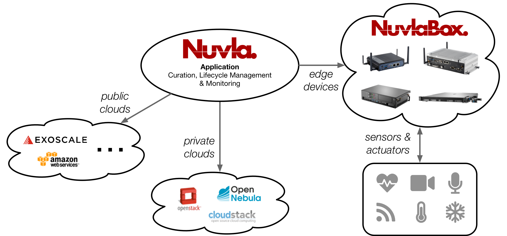

NuvlaCity
=========

NuvlaCity provides an edge computing platform that transparently
integrates a wide variety of cloud infrastructures and edge
devices.

 - **Nuvla**, a SlipStream service operated by SixSq, allows users to
   define, manage, and monitor their applications from a single point.
 - **NuvlaBox** machines (with varying capacities) provide edge
   computing capabilities near data sources and sensors.

**This demonstration covers the core elements and functionality of the
NuvlaCity platform.** In particular, it shows how you can:

 - Setup your account on **Nuvla** and manage applications.
 - Initialize a **NuvlaBox** and activate it through Nuvla.
 - Manage and monitor applications running with **virtual machines**.
 - Manage and monitor **Docker** (container-based) applications.
 - Deploy and use a container orchestration engine, specifically
   **Docker Swarm**. 
 - Update the state of running applications, with **Anisible** or
   other similar systems.

To make the demonstration as useful as possible, it uses concrete
container and configuration management technologies.  Keep in mind
however, that **NuvlaCity is a generic platform that allows a wide
variety of technologies to be used**.

.. toctree::
   :maxdepth: 1

   nuvla
   nuvlabox
   vm-mgt
   container-mgt
   container-orch
   cfg-mgt
