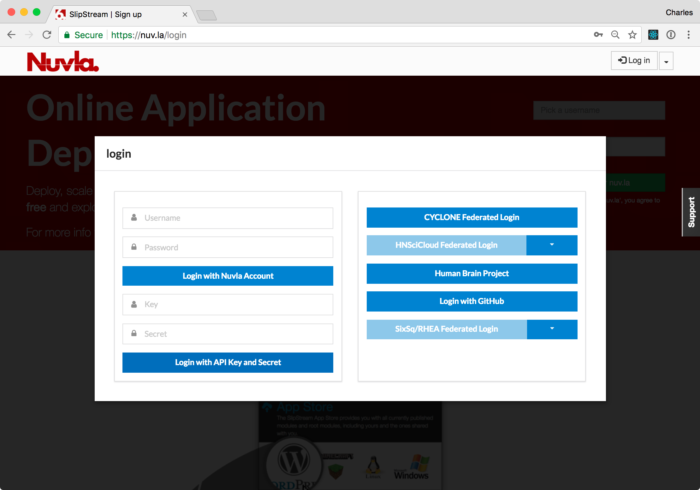
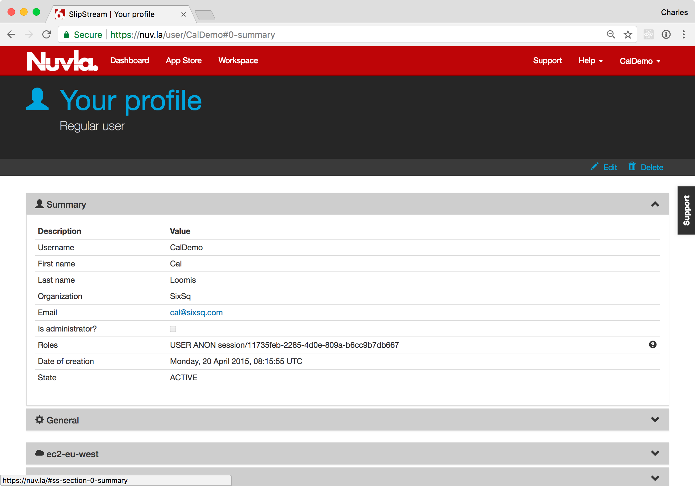

Nuvla
=====

Nuvla, a SlipStream service operated by SixSq, allows you to curate
your cloud applications, manage their lifecycle, and monitor them.  It
provides a convenient web browser interface that gives you an overview
of your applications and resources.  It also provides a complete REST
API to allow integration with other systems (but which is not covered
in this demonstration).

Account
-------

You will have been either asked to register to create an account or
provided with an account that has been created by the Nuvla
administrators. To log into your account:

 - Visit the Nuvla service at https://nuv.la,
 - Click on the ``Log in`` button in the upper-right corner,
 - Fill in your username and password,
 - Click on the ``Login with Nuvla Account``.

The first time you log in, you will be redirected to the App Store and
offered a tour.  Click one of the buttons to ignore the tour for now.
Subsequently, you will be redirected to the Dashboard.  Click on the
Dashboard menu item at the top to see your Dashboard.

On the Dashboard, you will see the clouds (and NuvlaBox edge devices)
you can access and an empty list of deployments.  The user in the
screenshot has access to one NuvlaBox device (nuvlabox-leo-esaki), one
region in the Exoscale_ cloud, and one region in AWS_ cloud.

User Profile
------------

Before proceeding, you need to setup or verify a few values in your
profile.  Open the menu item in the upper right corner and then click
on the "Profile" item.  You should then see a page similar to the
following screenshot.

Click on the ``Edit`` action and open the "General" section by
clicking on the header.  We will change three values:

 - **Default Cloud**: Change the value to your NuvlaBox device (or one
   of your NuvlaBox devices).  This will be the default value when
   deploying applications.
 - **Keep running after deployment**: Verify that this is set to "on
   success".  This will keep deployments running when then succeed. 
 - **SSH Public Key(s)**: Add your OpenSSL-formated, public SSH key.
   This allows you to log into deployed machines via SSH.

After the changed, click on the ``Save`` action.

Summary
-------

With the described actions, you should now have a Nuvla account that
is ready to be used for the rest of the demonstration.  You can
explore the various aspects of the Nuvla user interface before
preparing the NuvlaBox. 

.. _Exoscale: https://exoscale.ch

.. _AWS: https://aws.amazon.com/

