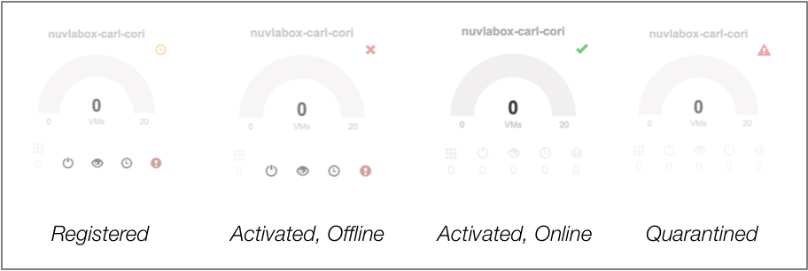

NuvlaBox
========

The NuvlaBox is a secure and intelligent edge computing solution that
integrates seamlessly with Nuvla, which provides management and a
unified view of your edge resources.  Hardware from `Hewlett Packard
Enterprise`_ (HPE) and `Logic Supply`_ are certified for the NuvlaBox
software.

This demonstration shows how to install the NuvlaBox software stack on
certified HPE hardware and then to activate the NuvlaBox to make it
accessible from Nuvla.

Network Access
--------------

**A NuvlaBox can be installed without a network connection, but it
must have a connection to be activated.**

The Internet connection must be provided via a physical ethernet cable
connected to the NuvlaBox machine's primary network interface. For
certified hardware with multiple ports, SixSq support can tell you
which ethernet port to use on your machine for the Internet
connection.

DHCP
~~~~

Your local network must be configured to provide an IPv4 address via
DHCP to the NuvlaBox machine. Static IP address assignment is
recommended.

Outbound Connectivity
~~~~~~~~~~~~~~~~~~~~~

It is strongly recommended that your firewall be configured to permit
**unrestricted outbound access** from the assigned IP address. As a
strict minimum, the firewall must allow access to port 443 (HTTPS) on
nuv.la; other ports may be required depending on which inbound
connectivity scenario is chosen.

Inbound Connectivity
~~~~~~~~~~~~~~~~~~~~

In many cases, inbound access to applications running on a NuvlaBox is
required.  The NuvlaBox can be configured is several ways to provide
this type of access.

 - By default, the NuvlaBox will provide direct access to applications
   running on the NuvlaBox to clients that are attached to the
   NuvlaBox's **local network**, either via a physical cable or via
   WiFi (if available).  The NuvlaBox bridges access to the Internet
   for client connected to the local network.  **This is the network
   configuration used in this demonstration.**

 - Nuvla and the NuvlaBox can be configured to **proxy ports to the
   nuvlabox.com domain**. This makes services running on those ports
   globally available to the Internet, although the number of
   available ports is limited.  This solution relies on SSH tunneling
   between Nuvla and the NuvlaBox.

 - The NuvlaBox can be integrated with the organization's **corporate
   network**. This allows full access to services running on the
   NuvlaBox from clients within the corporate network. This requires
   specific configuration of the NuvlaBox and the corporate network's
   DHCP server.

 - Finally, the NuvlaBox can be integrated with a **Virtual Private
   Network (VPN)**. This allows full access to services running on the
   NuvlaBox from other clients within the same VPN, but credentials
   for accessing the VPN must be managed.

You are invited to discuss with SixSq engineers which solution best
meets the requirements of your NuvlaBox deployment. 

Installation
------------

.. note:: If you order NuvlaBox machines directly through SixSq, the
   NuvlaBox software stack will already have been installed on the
   machines. If this case, you can skip ahead to the activation
   section.

.. note:: If your NuvlaBox is connected to the Internet during the
   installation process, then it will automatically perform **both**
   the installation and activation.

The installation and configuration of the NuvlaBox hardware is
accomplished by booting from an installation USB stick.

First, find a USB stick to use for the installation:

 - Obtain a USB stick with at least 2 GB of space.  Using a USB 3
   stick will allow faster installation, but USB 2 will work as well.
 - **The stick will be entirely reformatted.** Do not use a stick with
   data you want to save.
 - Attach the USB stick to the laptop (or other machine) that you will
   use to initialize the stick.

Second, download and copy the NuvlaBox installation image to your USB
stick.

 - Ask SixSq support for the URL to download the latest NuvlaBox USB
   image. 
 - Using this URL, download the image to a laptop where you have
   attached the USB stick.
 - Determine the USB device for your stick.
 - Perform a raw copy of the image to your USB stick.

On a Linux or Mac OS machine, the copy can be done with the command::

  $ dd ...

If you are on a Windows machine, there are a number of tools that can
be used to create a bootable USB stick from an image.  Use your
favorite!

Third, boot the target machine from the USB stick:

 - Plug the USB stick into target machine.
 - Turn on the machine.
 - Enter into the BIOS settings, on HPE machines this is usually
   accomplished by pressing the ``F10`` key while the machine boots.
 - In the BIOS, navigate to the boot options and force the machine to
   boot from the USB stick.
 - **Do not change the default boot device to the USB stick.**
 - Exit the BIOS and allow the machine to start from the USB stick.

Fourth, select the installation method.  The normal choice is the
default.

The machine will then boot several times; when the process is
finished, remove the USB key.

Activation
----------

A NuvlaBox must be "activated" before it can be used as a computing
resource from Nuvla.  The one-time registration activates a "NuvlaBox
connector" resource on Nuvla that is identified by the machine's MAC
address.

NuvlaBox Connectors
~~~~~~~~~~~~~~~~~~~

If you have purchased:

 - NuvlaBox hardware directly from SixSq, NuvlaBox connectors with the
   correct MAC addresses will already have been created and assigned
   to your Nuvla account(s).
 - Hardware from other suppliers, then you must provide SixSq with the
   MAC addresses of the machine(s) you will activate. SixSq will then
   create the necessary NuvlaBox connectors.

**The activation process will not succeed until the associated
NuvlaBox connector is available on Nuvla.**

.. note:: This activation can only be done once; further attempts to
   activate the same MAC address will fail.  This prevents someone
   else from impersonating your NuvlaBox with another machine.

.. note:: If a machine is compromised, you can quarantine the NuvlaBox
   connector on Nuvla.  This will deactivate the NuvlaBox and prevent
   any new workloads, data, etc. being sent to the machine.  A
   quarantined NuvlaBox can only be recovered with help from SixSq
   support.

Reboot to Activate
~~~~~~~~~~~~~~~~~~

To start the activation process, simply reboot the machine once the
machine has network access.  You can watch the progress from the
machine's console and see the activation status on the Nuvla
Dashboard.

(As a reminder, if network access was available during the
installation process, the machine will initiate the activation process
without a reboot.)

The Nuvla dashboard indicates the status of a NuvlaBox machine with an
icon in the upper-right corner of the tile:

 - For a NuvlaBox that has been **registered** with Nuvla (that is,
   the NuvlaBox connector with the correct MAC address is present),
   the dashboard will show the machine with a **yellow clock icon**.
 - When the activation process is complete, it will initially show the
   NuvlaBox to be **offline**.  This is indicated by a **red cross**.
 - After a final reboot, the machine will be **online**, indicated by
   a **green checkmark**.

Once it is online, applications can be started on the NuvlaBox
machine.  Like for all resources, the Dashboard will show the state of
those applications and provide the means to control them.

Summary
-------

In this section, you have seen how to install the NuvlaBox software
stack on a compatible machine and activate the machine so that it can
be used through Nuvla.  The following sections provide more details on
using the NuvlaBox to run your applications. 

.. _Hewlett Packard Enterprise: https://sixsq.com/products-and-services/nuvlabox/tech-spec#hpe

.. _Logic Supply: https://sixsq.com/products-and-services/nuvlabox/tech-spec#logic-supply
