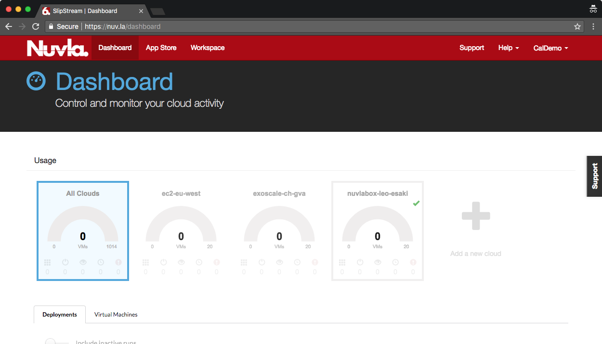

NuvlaBox
========

The NuvlaBox is a secure and intelligent edge computing solution that
integrates seamlessly with Nuvla, providing a unified view of your
edge resources.  Hardware from `Hewlett Packard Enterprise`_ (HPE) and
`Logic Supply`_ are certified for the NuvlaBox software.

This demonstration shows how to install the NuvlaBox software stack on
certified HPE hardware and then to activate the NuvlaBox to make it
accessible from Nuvla.

Installation
------------

If you order NuvlaBox machines directly through SixSq, the NuvlaBox
software stack will already have been installed on the machines. If
this is the case, you can skip ahead to the activation step.

The installation and configuration of the NuvlaBox hardware is
accomplished by booting from an installation USB stick.

First, obtain a USB stick to use:

 - Obtain a USB stick with at least 2 GB of space.  Using a USB 3
   stick will allow faster installation, but USB 2 will work as well.
 - **The stick will be entirely reformatted.** Do not use a stick with
   data you want to save.
 - Attach the USB stick to the laptop (or other machine) that you will
   use to initialize the stick.

Second, download and copy the NuvlaBox installation image to your USB
stick.

 - Download `NuvlaBox USB Image`_ to a laptop where you have attached
   the USB stick.
 - Determine the USB device for your stick.
 - Perform a raw copy of the image to your USB stick.

On a Linux or Mac OS machine, the copy can be done with the command::

  $ dd ...

If you are on a Windows machine, there are a number of tools that can
be used to create a bootable USB stick from an image.  Use your
favorite!

Third, boot the target machine from the USB stick:

 - Plug the USB stick into target machine.
 - Turn on the machine.
 - Enter into the BIOS settings, on HPE machines this is usually
   accomplished by pressing the ``F10`` key while the machine boots.
 - In the BIOS, navigate to the boot options and force the machine to
   boot from the USB stick.
 - **Do not change the default boot device to the USB stick.**
 - Exit the BIOS and allow the machine to start from the USB stick.

Fourth, select the installation method.  The normal choice is the
default.

The machine will then boot several times.  Finally, when the process
is finished, remove the USB key.

.. note:: If your NuvlaBox is connected to the Internet during the
   installation process, then it will automatically perform the
   activation process described below.

Network Connection
------------------

A NuvlaBox must be connected to the Internet to be activated.  This
must be done with a physical ethernet cable connected to the NuvlaBox
machine's primary network interface.

For certified hardware with multiple ports, SixSq support can tell you
which ethernet port to use on your machine for the Internet
connection.

.. warning:: Your local network must be configured to provide an IPv4
   address via DHCP. Your firewall should permit unrestricted
   **outbound** access from the assigned IP address and must allow
   access to port 443 (HTTPS) on nuv.la. 

Activation
----------

A NuvlaBox must be "activated" before it can be used as a computing
resource from Nuvla.  The one-time registration activates a "NuvlaBox
connector" resource on Nuvla that is identified by the machine's MAC
address.

NuvlaBox Connectors
~~~~~~~~~~~~~~~~~~~

If you have purchased:

 - NuvlaBox hardware directly from SixSq, NuvlaBox connectors with the
   correct MAC addresses will already have been created and assigned
   to your Nuvla account(s).
 - Hardware from other suppliers, then you must provide SixSq with the
   MAC addresses of the machine(s) you will activate. SixSq will then
   create the necessary NuvlaBox connectors.

**The activation process will not succeed until the associated
NuvlaBox connector is available on Nuvla.**

.. note:: This activation can only be done once; further attempts to
   activate the same MAC address will fail.  This prevents someone
   else from impersonating your NuvlaBox with another machine.

.. note:: If a machine is compromised, you can quarantine the NuvlaBox
   connector on Nuvla.  This will deactivate the NuvlaBox and prevent
   any new workloads, data, etc. being sent to the machine.  A
   quarantined NuvlaBox can only be recovered with help from SixSq
   support.

Reboot to Activate
~~~~~~~~~~~~~~~~~~

To start the activation process, simply reboot the machine.  You can
watch the progress from the machine's console and see the activation
status on the Nuvla Dashboard.

For a NuvlaBox that has been registered with Nuvla (that is, the
NuvlaBox connector with the correct MAC address is present), the
dashboard will show the machine but without a status indicator in the
upper right corner of the cloud's tile.

When the activation process is complete, it will initial show the
NuvlaBox to be offline.  This is indicated by a red cross in the
upper-right corner of the cloud's tile.

.. image:: images/screenshots/nuvlabox-offline.png
   :width: 60%
   :align: center

After a final reboot, the machine will be online.  This is indicated
by a green checkmark in the upper-right corder of the cloud's tile. 

Once it is online, applications can be started on the NuvlaBox
machine.  Like for all resources, the Dashboard will show the state of
those applications and provide the means to control them.

Summary
-------

In this section, you have seen how to install the NuvlaBox software
stack on a compatible machine and activate the machine so that it can
be used through Nuvla.  The following sections provide more details on
using the NuvlaBox to run your applications. 

.. _Hewlett Packard Enterprise: https://sixsq.com/products-and-services/nuvlabox/tech-spec#hpe

.. _Logic Supply: https://sixsq.com/products-and-services/nuvlabox/tech-spec#logic-supply

.. _NuvlaBox USB Image: https://example.com/to-be-provided-as-external-object

