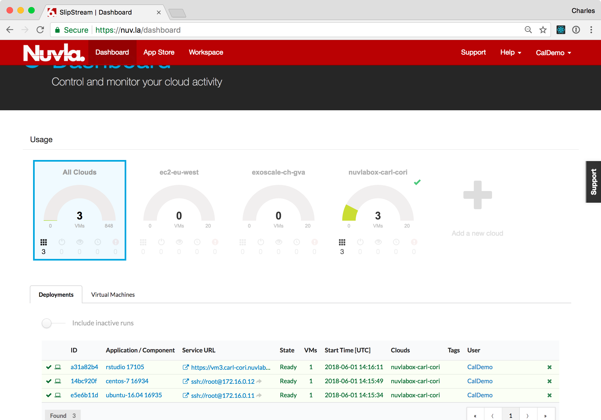
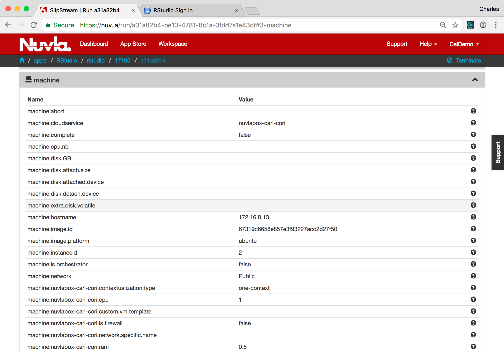

Virtual Machine Management
==========================

The NuvlaCity ecosystem allows you to define and to deploy cloud
applications across public clouds, private clouds, and NuvlaBox edge
devices.  Operators can deploy new application instances in a few
clicks and developers can create new applications with a minimum of
effort.

Minimal Operating Systems
-------------------------

SixSq maintains SlipStream components on Nuvla that reference base
operating system images that are (relatively) consistent across all
supported cloud infrastuctures.  The CentOS_ 7 and Ubuntu_ 16.04
operating systems are used most heavily and consequently, are embedded
in the NuvlaBox machines by default.

When you are logged into Nuvla, you can find these "native components"
in the Workspace:

  - `examples/images/centos-7
    <https://nuv.la/module/examples/images/centos-7>`_
  - `example/images/ubuntu-16.04
    <https://nuv.la/module/examples/images/ubuntu-16.04>`_ 

and in the Nuvla App Store.

New virtual machines based on these components can be provisioned by
clicking on the ``Deploy`` action on the component page in the
Workspace or on the tile's ``Deploy`` button in the App Store. Both
will bring up a deployment dialog.

From here, just select the target infrastructure, then click the
``Deploy Application Component`` button. This will take you to the
Dashboard, where you can follow the progress of the deployments. 

You can do the same for the CentOS 7 image as well.  Detailed
deployment information can be found by clicking on the deployment "ID"
link.

Once these are in the ready state, you can log into these machines
with SSH (provided you've configured your account with your public SSH
key).  Just click on the SSH link or use the IP address (with the
'root' account) from a terminal.

As the administrator of these machines, you can install and configure
any services you need for your application. 

When you're finished with them, you can free up resources by
terminating the machines.  Either click the "X" icon for the
deployment on the Dashboard or click the ``Terminate`` action on the
deployment page.

Preconfigured Applications
--------------------------

Although you have complete freedom with the minimal operating system
images, you will normally be running a small number of pre-defined
services. Application developers can create specialized SlipStream
components (single VM services) or applications (multiple VM
services) to automate the deployment.  This reduces the time to deploy
the services, as well as eliminating mistakes from manual steps.

There are many examples of pre-defined components and applications in
the App Store. Here we will demonstrate RStudio_, a web-browser
interface to the R statistical analysis program.

Find the RStudio tile in the App Store and click the ``Deploy`` button
to start it. The procedure for RStudio is the same as for CentOS 7 or
Ubuntu 16.04.

While RStudio is being deployed, you may want to review how the
RStudio component was created.  This information can be found on the
`RStudio component definition page
<https://nuv.la/module/apps/RStudio/rstudio>`_.

The information for the component is divided into sections. Click on
any of the section headers to see the details:

 - The **Summary** section provides general information about the
   component.  From here, you can also find the entire history of the
   component.
 - The **Cloud Image Identifiers and Image Hierarchy** section will
   show you the parent image.  For RStudio this is the Ubuntu 16.04
   image that we were using previously.
 - The **Application Parameters** section shows the input and output
   parameters for the component.  The output parameter of most
   interest for RStudio is the generated user password for the
   deployment.
 - The **Application Workflows** section shows the actions that are
   performed at each stage of the application lifecycle.  You can look
   at these scripts to understand how RStudio is configured and
   installed, as well as how it is integrated with the SlipStream
   parameter database.

The other sections also contain a few details of the deployment.

Once the deployment is ready, you can click on the provided link to
access the RStudio application.  You will immediately see that the
page requires a username and password.

This information is communicated to you via the component's output
parameters.  These can be found on the deployment page in the
"Machine" section.

With the provided username and password, you can log into the RStudio
console.  You should see a dashboard similar to the following
screenshot.

In the "Console" tab on the left you can type "demo(graphics)" to see
a demonstration of the RStudio graphics capabilities.  Just keep
hitting return to advance through the demo.

When you are finished, you can terminate the RStudio application with
the ``Terminate`` action.

Summary
-------

SlipStream allows you to define both simple and complex cloud
applications.  Once defined, you can manage the lifecycle of those
applications easily.  We will see an example of a complex application
when we deploy Docker Swarm later. 

.. _CentOS: https://www.centos.org/

.. _Ubuntu: https://www.ubuntu.com/

.. _RStudio: https://www.rstudio.com/ 
