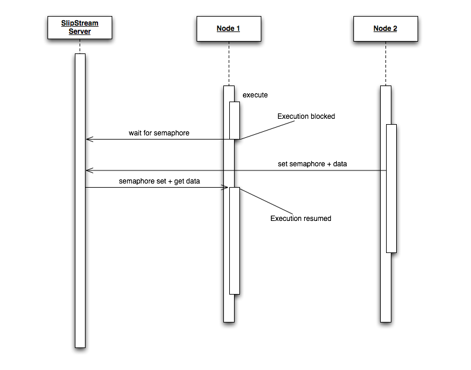
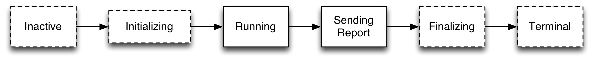

Introduction
============

Overview
========

SlipStream lets you deploy multi-tier systems in a near production
environment automatically, such that you can test your system under a
variety of conditions, in a continuous fashion and without having to
manage your own infrastructure. This document gives you an overview of
the functionality of SlipStream. This document is the companion of the
SlipStream Tutorial document, which presents SlipStream using a series
of specific examples. We suggest you work with both documents to get up
to speed quickly. You can also use the SlipStream mailing list at the
address: support@sixsq.com, if you have any questions.

The SlipStream application has two main workflows: *Image Creation* and
*Deployment*. Lets review these two workflows. The *Deployment* workflow
lets you deploy several virtual machines together, as part of a
consistent system. For example, you can deploy a 3-tier system, composed
of a client, a server and a database, all running on different machines.
You can also vary the number of machines running clients, servers and
databases, since they are parameterised in SlipStream, which gives you
great flexibility to explore different deployment models in a few simple
button clicks.

You can also deploy different deployments on different clouds, and even
deploy parts of a deployment on different clouds, simultaneously.

The underlying cloud environment that SlipStream targets cannot predict
hostnames or IP addresses. This is a common trait of *Infrastructure as
a Service* (IaaS) type clouds. To work around this limitation,
SlipStream provides a simple messaging API that can be used to such that
virtual machines can find each other (e.g. the server will need to know
what database's hostname to connect to, and similarly, the client will
need to be told what's the server's hostname). We describe this API in
section ? and you will find examples usage of this API in the tutorial
document mentioned above.

The building blocks of a deployment are machine images (i.e. virtual
images), which can also include disk images (i.e. mountable persistent
storage for machine images). The creation of these building blocks is
performed using the *Image Creation* workflow. We give a high-level
description of this workflow in the next section, with further details
in section ?.

Users can follow the execution of an image creation or a deployment
using the SlipStream dashboard, which provides a graphical
representation of execution. The dashboard represents each deployed
virtual machine, including its current state and custom information if
provided. At the end of all executions, a consolidated report is made
available to the user, including detailed log files, if configured, to
review the execution.

We also invite you to read the Best Practice (?) chapter, which provides
tips and tricks for troubleshooting and debugging executions. These best
practices take advantage of the fact that since we're using virtual
machines and a cloud environment, we can interrupt the execution of a
deployment or a machine image creation, log into the offending machine
and execute by hand part or all of the workflow. This way, you fix
problems very quickly and bring the required changes back to SlipStream
via the user interface, without spending time in trial and error
experiments.

Image Creation
==============

Before you can deploy your system with SlipStream, you will need to
choose machine images. For this you can start from already registered
virtual machines in the cloud environment that your SlipStream
installation targets, or create your own machine images, based on
existing base images. If the default base images provided in your
SlipStream installation are not appropriate, you can create new base
machine images. For this, please refer to the cloud providers
documentation.

By default, SlipStream ships with a few public machine image definitions
(e.g. Ubuntu, CentOS, Fedora). You'll find these base images in the
`Public` project in SlipStream.

From these base images, you can create custom images. ? shows the
different steps you can follow to create images. You can start from a
plain image (as in point 1). In this case you will have to create a new
machine image, referencing the plain image you want to base your image
on, and provide a `pre-recipe` script, if if necessary. This pre-recipe
script is responsible for installing the SlipStream client dependencies
onto the plain image (e.g. Python \>=2.6). If the plain image already
fulfills the SlipStream client dependencies, then the plain image can be
considered as a base image.. If not, you will have to build this image
using SlipStream. Once you have built this image, you will have a new
base image (as shown on point 4), which you can further customise. If
you start from a base image (point 2), which is the fastest and easiest
way to go, you can then provide a list of packages to install (a.k.a.
apt/yum for Linux based machines) and/or a recipe script. This will
install and configure your machine such that it can be (re)used for
further customisation (as in point 3) and/or used in an execution, as
part of a real deployment (point 5).

As mentioned above, machine images can be inherited, as shown on ?. The
inheritance mechanism is implemented using reference . Note that while
parameters are inherited, scripts (e.g. pre-recipes, recipe) and
packages are not inherited.

When creating a machine image, the SlipStream Server starts a dedicated
virtual machine called an Orchestrator. This is illustrated in ?.

Looking at the user interface for a machine image, you will see that we
can also define an *deployment scripts*. These are scripts that will be
executed during the execution of a machine image, every time the machine
boots as part of a deployment. We will look at these scripts in the next
section.

Now that we have looked at the highlights of the image creation
workflow, we will look at how to combine machine images into a
deployment model that can be executed to provision a multi-tier software
system in the cloud.

Deployment
==========

Deployments in SlipStream refers to the launch of a set of virtual
machines, as part of a coherent software system or multi-tier
application. We already mentioned the example of a
client/server/database 3-tier architecture. In this section we give an
overview of what a deployment is made of and how to take advantage of
the synchronisation feature SlipStream offers for controlling the
deployment of inter-dependent machines, and the coordination of the
services running inside these machines.

In the previous section, we briefly introduced the image creation model.
For *deployment*s, a similar model exists, as illustrated in ?. The
Orchestrator pattern is also used to control the instantiation of the
virtual machines that are described in the deployment model the user
wants to execute. In this diagram, the orchestrator instantiates three
virtual machines called: *Node 1*, *Node i* and *Node N*.

? introduces the concept of *node*, which is a terminology used by
SlipStream to associate machine image metadata with real virtual machine
instances. Section ? provides further details on the definition of
deployments. For now, what is important to understand is that machine
images, which can be generic units of reuse, can be combined, shared and
reused in flexible ways between different deployments. For example, the
same machine images (with or without extra disks attached) can be
combine together using different deployment models, such that they can
form the basis for a simple functional test, end-to-end system test or a
real application deployment. Further, increasing the number of nodes can
turn a basic deployment into a powerful performance or stress test, or
provide a real operational system. For example, you could use this
feature to deploy and test the same system with a range of back-end
databases, to verify the the system behaves correctly for all back-ends,
automatically, without having to deal with the manual work of deploying
and maintaining several back-end installations in your infrastructure.

The following figure (?) shows the high-level sequence diagram of a
deployment. The SlipStream Server launches a dedicated SlipStream
Orchestrator, a dedicated virtual machine for the execution of the
deployment. The orchestrator analyses the deployment model and launches
the required nodes (instances of machine images) and coordinates them.
This coordination includes a few rendezvous points during the deployment
for each node. This is described in further details a little later in
this section. As illustrated in ?, during the execution of each node,
the SlipStream client executes a set of user scripts. These scripts are:
*execute* and *report*. The execute script is there to call the normal
business logic for this node, while the report script's responsibility
is to gather all the logs and other important files and sources of
information to be added to the execution report. Once the execution
scripts have run and all the reports have been compiled and sent back to
the SlipStream Server, the orchestrator normally terminates the virtual
machines.

We already described the limitation that cloud environments have in
terms of not being able to predict IP addresses and hostnames. Further,
bootstrapping the deployment of a system on pristine resources is often
a challenge, since often software services are not design to be deployed
from scratch automatically. SlipStream offers a simple, yet efficient
and non-intrusive, mechanism to bootstrap the deployment process of
virtual machines, as well as providing a synchronisation mechanism
(a.k.a distributed semaphore-like logic) to control the way the machines
come to life, including services and their configuration. ? is a high
level sequence diagram showing how the synchronisation API is used such
that `Node 1` waits for a value set by `Node 2`. In this example, the
execute script runs until it hits a synchronisation point (using either
the SlipStream command-line client or Python API). At this point, the
script blocks, waiting for a key to be set. Once `Node 2` sets the key,
giving it an optional value, the blocked `Node 1` script resumes, using
the value associated with the key if necessary. While this
synchronisation mechanism allows simple key/value data exchange between
nodes (i.e. machine image instances) it is often used as a semaphore
mechanism for synchronization.

Deployments go through a simple set of states, as described in ?. In
this figure, states illustrated with a dotted lined boxes correspond to
states that are internal to SlipStream while boxes with a solid line
represent optional states where user scripts can be executed, if
defined.

It is worth noting that each virtual machine during a deployment
execution goes through these states, whether a failure is detected
during the deployment or not. Further, the SlipStream client will force
a synchronisation point at different points on the sequence. These
synchronisation points are the following:

-   After *Initializing*: allows each machine to have completed its boot
    sequence before the transition to the *Running* state is allowed.

-   After *Running*: ensures that the execution has completed before the
    *Report* scripts is executed. This is important such that the
    reports include all the actions that have taken place during the
    *Running* state.

Users can also instruct SlipStream to let the virtual machines running
if an error was detected during the deployment, or on the contrary, if
the deployment execution was successful. For further details on these
option, refer to section ?.
