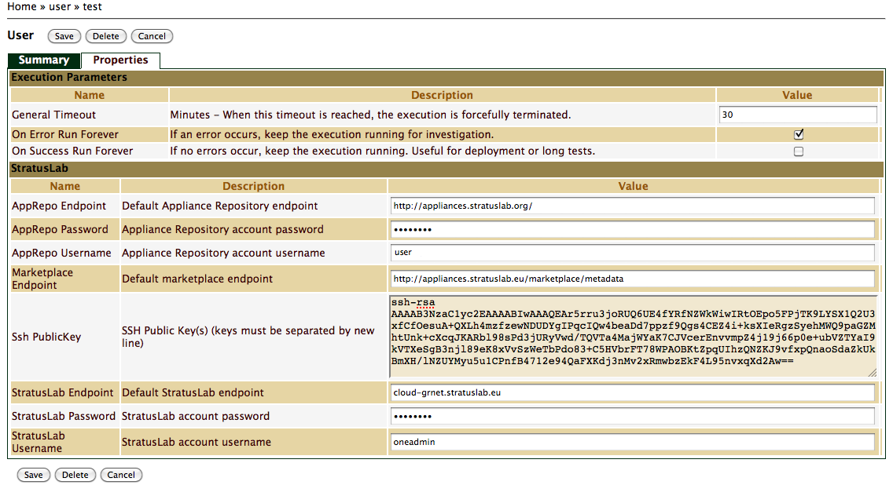

User Profile
============

Registration
============

SlipStream is a secured application, which requires authentication. New
users must create an account, following a simple online registration
process. To create an account select the *login* link at the top right
corner of any SlipStream page. On the login page, click on the
*Register* link.

On the registration page, fill all the required fields, identified with
a star (\*). You also need to read and accept the terms of the service.
Finally, click on the *Register* button to trigger the registration
process. Once your request has been accepted by the SlipStream
administrator, you will receive a confirmation email with a link to
activate your account. Once the account is activated, you will be able
to login and start using SlipStream.

Login
=====

Once you have an active account, you can login to SlipStream. From the
main SlipStream page, either select the *login* link at the top right
corner of the page, or simply select the *Start* link or the
corresponding icon on its left. You will then be directed to the *login*
page. To login, enter your user name and password in the appropriate
fields and hit the *Log in* button. Once you're logged in, you will see
your user name displayed at the top right of all SlipStream pages, as
well as a *logout* link.

Viewing Your Account
====================

To view your account details, login and go to your account page by
clicking on your user name at the top right of any SlipStream page. On
that page, you will have access to the *Summary* tab, selected by
default, as well as the *Properties* tab, if you have defined any
properties previously.

Editing Your Account
====================

To edit your account, login and go to your account page by clicking on
your user name at the top right of any SlipStream page. On that page hit
the *Edit* button.

Summary
-------

The default tab for the user account is the *Summary*. On that tab, your
can edit general information such as name and affiliation, as well as
email and password. If you are granted super user role, you turn your
account into a normal user by de-selecting the corresponding check-box.

Properties
----------

The *Properties* tab as shown on ? is composed of several groups.

### Execution Parameters

This group lets you to control the execution of your builds and
deployments:

On error run forever
:   When ticked, if the deployment execution fails, let all the virtual
    machines of this execution run forever. This is useful for
    troubleshooting failing deployments (see Reference Manual for
    details). Please note that with this option, all failing deployments
    will run forever, which means you have to terminate the virtual
    machines manually.

On success run forever
:   When ticked, if the deployment succeeds, let all the virtual
    machines of this execution run forever. This is useful when using
    SlipStream as a production deployment engine, or to further test
    deployed systems. With this option, the SlipStream Orchestrator will
    shutdown at the end of the successful deployment, only leaving the
    nodes running. Please note that with this option, all successful
    deployments will run forever, which means you have to terminate the
    virtual machines manually.

General timeout
:   This parameter controls the maximum time SlipStream will wait for
    during the execution of builds and deployments. This parameter also
    controls how long will blocking reads will wait before they timeout.
    Make sure to adjust this parameter if you build long running machine
    or disk images, as well as deployments.

### Cloud Properties

SlipStream uses a cloud infrastructure to build machine and disk images,
as well as to deploy your systems. Your account must be configured with
your cloud provider's credential, such that SlipStream can use these
credentials on your behalf.

**StratusLab Properties**

The following properties are specific to StratusLab type credentials.

StratusLab Endpoint (required to submit to StratusLab)
:   This is the endpoint to a private StratusLab cloud deployment.
    Usually this is just a hostname of the cloud front-end for which the
    the user was granted access via StratusLab Username/Password. This
    field is required to submit to StratusLab.

StratusLab Username (required to submit to StratusLab)
:   This field is required to submit to StratusLab.

StratusLab Password (required to submit to StratusLab)
:   This field is required to submit to StratusLab.

Marketplace Endpoint (required to submit to StratusLab and build images)
:   In StratusLab all images are referenced by IDs. StratusLab
    Marketplace is a searchable collection virtual machine images
    identified by the image IDs. This field is required to submit to
    StratusLab and build images.

AppRepo Endpoint (required to build images)
:   In StratusLab, images (appliances) physically are stored on the web
    and accessible via http/ftp protocol. Appliance Repository (AppRepo)
    Endpoint is URI pointing to a server capable of storing appliances.
    This field is required to build images.

AppRepo Username (required to build images)
:   This field is required to build images.

AppRepo Password (required to build images)
:   This field is required to build images.

Ssh PublicKey (required to submit to StratusLab; optional to build images)
:   SSH public key(s) (new-line separated list of keys is possible). At
    an image boot time, during the process of contexualization the
    key(s) will be placed in a respective location to allow you
    successive passwordless login to the running image instance. This
    field is required to submit to StratusLab and optional to build
    images.

