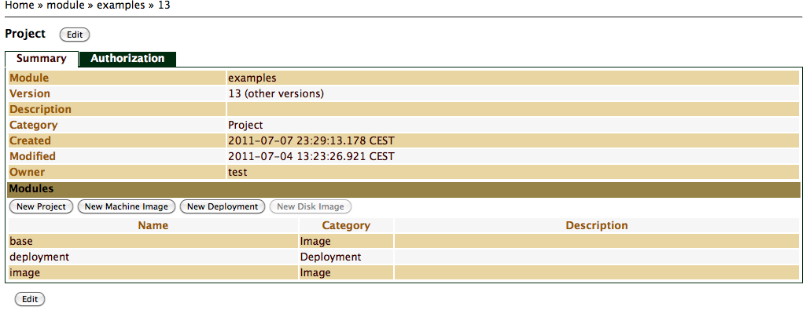

Project Module
==============

Introduction
============

*Projects* in SlipStream are similar to directories or folders in normal
file systems. They basically provide grouping. Projects can contain
other projects, which are normally used to organise all the other
metadata modules. Like all items in SlipStream, Projects are version
controlled and have specific access control parameters. By default,
Projects are private to their owner, but can be made public.

Root Project
============

SlipStream follows a *shared root project* model. This means that all
projects share the same namespace. This doesn't mean that your root
project must be public, on the contrary, it simply means that its name
must be unique with respect to other root projects. SlipStream will
report an error if you choose a name already used by another user.

To access the Root Project of the public installation, go here:
[slipstream.sixsq.com/projects](https://slipstream.sixsq.com/module).
Like most pages in SlipStream, this page requires to login to the
application. From this page, you will be able to create new projects by
clicking on the `New Project` link (see ?), or view existing projects,
that are either public or owned by you.

Standard Project
================

With the exception of the Root Project described above, which only
contains a list of projects your user has access to, sub-projects
contain further information. This information is described in this
section.

Viewing Project
---------------

To view a project details, navigate to the project by clicking on its
parent name from the root project. On the project page, you will have
access to the *Summary* tab (?), selected by default, as well as the
*Authorization* tab (?), which gives you access to the access control
parameters of the module.

Editing Project
---------------

To edit your account, navigate to the project by clicking on its parent
name from the root project. On the desired project page hit the *Edit*
button.

### Summary

The default tab for Project module is the *Summary*. On that tab, your
can edit general information such as description, as well as creating
new modules.

To create a new module (e.g. Sub-Project, Machine Image, Disk Image,
Deployment), press respective button in Modules sections of *Summary*
tab (?). You will then be redirected to a new page in which you'll be
able to fill the information corresponding to the new module.
