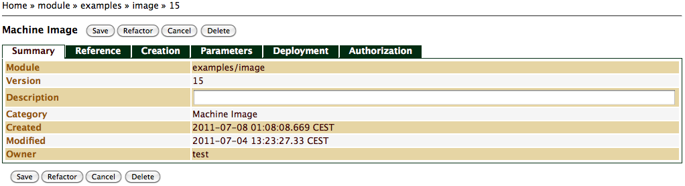
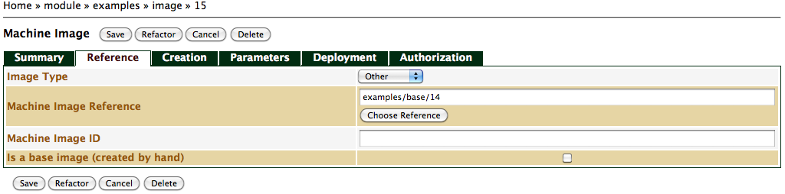
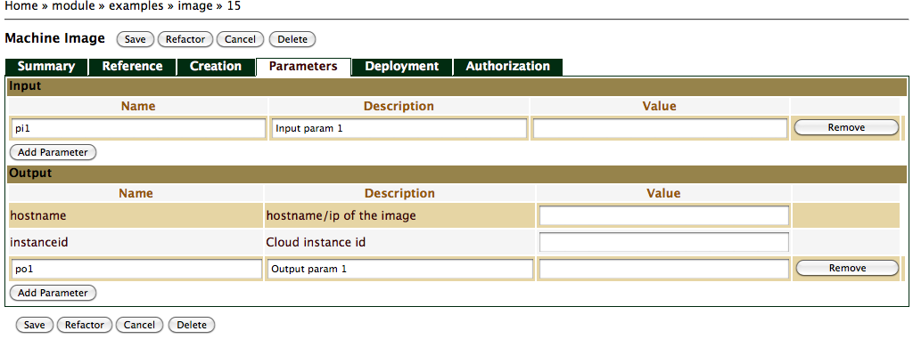

Machine Image Module
====================

Introduction
============

*Machine Image* in SlipStream is the model describing the creation of a
virtual machine image, as well as it behaviour during deployment
execution. The model can inherit from another machine image model, hence
extending the parent model. We encourage you to build parameterized
machine image models, such that you can more easily reuse them. The
model also includes a set of scripts, parameter and properties. The
machine image model includes two main groups of metadata. The first
group describes image creation, which include all the required
information for SlipStream to build a new machine image. The second
group is the deployment execution, which enables SlipStream to execute
the machine image (node) as part of a coherent multi-tier software
system. In this section, we describe both groups.

Viewing Machine Image
=====================

To view a machine image, navigate to the image module by clicking on its
parent name hierarchy from the root project. On the machine image page,
you will have access to the *Summary* tab, selected by default, as well
as several other tabs, described in details in the following section.
Note that only tabs with corresponding defined data are shown in view
mode, which de clutters the user interface.

Editing Machine Image
=====================

To edit a machine image, navigate to the image module by clicking on its
parent name hierarchy from the root project. On the desired image page
hit the *Edit* button.

Summary
-------

The default tab for Machine Image module is the *Summary* ?. On that
tab, your can edit general information such as description.

Reference
---------

As mentioned in the introduction, machine images can inherit from other
machine images. The *Reference tab* is where this information is
captured ?.

Image Type
:   The machine image type describes the type of machine image this
    module describes. For Amazon cloud choose *AMI* (Amazon Machine
    Image). For StratusLab cloud choose *Other*.

Machine Image Reference
:   If your model inherits from an existing SlipStream machine image,
    use this field to capture that data. To choose an existing machine
    image, simply hit the *Choose Reference* button, navigate to the
    model and hit the *Select* button. The referenced model has to have
    been built before you will be allowed to build this machine image,
    unless the machine image is virtual (see below for details on a
    virtual machine image).

    **Important**: If you are defining a plain image, which will be used
    as the reference for a stock image, this field must be left blank.

Machine Image ID
:   This field captures the underlying cloud service machine image
    unique identifier. When you successfully build a machine image, a
    new version of the corresponding module is automatically created by
    SlipStream, and the new machine image unique identifier assigned by
    the underlying cloud environment is set to this field. This is
    identifier is then used by SlipStream to identify the virtual
    machine to start during deployment execution.

    If you're defining a plain image, which will be used as a reference
    by a stock image, manually enter the corresponding machine image
    unique identifier of the plain image. This should be the only case
    for which you would be entering this value by hand. Other corner
    cases exists such at the case where you would be building a
    SlipStream machine image completely by hand, but we discourage you
    from doing this.

Creation
--------

The *Creation tab* ? contains the information required to build a new
machine image. Here are the details:

Bootstrap recipe
:   By default this field is collapsed and you'll have to click on the
    down arrow at the far right of the field title to expand the field
    in order to enter data. If the image you are creating is a stock
    image you need to provide a script responsible for installing the
    dependencies the SlipStream Client requires. The Tutorial document
    provides examples of bootstrap scripts and you'll also find examples
    in the public stock images that you can find
    [here](https://slipstream.sixsq.com/projects/Public/Images).

Packages
:   For Linux-like operating system, you can take advantage of the
    apt/yum installation mechanism that these types of operating system
    support. All packages listed in this field will be installed using
    either *yum* or *apt* (a local detection mechanism is implemented by
    the SlipStream Client). To add a package to the list, simply click
    on the `Add Package` button and fill the new added field. To remove
    an item on the list, simply click on the `Remove` button
    corresponding to this field. The order of the packages doesn't
    matter since the entire list is provided to the yum or apt command,
    which will internally sort-out the dependencies as a set.

Recipe
:   The *Recipe* is the main script where you can configure the machine.
    For example, any modifications to configuration files should be done
    here. You can also download other scripts and code, such that you
    can delegate the configuration to these scripts. We recommend that
    if you decide to delegate the configuration to other scripts, that
    these scripts are downloaded from version controlled sources.
    Further, you can use the SlipStream Client to fetch SlipStream
    properties (see next section), which allows you to parametrize your
    scripts, hence making them more manageable. The SlipStream Client
    also provides a few helper commands to modify simple key/value
    configuration files .

Note that if a machine or disk image doesn't have anything declared in
this tab, the image is considered *virtual*, which means that it doesn't
have to be created. This is useful if for example you decide to only use
Deployment information (see below), where the customisation of the
machine image is performed during the deployment. Another usage for
virtual images is similar to the concept of abstract classes in object
oriented programming languages. This means that the image can be
configured with parameters and properties, which will be inherited by
images setting a reference to a virtual image.

Parameters
----------

*Parameters* play an important role in SlipStream. They provide
key/value pairs used for the synchronisation and messaging API used
during the deployment execution. They also provide parametrisation
support for user scripts (e.g. recipes). Here are the different types of
properties you can define ?:

Input Parameters
:   Input parameters are used to declare that the machine image requires
    input information in order to configure itself. For example, the
    *hostname* or the *IP address* of a database for a server or a
    server for a client. Optionally, input parameters can have default
    values, which means that they do not have to be explicitly provided
    in each deployment. Unless a default value is provided, for a
    deployment to be valid, all its nodes (i.e. assigned machine images)
    must have their input parameters resolved, in other words all the
    input parameters must be either connected to output parameters of
    other nodes, or directly resolved as a quoted string. Input
    properties can be added by clicking on the *Add Parameter* button.

Output Parameters
:   As opposed to input parameters, output parameters are there to
    provide information about the machine or disk image that can be of
    interest for other machine or disk images. This information is
    typically dedicated to the clients running on different machines,
    wanting to access services running on the current machine.

Deployment
----------

As mentioned in the introduction of the chapter, the *Deployment tab* ?
contains scripts that will be executed every time a machine image is
used (as a node) during a deployment. This is in contrast with the
*Creation tab* that contains scripts and packages that are executed when
*creating* the machine image. As we were saying, deployment scripts
execute every time the machine image boots, as part of a deployment. To
understand deployment scripts, their role and what is expected of them,
we think that it's important to understand the states each deployments
go through, hence the deployment workflow.

Deployment scripts are called *targets* in SlipStream. To add a target,
simply click on the *Add Target* button. And to remove a script, click
on the corresponding script's *Remove* button. Here are the scripts that
can be defined (both are optional):

execute
:   During the *Execute state* of the machine image, the SlipStream
    Client executes this script, if defined. If the script executes a
    service, which must run for the entire duration of the deployment
    and if the image doesn't have knowledge of when the deployment must
    end, then tick the *Run in the background* check box. Doing this
    instructs the SlipStream Client to launch the script in the
    background, and continue the normal deployment workflow. If you do
    not tick this box, the script will block (even if you put it in the
    background using the *&* symbol in Linux/Unix systems), resulting in
    blocking the entire deployment, until the general timeout expires
    and the orchestrator terminates the deployment with an error.

report
:   By default, the SlipStream Client output are added to the report
    bundle (.tgz file) that you can access at the end of each
    deployment. If you require further information in this report
    bundle, simply implement this target. This target is often used to
    gather log files. The SlipStream Client expects that you put the
    files that you want added to the report bundle in
    `/tmp/slipstream/reports`.

