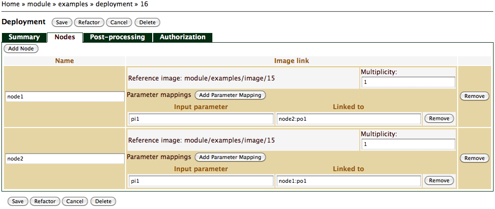
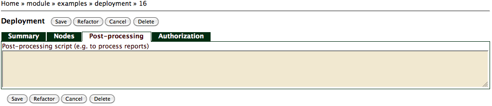

Deployment Module
=================

Introduction
============

*Deployment* in SlipStream is the model describing the deployment and
execution of a set of machine images, including disk images if defined.
These machine images are called *nodes* in a deployment model.

Viewing Deployment
==================

To view a deployment, navigate to the deployment module by clicking on
its parent name hierarchy from the root project. On the deployment page,
you will have access to the *Summary* tab ?, selected by default, as
well as several other tabs, described in details in the following
section. Note that only tabs with corresponding defined data are shown
in view mode, which de clutters the user interface.

Editing Deployment
==================

To edit a deployment, navigate to the deployment module by clicking on
its parent name hierarchy from the root project. On the desired
deployment page hit the *Edit* button. (This enables deletion of the
deployment module as well.)

Summary
-------

The default tab for Deployment module is the *Summary* ?. On that tab,
your can edit general information such as description.

Nodes
-----

Node on a *Nodes* tab ? is a machine image metadata associated with and
describing a real virtual machine instance. Each node has a unique name,
a link to a reference machine image and a multiplicity. One can add an
remove nodes. Nodes may require input parameters. The input parameters
are qualified by a name of the node providing the parameter (e.g.
node2:po1).

Post-processing
---------------

*Post-processing* tab ? allows for a definition of a script which will
be run after the deployment is finalized.

