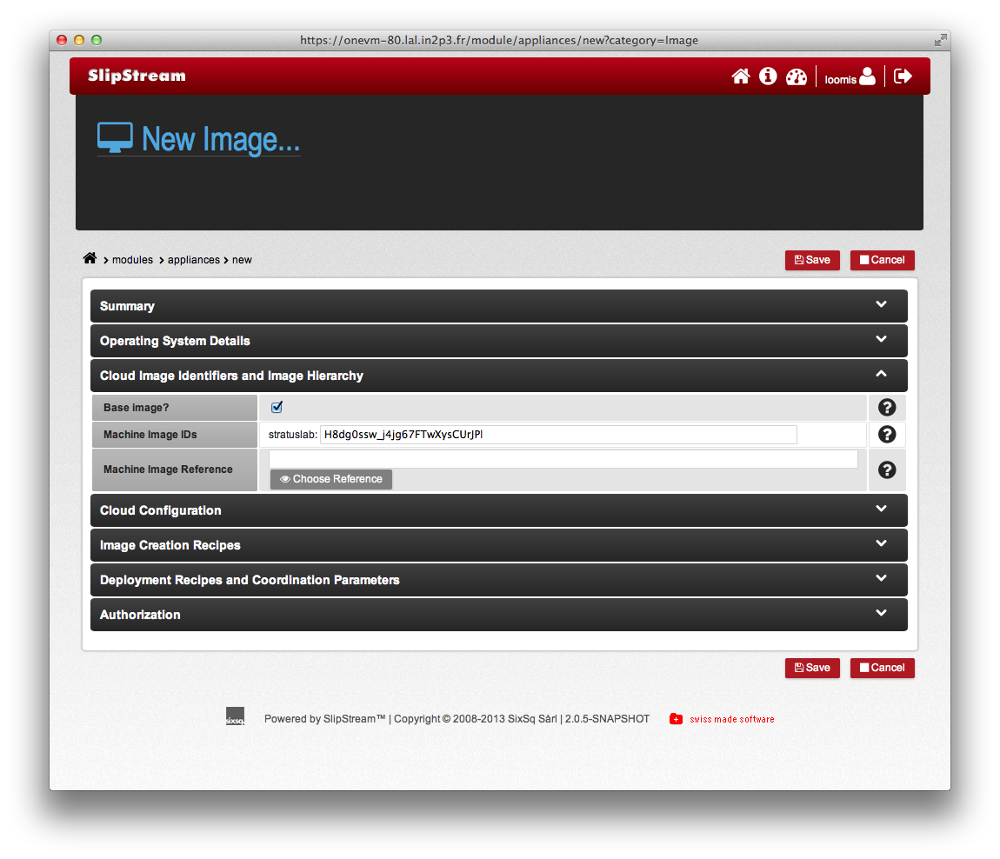
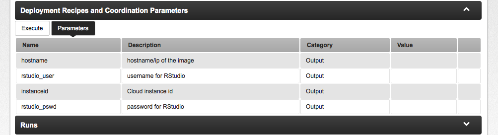

# Service Providers

Service providers can use SlipStream™ to define customized images and
full systems (batch clusters, LAMP applications, analysis platforms,
etc.) to create a **rich catalog of services** that end-users can
deploy with the click of a button.  You have seen two examples already
in the previous chapter.  Maintaining and expanding those services is
simplified by the ability of SlipStream™ to store and version the
procedures for creating them.

## Define Machines

One of the most powerful features of cloud technology is the ability
to provide fully customized, reproducible computing environments.
SlipStream™ allows its users to take advantage of this, while keeping
track of the knowledge required to build those images and to
understand their contents.

### Native Images

Unfortunately, it is next to impossible to create images that can be
easily and reliably run on all of the popular cloud platforms.
Because of this SlipStream™ references minimal images, called "native
images" in SlipStream™, within each cloud platform to use as starting
points for more complex, customized images.

As you saw previously, SlipStream™ provides a couple of these in the
"examples/images" module.  However, service providers will often want
to make a larger set of images available.

The majority of existing images for a cloud will be compatible with
SlipStream.  However the SlipStream bootstrap process does require a
couple of things:

1. the existance of `wget` on the machine and
2. `python` v2.x (v2.6+).

Any existing image for a cloud meeting those requirements can be used
as a native image for SlipStream™.

Specifically for StratusLab, all of the standard images already have
these dependencies.  To create new images, the procedure is the
following:

1. Log in as a non-priviledged user.  If you are planning to make 
the images available to others ("public"), then you probably want to
use the "SixSq" account that owns the examples, although any account
can be used.

2. In your home area, create a new project ("New Project" button) to
hold your images.  Provide an appropriate name for the project and
save it.

3. Within the project (which should be open now), click on the "New
Machine Image" button.  Provide an appropriate name and description.

4. Before saving this, open the "Cloud Image Identifiers..." section.
You then can click on the "Native image?" checkbox and provide the
StratusLab Marketplace identifier for the image (see the screenshot
below).

5. Now save the image.

This image can now be used through SlipStream like any other.  You can
launch an instance of it directly or include it in a deployment.  Note
that for native images, you can also provide deployment recipes and
coordination parameters.

If you look carefully at the screenshot, you will see that you can
provide a reference for each of the defined cloud connectors.  Even
though the actually images will not be identical in each cloud (they
are different images after all), they should be as functionally
equivalent as possible.  This allows users to define images which
build on these independently of the underlying cloud.

If you want to make this image available to other users, then see the
section on making modules public. 

### Creating Derived Images

Once an appropriate native image is available for a cloud
infrastructure, SlipStream™ can automate the generation of further
customized images.  The idea behind the image creation is simple:

1. Add a list of new packages to the machine.
2. Run a script defined by the user to configure the machine.

Once these are defined, SlipStream™ automates the creation of an
image.  These images are called "derived images" in SlipStream™.

> **NOTE**: Not all cloud connectors support the creation of new
> images.  If the connectors you are using does not, then you should
> not provide image creation packages or recipes.

You have already seen an example of a derived image.  The RStudio
image builds on the standard Ubuntu image, adding the RStudio
software, its dependencies, and configuring the server.  If you open
the RStudio appliance in the "examples/rstudio/rstudio-appliance"
module, you can see the dependencies listed for the RStudio.

You can also define an image creation "recipe" that runs after the
given packages have been installed and will make configuration (or
other) changes to the image.

For the RStudio appliance there are two tasks to be accomplished.
Because RStudio is not available via a package repository, it must be
downloaded and installed from the image creation script.  Second, the
RStudio service needs to be configured.  If you look in the "Image
Creation Recipes" section under the recipe tab you will see the script
used to accomplish these tasks. 

    #!/bin/bash -x

    #
    # install RStudio
    #
    wget http://download2.rstudio.org/rstudio-server-0.97.551-amd64.deb
    gdebi --non-interactive rstudio-server-0.97.551-amd64.deb

    #
    # put this on standard port
    #
    echo 'www-port=80' > /etc/rstudio/rserver.conf

    #
    # finish by upgrading entire system
    #
    apt-get -o DPkg::options::="--force-confdef" \
            -o DPkg::options::="--force-confold" \
            -y upgrade

Although not completely necessary, this script also does a full system
upgrade.  This is a good practice that ensures that created images
have all of the current security patches applied.

Another point to notice in the script is that the `gdebi` and
`apt-get` commands use options that make them **completely
non-interactive**.  The image creation process is automated and it is
imperative that scripts do not ask for input from the user.  If the
script does ask for input, the creation process will eventually time
out.

To launch the build process, click on the "Build" button for the
module.  As with other deployments, the progress can be followed on
the "Run" page for the deployment and on the dashboard.  Typically,
this is a rather time-consuming process (20-30 minutes) as the cloud
must perform the installation and configuration and then copy the
image contents.

> **Note that images that are not native images, and have image
> creation recipes or packages cannot be run until they have been
> built.**

Some clouds may also require some additional treatment after they have
been built.  For example, the created images must be signed and moved
to a public location for StratusLab.

### Deployment Scripts

Images may also define deployment parameters and scripts.  The script
is only run when the image is being started as part of a deployment
and is designed to handle configuration that must be done on a per-VM
basis.  The parameters provide a mechanism for publishing information
about the instance.

The RStudio deployment again provides a good example.  Looking at the
"Execute" tab under the "Deployment Receipes and Coordination
Parameters" section, you will find the following script.

    #!/bin/bash -x

    #
    # create a random password for ruser
    #
    ruser_password=`openssl rand -base64 8`
    crypt_ruser_password=`echo $ruser_password | openssl passwd -crypt
    # -stdin`

    #
    # create the ruser account with this password
    #
    adduser --quiet --disabled-password --gecos '' ruser
    usermod --password $crypt_ruser_password ruser

    #
    # publish password so user can log in
    # will be visible in machine parameters in SlipStream interface
    #
    ss-set rstudio_user ruser
    ss-set rstudio_pswd $ruser_password

    #
    # restart the server to ensure all changes are taken into account
    #
    rstudio-server restart 

    #
    # set the customstate to inform user that everything's ready
    #
    ss-set statecustom 'RStudio Ready!'

Authentication with the RStudio server is done via the local user
accounts on the system.  One should never configure an image with
fixed accounts and known passwords; this is a security issue waiting
to happen.  Instead the script dynamically creates a new user account
with a randomized password for every deployment.  The script also
restarts the service to take into account any change. 

Having a randomized password is not practical unless the legitimate
user can recover it.  In this case, the script uses the parameter
functionality of SlipStream™ to furnish this information to the user.
Under the "Parameters" tab in the "Deployment Recipes and Coordination
Parameters" section, you will find four parameters.  

The values for the "rstudio_user" and "rstudio_pswd" parameters were
published by this script using the `ss-set` command.  This is part of
the synchronization infrastructure of SlipStream™ that we will see in
more detail in the next section.

The other two output parameters "hostname" and "instanceid" are
automatically defined and set by SlipStream™.  They provide the
hostname (or more usually the IP address) of the virtual machine.  The
"instanceid" provides the virtual machine identifier within the cloud
being used.

## WordPress

The deployment of WordPress, a common blogging platform, is 
similar to the RStudio example.  A single customized appliance is
created using a few input parameters from the user.

For WordPress however, we will use Puppet to install and configure the
service.  Puppet is a machine configuration and management system that
allows a large number of services to be installed and configured
through published Puppet modules.

If you look in the deployment script for the
"examples/tutorials/wordpress-appliance" module, you will find the
following: 

    ss-display "Installing Puppet client"

    apt-get install -y puppet-common
    apt-get install -y rubygems
    gem install puppet-module

which installs the Puppet client.  The Puppet tools can then be used
to install the published module for WordPress:

    ss-display "Installing WordPress manifest"
    cd /etc/puppet/modules/
    puppet module install jonhadfield/wordpress

The next part of the script then retrieves the input parameters
defined by the user for the administrator password, etc. and
defined the Puppet configuration using those parameters. 

The `init.pp` executes a script that uses a `curl` command to perform
the service initialization.

The last part of the script, just invokes Puppet to do the actual
installation and configuration:

    ss-display "Installing WordPress"

    puppet apply -v wp.pp

    ss-display "Configuring WordPress"

    puppet apply -v init.pp

    ss-display "WordPress ready to go!"

You can then visit the deployed server with a brower to see the
WordPress interface.

The RStudio example used simple bash scripts to configure the service,
where for WordPress, Puppet was used.  SlipStream™ remains agnostic
towards the various service management toolkits; anything that can be
launched from a script can be used to manage SlipStream™ images and
deployments.

## Defining Systems

While being able to customize individual machines is powerful, most
real world systems consist of multiple machines.  This is often
required because of very different resource requirements for the
different components in the system and the desire to support scaling
the system in response to changes in demand.

To demonstrate the abilities of SlipStream™ in this area, we will
first revisit the Torque cluster example from the last chapter.

<!--
and then define a high-availability LAMP (Linux, Apache, MySQL, PHP)
application.
-->

### Coordinated Startup

Once services in a system are distributed over a set of machines,
coordination of the various services becomes an issue.  You may want
to ensure, for example, that your database is started (and configured)
before your application accepts requests.

SlipStream facilitates the **reliable, coordinated deployment** of
multi-machine systems by providing an infrastructure for passing
information between machines and synchronizing the start-up of
services.

For each deployment, SlipStream™ maintains a database (or more
accurately a key/value store) consisting of the input and output
parameters for each node in the deployment.  These values are
retrieved and set with the `ss-get` and `ss-set` commands,
respectively.  They are lightweight python scripts that are included
automatically in the path when running SlipStream™ scripts.  You have
already seen in the RStudio example, how output parameters are defined
and set.

To allow for coordination between services on different machines, the
parameters can act as semaphores.  Specifically, if the `ss-get`
command is invoked for a parameter and the parameter has not yet been
set, the command will wait.  Thus parameters can be used as
synchronization points in a deployment.  

> **Note that `ss-get` waits only until a timeout expires.  This timeout
> can be set by an option on the commandline.**

The SlipStream™ client provides a way to pass parameters between the
various nodes, allowing for example, the PHP frontend to discover the
location of the MySQL database.  Moreover, this system provides a way
to synchronize the startup of services to allow staged deployments of
services even if the virtual machines are deployed in bulk.

### Revisiting the Torque Cluster

To create a fully operational cluster, various pieces of information
must be passed between the master and the workers.  In particular,
credentials generated on the master must be passed to the workers and
the master needs to have the complete list of workers within the
cluster.

The complete deployment recipes for the master and worker nodes can be
found in the image modules in the "examples/torque" subproject.  The
following code will only highlight the points that concern the
information transfer between the nodes.

To manage authorizations between the nodes, torque is configured to
use the munge daemon.  Daemons which share the same key form a unified
authentication domain.  Importantly, the munge key must exist before
the munge daemon is started and the munge daemon must be started
before any of the torque daemons are started.

The deployment script for the master generates the key and starts the
daemon on the master.

    #
    # configure and start munge service
    #
    create-munge-key
    service munge start 

and then publishes the key into the "munge_key64" parameter. 

    #
    # set parameter with munge key to be shared with workers
    # value is the base64 encoded value of the binary file
    #
    ss-set munge_key64 `cat /etc/munge/munge.key | base64 --wrap 0`

The munge key is a binary file, but parameter values must be simple
text values.  A common technique, shown here, is to encode the value
with base64 into a single text value.

The deployment script for the workers imports the value, creates a
file with the correct contents, and starts the munge daemon.

    #
    # import the munge key from the server and start daemon
    #
    export munge_key64=`ss-get --timeout 480 master.1:munge_key64`
    echo $munge_key64 | base64 -d > /etc/munge/munge.key
    chown munge:munge /etc/munge/munge.key
    chmod 0400 /etc/munge/munge.key
    service munge start

Since the value was base64-encoded, it must be decoded before using
it.  Also note that a relatively long timeout has been set for the
`ss-get` command to allow the master to boot fully and to generate the
munge key. 

The last part of the Torque configuration for the server consists of
creating a "nodes" file listing all of the workers within the
cluster.  Only workers listed in this file will be able to participate
in the cluster.  The script does the following:

    #
    # pull in node names of all of the workers
    #
    for (( i=1; i <= `ss-get worker.1:multiplicity`; i++ )); do
      worker_ip=`ss-get --timeout 480 worker.$i:hostname`
      cmd="import socket; print socket.getfqdn('$worker_ip')"
      worker_hostname=`python -c "$cmd"`
      echo $worker_hostname >> /var/spool/torque/server_priv/nodes
    done

Again a long timeout has been used to allow the worker to boot fully.
Of more interest is how the number of workers and the hostname of each
worker are found.  The number of any type of node in a deployment is
always available from a parameter of the form:

    worker.1:multiplicity

where the "worker" is the name of the node, "1" is the index (starting
at 1), and "multiplicity" is the fixed name of the parameter.  The
parameter value of a particular instance can then be found by indexing
the parameter name.  The parameter

    worker.2:hostname

would provide the hostname of the second worker.  The above code uses
the multiplicity and indexing of parameters to create a node list with
all of the workers.  (The "magic" in the above code just ensures that
the value is really a name rather than an IP address to keep Torque
happy.)

The private SSH key for the created user account ("tuser") is
generated on the server, encoded, and passed to the workers similarly
to the way that the munge key was.  You may want to look in detail at
the SSH configuration for the master and workers, as this is a good
example on how to setup password-less SSH access between the nodes in
a cluster. 

Although the coordination of the various services is somewhat involved
for the person setting up the deployment, the result for the end-user
is straightforward: click to get a private batch cluster!

<!--
### High Availability LAMP Application

Already you have seen how SlipStream™ can define single and multi-node
deployments to provide high-level services for users.  Going a step
further we can also define full applications with redundant services
for failover.  

In this case, we will define a multi-tiered LAMP application with
redundant services for high-availability. 

**TO BE COMPLETED...**

-->

## Making Modules Public

Combining the ability to customize images and to parameterize complex
systems allows SlipStream™ to become a powerful, extensible platform
for providing generic, high-level services to end-users.  However, the
value in generalizing a deployment would be greatly diminished if the
deployment could not be shared with others.

Fortunately, SlipStream™ provides allows users to make their modules
visible to an explicit group of users or to all authenticated
("public") users.  Simply edit the authorization section of the module
you want to share, setting the appropriate permissions. 

Once the module(s) are public, any other user can deploy them with a
simple click.
