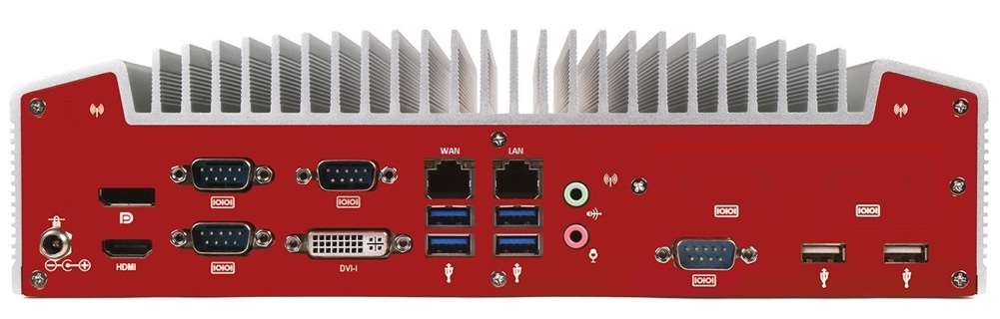

Hardware Specifications
=======================

Supply chain
------------

SixSq choose `Logic Supply`_ to design, assemble, and initialize the
NuvlaBox hardware.  Each NuvlaBox is individualized and each one in
the current production series is named after a prize nobel recipient.
Each NuvlaBox comes with a prospectus that provides all the unique
credentials to connect to it.

.. _Logic Supply: https://www.logicsupply.com

NuvlaBox Standard v2
--------------------

Up to 8 Virtual Machines, sharing 14 GB of RAM and 215 GB disk space.

======================================  =========================================================================================================
Description                             
======================================  =========================================================================================================
Hardware Line                           Industrial Fanless Intel Haswell Computer
Processor                               Intel Core i5-4570TE Haswell / 2 Cores - 4 Threads / 2.7 GHz
Memory                                  2 x 8 GB - DDR3 1600 SO-DIMM Memory
Primary Storage                         256 GB - Transcend 370 2.5" SSD
WiFi/Bluetooth                          Intel 7260 Dual Band 802.11ac/n/g/a/b
Graphics/GPU                            Intel 4th Generation HD Graphics
Rear I/O ports                          4 x USB 3.0 / 2x USB 2.0 / 2 x Gb LAN
Rear I/O ports                          1 x HDMI / 1 x DisplayPort / 1 DVI-I / 2 x Audio jacks / 1 x DC-Jack
Rear I/O ports                          3 x RS-232/422/485 COM / 3 x RS-232 COM
Front I/O ports                         2 x USB 2.0
Dimensions (WxHxD)                      187 x 79 x 290mm
Operating Temperature Range             0°C ~ 50°C
LAN Controller                          Intel 82583V PCIe GbE
Expected Life Cycle                     5 Years
Regulatory Information                  CE standards / FCC / RoHS
Mounting Options                        VESA / DIN / Wall
Warranty                                2 year limited warranty on parts and services
======================================  =========================================================================================================

NuvlaBox Mini v2
----------------

Up to 8 Virtual Machines, sharing 6 GB of RAM and 98 GB of disk space.

======================================  =========================================================================================================
Description                             
======================================  =========================================================================================================
Hardware Line                           Industrial Fanless Intel Bay NUC Computer
Processor                               Intel Celeron N2930 / 4 Cores - 4 Threads / 1.83 GHz
Memory  	                        8 GB - Transcend SO-DIMM DDR3L Low Voltage 1600 Memory
Primary Storage                         128 GB - Transcend 370 mSATA SSD
WiFi/Bluetooth                          Intel 7260 Dual Band 802.11ac/n/g/a/b
Graphics/GPU                            Intel HD Graphics
Rear I/O ports                          2 USB 2.0 / 2 Gb LAN / 2 HDMI / 1 Line-out / 1 DC-Jack
Front I/O ports                         1 USB 2.0 / 1 USB 3.0 / 1 RS-232/422/485 COM
Dimensions (WxHxD)                      142 x 62 x 107 mm
Operating Temperature Range             0°C ~ 50°C
LAN Controller                          Intel 82583V PCIe GbE
Expected Life Cycle                     4 Years
Regulatory Information                  CE standards / FCC / RoHS
Mounting Options                        VESA / DIN / Wall
Warranty                                2 year limited warranty on parts and services
======================================  =========================================================================================================

.. NOTE:: Contact SixSq if you are interested in installing NuvlaBox
          Firmware on your own hardware.  This is often the case if
          you need to use precertified hardware or need larger
          resources than those provided by the standard hardware.

