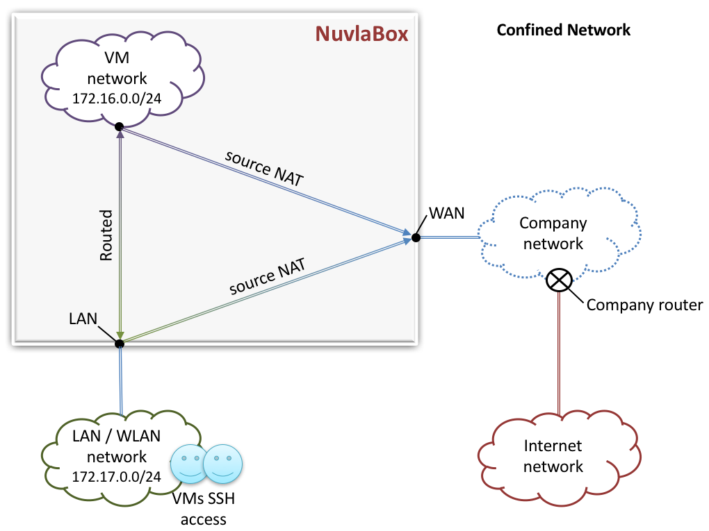
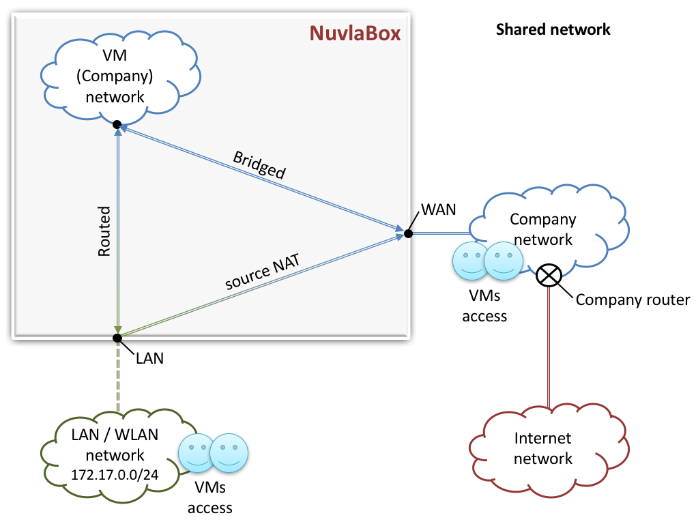
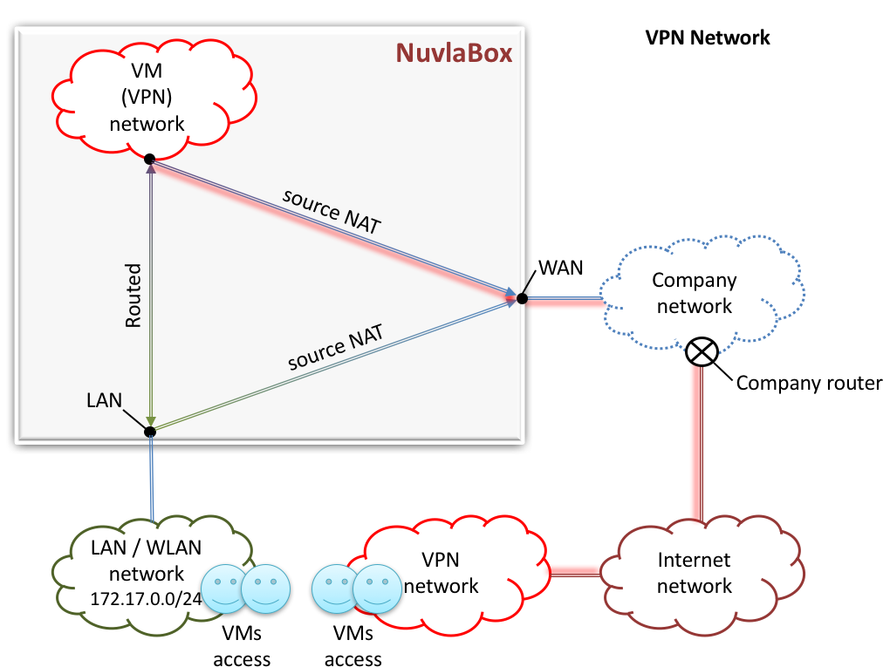

Networking
==========

NuvlaBox have been designed to be flexible and support several network scenarios.

Nonetheless, by default, NuvlaBox is configured with the most common used scendario, which is name `Confined Networking`.

Here is a list of well tested network scenarios on the NuvlaBox:

- Confined Network
- Shared Network
- NuvlaBox VPN Network
- VM level VPN connection

Confined Network
----------------

The idea about this network scenario is to have all VMs and connected users managed by the NuvlaBox.
The advantage of this network scenario is that no configuration is needed at first use of the NuvlaBox.

Specificity:

- Virtual machines (VMs) are created into internal virtual networks inside the NuvlaBox.
- An internal DHCP is responsible to allocate IPs to VMs and to users.
- Connected users in `LAN / WLAN network` and virtual machines in `VM network` have access to the Company Network and to the Internet through NAT (Network Address Translation).
- VMs are reachable through LAN / WLAN network.

Shared Network
--------------

The idea about this network scenario is to have all VMs reachable from the `Company Network` without being connected directly to the NuvlaBox.
The advantage of this network scenario is to give a direct access to VMs from the `Company Network`.

Specificity:

- Virtual machines and connected users are bridged onto the `Company Network`.
- The Company DHCP allocate connected users IPs, but for VMs, a range of IPs into the `Company Network` should be managed by the NuvlaBox itself.

VPN Network
-----------

The idea about this network scenario is to have running VMs on a shared VPN network transparently to the VMs. 
The advantage of this network scenario is to have access to VMs from anywhere from the internet by using a VPN connection.

Specificity:

- Virtual machines are bridged onto the `VPN Network`. 
- If a local connection is available with access to the Internet, VMs use this connection to access internet and VPN connection to communicate with the `VPN Network`.

VM level VPN connection
-----------------------

This is not a real network scenario, because it use the `Confined Network` scenario and SlipStream recipe configuration to make the VMs connect to a remote VPN server.
The advantage of this network scenario is to have access to VMs from anywhere from the internet without changing the default network scenario of the NuvlaBox.

TODO Add image about VM level VPN connection

.. NOTE:: Contact SixSq if you need a custom network scenario.

