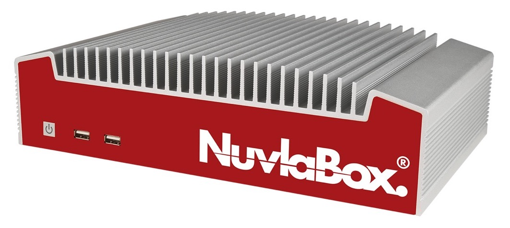

.. include:: ../links.txt

What is a NuvlaBox?
===================

NuvlaBox is a simple and secure private cloud solution that offers
easy and affordable access to the benefits of cloud computing.  It is
a plug & play device with remote management and application update
capabilities. It can be easily and securely deployed by a
non-technical operator.  The NuvlaBox’s ability to work both
autonomously and as a remote controlled connected device gives great
flexibility, supporting a diverse set of deployment scenarios.



   NuvlaBox Standard v2

Key business benefits
---------------------

- Built-in **security**. All services are configured for secure
  operation and all communication is encrypted.
- **Secure web access** to the applications running in your NuvlaBox.
- **Reliable**. All deployments are fully automated to avoid human
  error.  The appliance will restart all applications in case of an
  unexpected power outage. 
- **Plug & Play** device. The NuvlaBox is pre-configured; the user
  simply has to plug it in to have an operational machine.
- Central control point. Using a **user-friendly web interface** the
  NuvlaBox can be controlled via a simple dashboard.
- **Remote updates** mean reduced costs. No need to send an engineer
  or expert on site for software updates.
- Supports **hybrid cloud** deployment scenarios. Workloads can be
  easily moved between private and public clouds, providing
  flexibility and potential cost savings.
- **Reliable local connectivity**. Once powered up the NuvlaBox
  creates its own local WiFi network, which can be used by any device.
- **Flexible WAN connectivity**. The NuvlaBox can be connected to the
  wide area network using many popular connectivity technologies,
  including Ethernet, mobile, WiFi, and satellite.

Usage Scenarios
---------------

The NuvlaBox platform has been designed to bring the flexibility and
ease-of-use of cloud infrastructures to Internet-of-Things (IoT_) and
`Edge Computing`_ platforms.  Incorporating NuvlaBox machines into
these platforms improves their reliability, performance, and
security. A wide range of scenarios can benefit from NuvlaBox systems.

Smart Grid
``````````

All industrial control systems acquire equipment monitoring and
performance data.  They use this data to control operations and to
ensure that the industrial plant is working correctly.  Unfortunately,
these platforms are static, limited by the hardcoded algorithms
embedded into the system. They cannot quickly react and adapt to
changes within the industrial environment.

Through the `SCISSOR project <https://scissor-project.com>`_,
co-funded by the European Commission, SixSq has demonstrated how cloud
technologies including the NuvlaBox can provide a SCADA platform that
can react rapidly to changes and evolves as the knowledge of the
industrial platform improves.  The platform benefits both from the
remote management possible from SlipStream and the NuvlaBox, while
allowing for autonomous operation in cases where remote locations are
temporarily isolated from the rest of the platform.

Smart Cities
````````````

Communities can markedly improve the life of their citizens and
streamline their operations by taking advantage of the vast amount of
data provided by public transport systems, traffic monitoring,
environmental sensors, and the like.

NuvlaBox deployments can improve these "Smart City" platforms by:

 - Avoiding large data flows over low-bandwidth connections, though
   local analysis of data.
 - Protecting data with privacy concerning by limited the diffusion of
   such data to a local area.
 - Remove silos of information allowing the platforms to increase
   performance by understanding the correlations between different
   data sources.

SixSq, through the `CityZen initiative <http://cityzen.ch>`_ , has
shown how lighting systems can adapt to changing traffic conditions to
increase safety and energy efficiency. 

DevOps
``````

TODO: CAL

How does it work?
-----------------

The customer can decide which applications should be pre-installed in
the NuvlaBox.  The boxes are then shipped directly to the customer’s
location. Once on site, simply connect the NuvlaBox(es) to a power
supply and a network device.  The NuvlaBoxes can then be locally or
remotely operated. When connected to the network, new applications can
also be downloaded and installed on any box, remotely, at the click of
a button.

