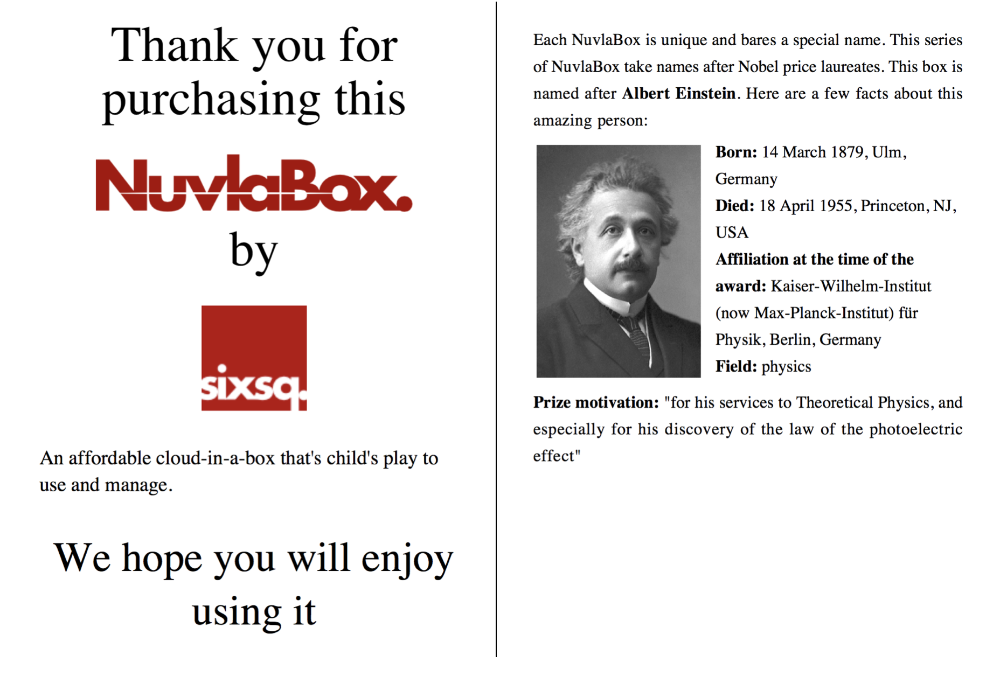

.. include:: ../links.txt

How to use the NuvlaBox
-----------------------

Here are the first things to do with the NuvlaBox:

1. Remove the packaging
2. Screw the Wi-Fi antenna in place
3. Connect the box’s power cord to the mains and NuvlaBox
4. Push the power button
5. Keep credentials prospectus in a safe place



   Example of credentials prospectus for the NuvlaBox named after Albert Einstein

Using another device such as laptop, smartphone or tablet (not included) connect to the NuvlaBox Wi-Fi or LAN network.
This connection give you access to a local SlipStream and allows you later on to access your running virtual machines.

You can see the NuvlaBox as your private *mini* IaaS_ Cloud.  And as with any IaaS Cloud you
want a friendly SaaS_ or PaaS_ service to help you with building and deploying
applications on IaaS.  This is where SlipStream comes into the picture.  As with
any onther Clouds, SlipStream can be used to manage your applications on your
NuvlaBox(s).


Manage the NuvlaBox from a local SlipStream
````````````````````````````````````````````
Using another device such as laptop, smartphone or tablet (not included)
connect to the NuvlaBox Wi-Fi or LAN network.

Then connect to the URL: https://nuvlabox. This URL corresponds to the
SlipStream service.

Choose local in NuvlaBox welcome page and login into SlipStream with the "nuvlabox" user account.

Manage the NuvlaBox from a remote SlipStream
````````````````````````````````````````````

By default, NuvlaBoxes are pre-configured to connect to a remote SlipStream named Nuvla_ managed by SixSq.
Connect the NuvlaBox's WAN port to a network with an Internet access and where a DHCP/DNS services are available.

.. HINT::
   TODO If no DHCP is available in your network, you can connect to your LAN, access NuvlaBox admin UI and set a static IP for the NuvlaBox WAN interface.

Then connect to Nuvla with following URL: https://nuv.la.

TODO (What about cloud config on Nuvla, user should configure his account to
access his box)

Deploying Applications
-----------------------

There is no differece between running on a cloud or NuvlaBox. 

TODO Link to SS tutorial. 

Accessing VMs
-------------

Use a SSH client to connect to your VM by using default SSH ``port 22`` and by using the ``displayed IP`` in your deployment on SlipStream.

