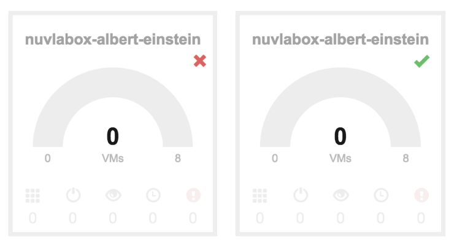

Connection to a Remote SlipStream
=================================

A NuvlaBox is able to connect to a remote SlipStream (mothership) via
SSH tunneling.  When an Internet access is available, the NuvlaBox
tries to contact the remote SlipStream and register with it.  You can
check if your NuvlaBox is connected in the remote SlipStream server by
checking the status of the NuvlaBox in the corresponding gauges in the
dashboard.

   Gauges of disconnected and connected NuvlaBox machines

From the remote SlipStream, remote tunnel ports are opened that allow
the remote SlipStream to access NuvlaBox endpoints for SlipStream,
OpenNebula, and SSH.

.. NOTE:: Contact SixSq if you are interested in installing your own
          on premise SlipStream service instead of using Nuvla.

.. HINT:: Check how to change the remote SlipStream in the NuvlaBox
          Admin UI.

By default the SSH tunnel to the remote SlipStream service is enabled.
You can disable it from the NuvlaBox Admin UI or from the NuvlaBox
console.

To open the console, connect to the NuvlaBox as root with SSH.  The
credentials are provided in the credentials prospectus. Then run
the following commands from the console of the NuvlaBox to disable SSH
tunneling to the remote SlipStream service:

.. code:: bash
   
   systemctl stop nuvlabox-ssh-tunnel.service
   systemctl disable nuvlabox-ssh-tunnel.service

The username and host to use for the tunnels can be configured in the
following file ``/etc/default/nuvlabox-tunnels``.  The most likely
parameters you will need to change are the HOST and the remote ports.
