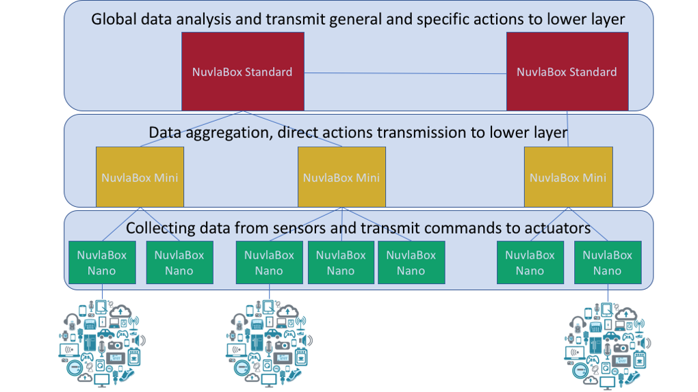

Roadmap
=======

SixSq produces a new, incremental release of NuvlaBox approximately every two months.

In addition to the continual bugfixing, robustness, and usability improvements, 
there are several areas where important new functionalities are planned:

Software improvements:
- Creating a dedicated UI for managing NuvlaBoxes
- Make admin UI visible from the remote SlipStream
- Cleanup of built images from SlipStream
- Make NuvlaBox support containers

SixSq is working to design a NuvlaBox Nano. NuvlaBox Nano will not have an embded SlipStream and will be able to run only containers.
This box will be specialized in IoT port connectivity.

The idea is to have a hierarchy of NuvlaBoxes which are controlled by more powerful NuvlaBoxes. 
The NuvlaBox Nano should communicate whith the upper level when connectivity is available and execute actions received from upper layers.
Upper layers are specialized in processing data and transmiting actions to lower layers.

Your feedback on what features you’d like to see in NuvlaBox is important. We continuously adjust our development priorities based on user feedback. Give us your feedback by contacting us at support@sixsq.com.