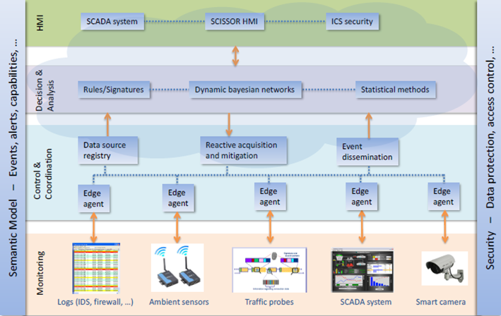

Attaching Sensors & Controllers
===============================

To attach a sensor, you have to edit your component in SlipStream and
add an `Additional custom textual VM template`.  Anything placed in
this field is transmited unmodified to the KVM hypervisor.

First of all, we need to add a USB controller, on which we attach the
USB device.  To do so, for USB 2.0 or USB 3.0 devices, use the
following template to attach your device to your virtual machine at
startup.

You should only update the ``vendor id`` value and the ``product id``
with values corresponding to your device.

.. code:: xml

   RAW = [ TYPE = "kvm",
           DATA = "
           <devices>
             <controller type='usb' index='1' model='piix3-uhci'/>
             <hostdev mode='subsystem' type='usb' managed='yes'>
               <source>
                 <vendor id='0x046d'/>
                 <product id='0x0826'/>
               </source>
               <address type='usb' bus='0' port='1'/>
             </hostdev>
           </devices>"]

.. HINT:: In NuvlaBox administrator UI, you can easily get ``vendor
   id`` and ``product id`` of attached devices.

.. WARNING:: You have to attach specified devices in `Additional
   custom textual VM template` to your NuvlaBox, otherwise deployed
   concerned Virtual machine can't boot.

To attach other host devices, please refer to the `libvirt
documentation`_.

Deploying Sensor-based Applications
-----------------------------------

`Here on Nuvla <https://nuv.la/module/nuvlabox-training>`_ you can
find different sensor-based applications to be launched from Nuvla on
your NuvlaBox.

Other examples
--------------

SixSq is participating in `SCISSOR`_, a H2020 project supported by the
European Commission.  The aim of this project is to design a new
generation SCADA security monitoring framework.

   SCISSOR four-layer SCADA security monitoring framework

The "edge agents" in the above figure run on NuvlaBox
machines.

Through SixSq's participation in this project, the following
types of devices have been demonstrated with the NuvlaBox:

  - IP camera
  - USB microphone
  - Serial communication to capture information from RFID sensors
  - Network activity from IDS analysers
  - Logging

.. _libvirt documentation: https://libvirt.org/formatdomain.html#elementsHostDev

.. _SCISSOR: https://scissor-project.com/
