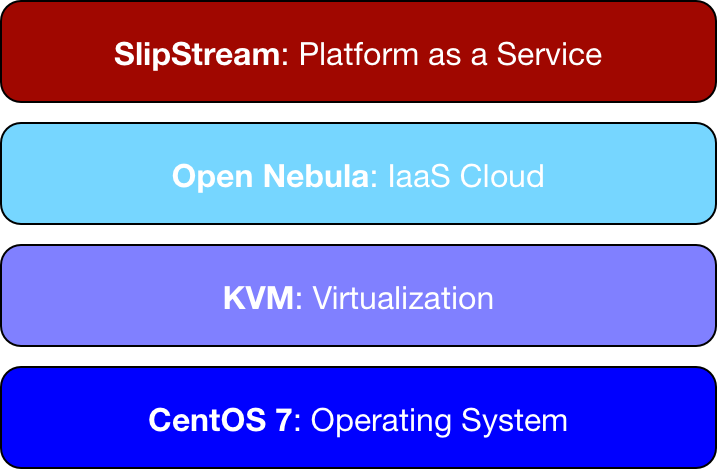

Software Architecture
=====================

Software Stack
--------------

The NuvlaBox is built atop a robust Open Source foundation, benefiting
from the reliability and diverse features of tested, open software.
No other cloud appliance has the level of functionality and
integration provided by the NuvlaBox.



   NuvlaBox Software Stack

The NuvlaBox also takes advantage of numerous system-level services to
support the core software stack.  Many of them can be configured to
support customized NuvlaBox installations.

Accessible Service Endpoints
----------------------------

Users connected to the WiFi/LAN network of the NuvlaBox can access
the following endpoint:

- nuvlabox (172.16.0.1)

If you are not connected to the NuvlaBox on the wide area network, you
can connect to those services by using the IP of the NuvlaBox in your
network.

===================  ================
Services Names       Listening Ports 
===================  ================
SlipStream                        443
OpenNebula Sunstone              9870
SSH                                22
===================  ================

User Accounts
`````````````

============  ========  =============================  ========================================================
Service Name  Username  Password location              Description
============  ========  =============================  ========================================================
SSH           root      In credentials prospectus      NuvlaBox administrator
SlipStream    nuvlabox  In credentials prospectus      NuvlaBox cloud user
SlipStream    super     In credentials prospectus      SlipStream administrator
OpenNebula    ssuser    In credentials prospectus      OpenNebula cloud user configured for NuvlaBox cloud user
OpenNebula    oneadmin  In /var/lib/one/.one/one_auth  OpenNebula cloud administrator
============  ========  =============================  ========================================================
