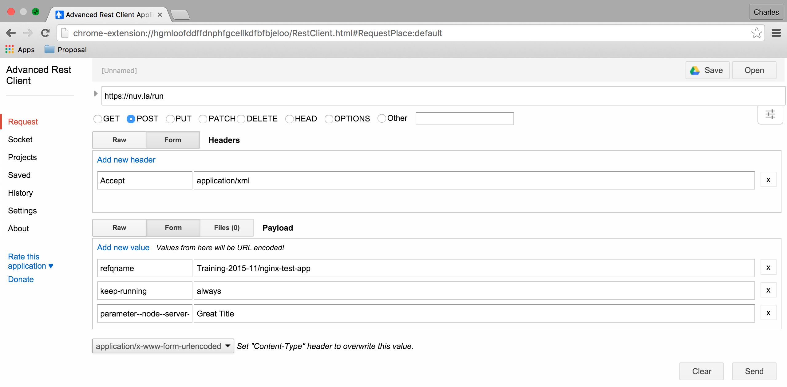

Automating SlipStream
=====================

Although the SlipStream web interface provides a great interface for
humans, there are cases where programmatic access is more
appropriate.  These cases include the need for bulk operations,
programmatic control for continuous integration systems, and in a few
cases access to features that don't yet appear in the web interface.

In this chapter, you'll learn about programmatic access to SlipStream
through the command line client and through the REST API.  The text
and exercises will concentrate on the management of components and
applications.

The REST API is documented on the http://ssapi.sixsq.com website.  It
provides the full list of SlipStream resources.  Although we strive
for complete documentation, there may be some holes in the API docs.
If you run into trouble, please contact support and we'll give you a
hand.

Setup
-----

Command Line Client
~~~~~~~~~~~~~~~~~~~

The SlipStream client is installed by default on all machines started
through SlipStream. To install it on your local machine, it can be
installed with ``pip``, the python installer.

You will need to have python (v2.6+, not v3.x) installed on the
machine as well as ``pip``.  See the Python_ and pip_ websites for
installation of these tools on your machine.

Once python and ``pip`` are available, just running the following
should work::

    $ pip install slipstream-client

for a system-level installation.  If you don't have administrator
access to your machine, you can also perform a user-level
installation::

    $ pip install --user slipstream-client

In this case, be sure to modify your ``PYTHONPATH`` and ``PATH``
to include the directories used by the ``pip`` user-level
installation.

.. _ss-curl:

cURL
~~~~

The REST API uses the standard HTTP protocol, so any HTTP library can
be used to access the API.  A ubiquitous tool for quick HTTP requests
is cURL_.  This is available natively on most operating systems.

If it is not available and you want to use it, see the cURL_ website.

If you're going to use the cURL command line extensively, you will
probably want to define the following alias::

    $ alias ss-curl="curl --cookie-jar ~/cookies -b ~/cookies -sS"

This avoids having to repeat the options that you'll need for every
command.  The following text, will assume that this alias has been
defined.

Advanced REST Client
~~~~~~~~~~~~~~~~~~~~

The `Advanced REST Client (ARC)
<https://chrome.google.com/webstore/detail/advanced-rest-client/hgmloofddffdnphfgcellkdfbfbjeloo>`__
extension to the Chrome_ web browser allows a more graphical method of sending
HTTP requests and visualizing the responses.  To be able to reuse
authentication cookies with ARC, you will have to install `ARC cookie exchange
<https://chrome.google.com/webstore/detail/arc-cookie-exchange/apcedakaoficjlofohhcmkkljehnmebp>`__
Chrome extention as well.

Consult the referenced web sites for installation of Chrome and the
REST client along with its cookie exchange on your machine.

Authentication
--------------

Just like with the web interface, you must be authenticated to use most of
the SlipStream features through the command line or the REST API.  At
the moment, SlipStream supports both basic authentication and
cookie-based authentication.

Command Line Client
~~~~~~~~~~~~~~~~~~~

The command line client uses primarily basic authentication.  When
using the client, you must supply your SlipStream username and
password either via environmental variables or via command line
options.

The environmental variables to set are::

    $ export SLIPSTREAM_USERNAME=ssuser
    $ export SLIPSTREAM_PASSWORD=sspass

substituting the ``ssuser`` and ``sspass`` values with your own
username and password.  You can also set these values explicitly on
the command line with the ``-u`` or ``--username`` options for the
username and with the ``-p`` or ``--password`` options for the
password.

You can quickly test the authentication by listing your user account
information::

    $ ss-user-get ssuser

again changing ``ssuser`` to your username.  This should return an XML
representation of your user account.

.. _ss-curl-login:

cURL
~~~~

It is strongly recommended to use cookie-based authentication when
using the REST API. The basic authentication method is deprecated and
will be removed at some point in the near future.

To obtain a valid authentication cookie, you must login to SlipStream,
much like you'd do with the web interface.  To do this, create a
"session create" document like the following:

.. code-block:: json

   {
     "sessionTemplate": {
        "href": "session-template/internal",
        "username" : "your-username",
        "password" : "your-password"
     }
   }

substituting ``your-username`` and ``your-password`` with your actual
username and password.  Name the file something like
``session-create-internal.json``. 

You can then POST this document to the session resource collection to
create a new session and to recover an authentication cookie. 

Doing this with cURL (and the alias defined above!)::

    $ ss-curl https://nuv.la/api/session \
        -D - \
        -o /dev/null \
        -XPOST \
        -H content-type:application/json \
        -d@session-create-internal.json

This should return only the headers from the response, which should
include a "Set-Cookie" header with a value and a "201 created"
response code.  The cookie should also end up in the ``~/cookies``
file.

If you provide the wrong credentials, you will get a "403 forbidden"
response.

The "internal" login method is always available.  You may also be able
to log in via another method.  You can find the full list of available
methods by listing the Session Template resources::

  $ ss-curl https://nuv.la/api/session-template

Note that external methods (e.g. GitHub) may not support login
workflows that are adapted to command line interactions.

Advanced REST Client
~~~~~~~~~~~~~~~~~~~~

Doing this with the Advanced REST Client in Chrome, you can fill in
the form for the login request, which should look like the following
screenshot.

and which should return something like the following screenshot.

As for cURL, the "Set-Cookie" header should have a value.  To automatically
reuse the cookie for the next requests in the Advanced REST Client, you need to
have the ARC cookie exchange extension installed and enabled in Chrome and also
enabled in ARC: in the right corner the ``Use XHR`` should be turned on.

.. note::

   If you want to logout by destroying your access cookie, then you
   can either delete the cookie manually or send a HTTP DELETE request
   to the logout resource \http://nuv.la./logout.

Managing an Application
-----------------------

Command Line Client
~~~~~~~~~~~~~~~~~~~

To deploy an application or a component via the command line client use the
``ss-execute`` command.  To deploy the web server and client
application defined earlier::

    $ ss-execute --parameters="server:title=Great Title" \
                 --kill-vms-on-error \
                 Training-2015-11/nginx-test-app

This will return the URL of the created run.

This is essentially a "shoot and forget" feature intended for
deploying test applications.  There are no comparable commands for
finding the application's status or terminating it.  Those actions
either need to be done through the web interface or REST API.

cURL
~~~~

The REST API allows complete control over the application
lifecycle.

To start an application with cURL, you must use the following
command::

    $ ss-curl https://nuv.la/run \
      -X POST \
      -d refqname=Training-2015-11/nginx-test-app \
      -d keep-running=always \
      -d parameter--node--server--title='Great Title' \
      -H 'Accept: application/xml' \
      -D - \
      -o response-body.txt

This will send a POST request to the "run" resource to start an
application.  The "Location" header will contain the run identifier if
the command completes successfully.

The command shows how parameter values are encoded for the REST API.
You can also specify other parameters such as the "keep-running"
value.  The "refqname" is required as it identifies the application to
run.

You can see the full state of the run by performing a GET request on
the given run URL::

    $ ss-curl https://nuv.la/run/815a8f66-fc9d-4444-849c-d12e883982c1

All of the responses related to the applications and runs are in XML.
Newer resources such as events and usage are in JSON.  All of the
resources will eventually be migrating toward JSON in the future.

You can then terminate the run by sending a DELETE request to the
given run URL::

    $ ss-curl -X DELETE \
      https://nuv.la/run/815a8f66-fc9d-4444-849c-d12e883982c1

This will immediately terminate the application, so be careful when
using DELETE requests.

Advanced REST Client
~~~~~~~~~~~~~~~~~~~~

You can perform the same lifecycle with the Advanced REST Client.
Start with deploying the application.

If successful, it will return a 201 response with the run identifier
in the "Location" header.

Performing a GET on the returned URL will give you the status.

And finally the application can be terminated with a DELETE request.

A successful termination will return a "No Content 204" response.

.. admonition:: EXERCISES

   1. Start your web test application with the ``ss-execute``
      command.
   2. Perform a full lifecycle of your web test application with the
      REST API.
   3. Perform a full lifecycle of your web component with the REST
      API.

.. _Python: https://www.python.org

.. _pip: https://pip.pypa.io/en/latest/

.. _cURL: http://curl.haxx.se

.. _Chrome: https://www.google.com/chrome/
