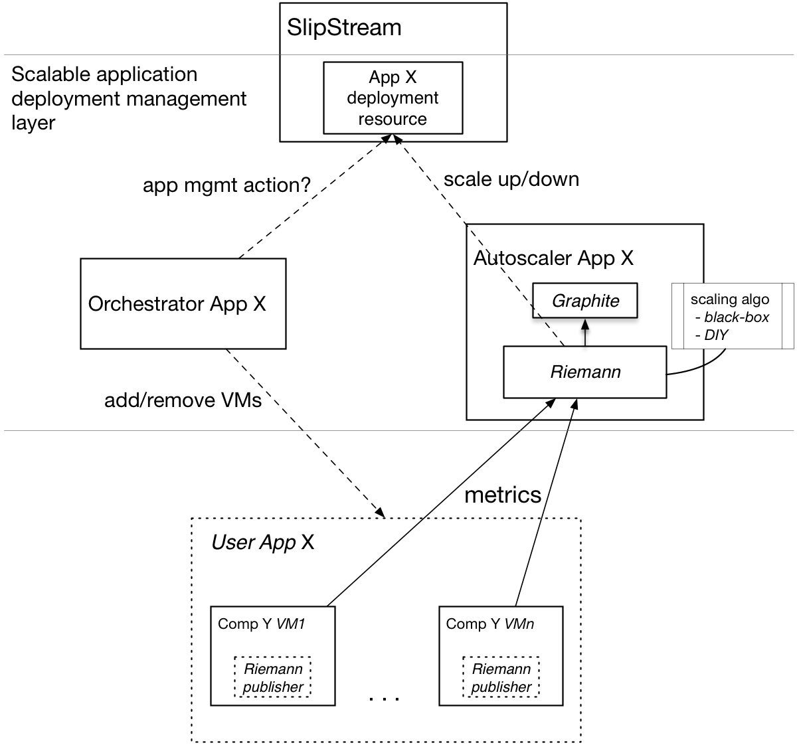
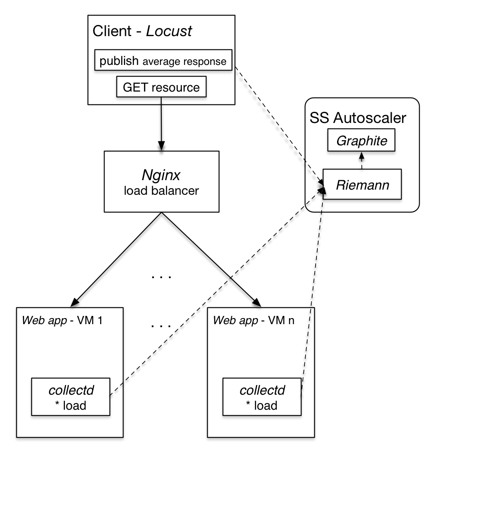
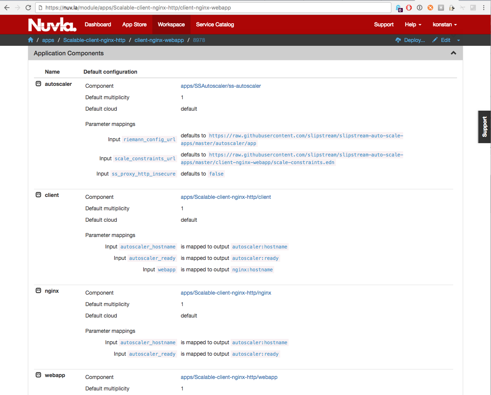
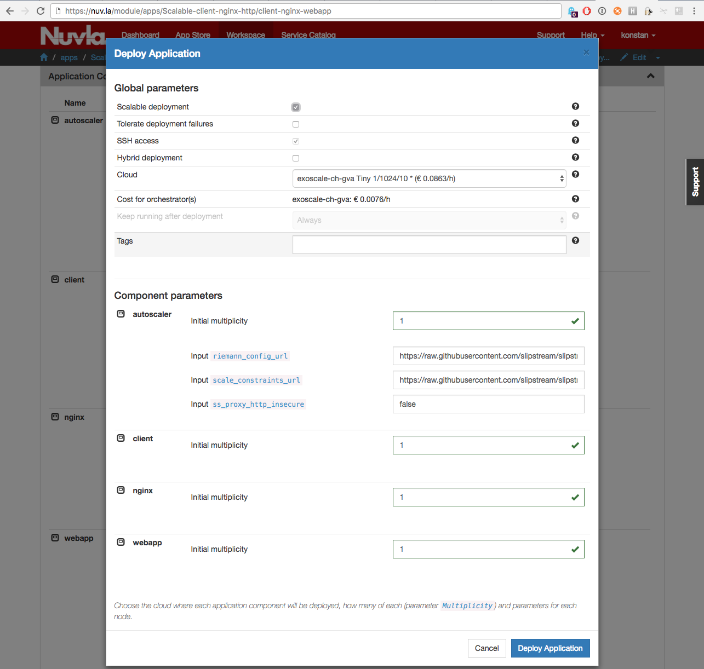
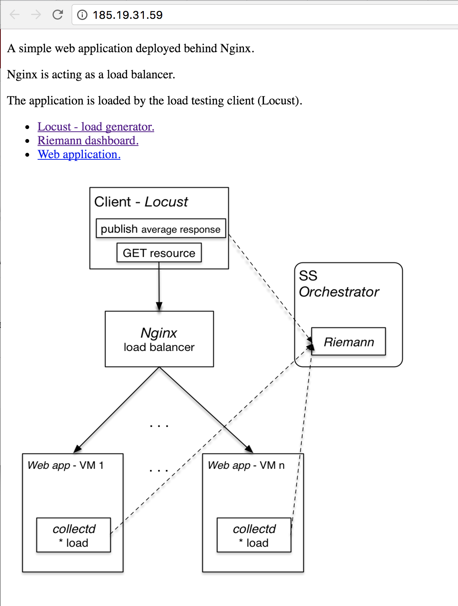
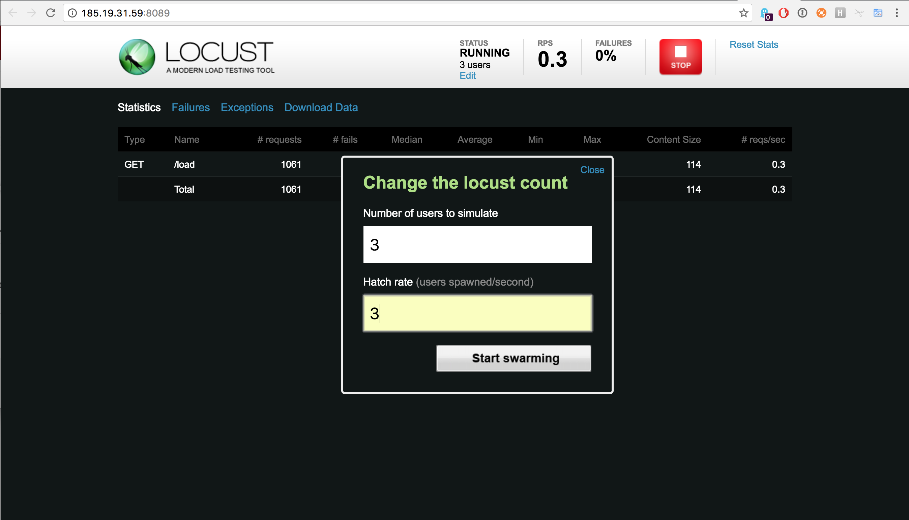
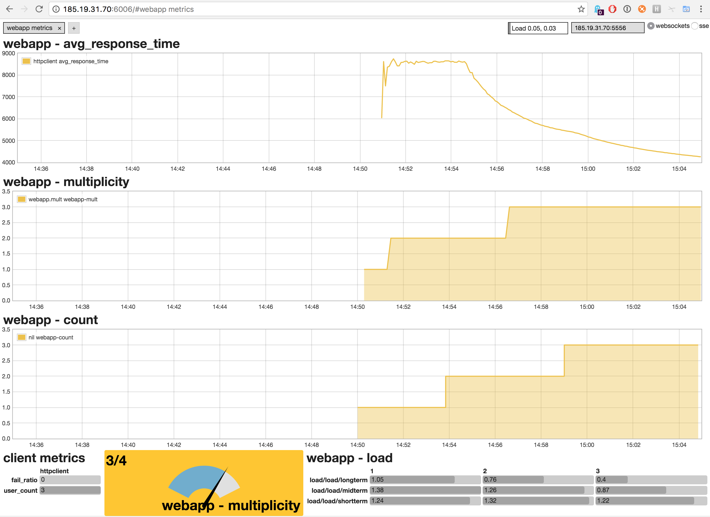
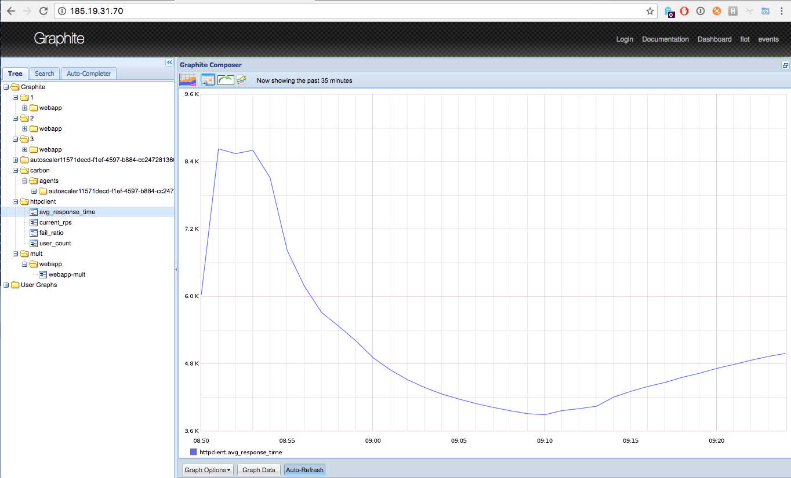

.. include:: ../links.txt

Autoscalable Applications
=========================

`Scalable Applications <scalable-applications.html>`_ described how it is
possible to define and manually manage the scaling of applications with
SlipStream.  This section presents the mechanisms and the accompanying
infrastructure in SlipStream that allows to auto-scale such applications.

Auto-scaling of User Applications
---------------------------------

With SlipStream one can automatically scale up and down the number of instances
of an application component of a (possibly) complex application. Currently only
one component can be scaled at a time. Work to remove this limitation is
ongoing. There are two ways to take advantage of auto-scaling with the existing
SlipStream implementation:

-  **Black-box autoscaling** The simplest approach is to use the default
   implementation of the auto-scaling in SlipStream. Currently, it is suitable
   for the applications where the only one component will scale based on only
   one metric. If these requirements are met, adding a special autoscaler
   component to the user’s application, providing configuration file with the
   application component scalability constraints, and deploying the application
   as a scalable deployment allows user to benefit from the automated
   scalability provided “out of the box” by SlipStream.

-  **Do-it-yourself (DIY) autoscaling** The implementation of the autoscaler in
   SlipStream allows users to supply their own implementations of the
   autoscaling logic. In this case, SlipStream takes care of the deployment of
   the autoscaler platform and running the user supplied auto-scaling logic.
   What is required from the user is the inclusion of the autoscaler in the
   user’s application as a component and providing a public URL with the
   autoscaling implementation.

In the above cases, it is required that chosen components of the user’s
application publish metrics on which the scaling actions will be based and to
support the automatic scaling.

SlipStream uses Riemann_ to implement its auto-scaling decision making feature
and consequently requires that the metrics be published as Riemann events. To
facilitate metrics collection, Riemann has a wide range of `metric publishers
<Riemann clients_>`_; these include a Riemann plugin for
Collectd_ and a Python CLI and library API.

The implementation of the autoscaler in SlipStream is completely open and
flexible. It allows users to write their own decision making logic as Riemann
streams and to provide it to the autoscaler component as an input parameter.
This can be useful in cases when the default autoscaling implementation, that
comes with the SlipStream autoscaler, does not fully satisfy the needs of the
user’s application.

   Auto-scaling applications with SlipStream

Configuration of Auto-scale Constraints
~~~~~~~~~~~~~~~~~~~~~~~~~~~~~~~~~~~~~~~

Below is the example configuration file (in `edn
<https://github.com/edn-format/edn>`_ format) to be used
with the black-box autoscaling approach. The configuration defines scalability
constraints for an application component called ``webapp``::

    [
     {
      ;;
      ;; Mandatory parameters.

      ; name of the component in the application
      :comp-name         "webapp"

      ; service tags as sent by Riemann publisher in the event
      :service-tags      ["webapp"]

      ; monitored service metric name (as sent with Riemann event)
      :service-metric    "avg_response_time"

      ; value of the metric after which start adding component instances
      :metric-thold-up   500.0
      ; value of the metric after which start removing component instances
      :metric-thold-down 200.0

      ; max number of component instances allowed
      :vms-max           4   ; "Price" constraint.

      ;;
      ;; Optional parameters (with defaults).

      ; min number of component instances allowed
      ;:vms-min       1

      ; number of instances by which to scale up
      ;:scale-up-by   1
      ; number of instances by which to scale down
      ;:scale-down-by 1
     }
    ]

It reads the following way:

    1.  For an application component ``webapp`` the autoscaler expects to receive
        Riemann events:

        1.  with the service name ``avg_response_time``,
        2.  one of tags being ``webapp``;

    2.  When the value of the metric in the event is

        1.  above ``metric-thold-up`` (500.0), then the autoscaler should
            perform a scale up action,
        2.  below ``metric-thold-down`` (200.0), then the autoscaler should
            perform a scale down action;

    3.  The autoscaler should not perform scale up action if there are already
        ``vms-max`` (4) component instances running,

    4.  The minimum number of component instances should not go below
        ``vms-min``.  That is, the autoscaler should not attempt a scale
        down action if the number of the currently running component
        instances is ``vms-min`` (1),

    5.  The autoscaler should scale up by ``scale-up-by`` number of instances
        and scale down by ``scale-down-by``.

Autoscaler Component
~~~~~~~~~~~~~~~~~~~~

The autoscaler component is available on Nuvla_ at |autoscaler|. Its source
code is `published on GitHub
<https://github.com/slipstream/slipstream-auto-scale-apps/tree/master/autoscaler>`_.

The application uses Riemann to process incoming component metrics as events.
The main part of the application is the Riemann configuration file,
``app/riemann-ss-streams.clj``, the script is written in Clojure_ programming
language.

The default implementation loads the auxiliary library (as the
``sixsq.slipstream.riemann.scale`` Clojure namespace) that defines custom event
processing streams and helper functions. It then uses those functions to read
in the scalability constraints for the component(s), to process/update incoming
events (or generate new events), to make the scaling decisions, and to request
the scaling actions from SlipStream.

The decision-making algorithm uses Riemann’s moving time window stream with a
window size of 30s to smooth out spikes in the incoming metrics’ time series.

The functions defined in the ``sixsq.slipstream.riemann.scale`` namespace
simplify the main configuration script by providing a number of utility
functions that hide the details of interacting with SlipStream to request
scaling actions, creating new and/or updating old events, and (re-)indexing
and/or publishing them to Graphite_. The namespace is defined in a the
``run-proxy/api`` module in the GitHub repository. All the public functions are
documented.

Based on the example in ``app/riemann-ss-streams.clj`` and taking advantage of
the utility functions, application developers can write their own scaling logic
and then provide it to the autoscaler component as a public URL via an input
parameter. For details, see the |autoscaler| component on Nuvla_.

The deployment script of the autoscaler module deploys Riemann, the `Riemann
dashboard <http://riemann.io/dashboard.html>`_, and Graphite. After deployment,
the Riemann dashboard can be found at the URL ``http://<autoscaler IP>:6006``
and Graphite, at ``http://<autoscaler IP>``.

Riemann acts as a stream processing engine with no or little memory of the
events. Graphite is used to store the historical data of the events. Primarily
this is used to plot the historical data, but could also be read into the
Riemann streams to consider the history when making scalability decisions.

Publishing Component Metrics to Autoscaler
~~~~~~~~~~~~~~~~~~~~~~~~~~~~~~~~~~~~~~~~~~

The autoscaler makes the scalability decisions based on the metrics coming from
the user’s application components and the thresholds provided by the user.
Because the autoscaler is a Riemann application, the user must use one of the
many Riemann clients to push the metrics (as events) to it. Check `Riemann
clients`_ for the list of available clients.

Example Auto-scale Application
------------------------------

The following section describes the example auto-scale application that uses
write Riemann plugin of collectd and a custom publisher written in Python using
Riemann client library API.

The example auto-scale application is a web application that uses the Riemann
``collectd`` plugin and a custom publisher written in Python and the Riemann
Client API. It consists of the following components:

* **webapp:** a stateless web application that takes requests, synchronously
  performs a moderately intensive computation (calculating Pi up to 100
  digits), and returns the result,
* **nginx:** a load balancer based on Nginx_ that distributes client requests
  to the set of stateless web servers,
* **client:** a test client based on Locust_ that simulates a varying number of
  clients, and
* **autoscaler:** Standard SlipStream autoscaler component that makes scaling
  decisions.

and it is schematically depicted in the figure below.

   Components of Example Auto-scale Application

Application Configuration and Deployment
~~~~~~~~~~~~~~~~~~~~~~~~~~~~~~~~~~~~~~~~

The figure below shows the definition of the autoscalable application in
SlipStream.

   Example Scalable Application Definition in SlipStream

Note that values for the autoscaler input parameters, namely,
``riemann_config_url`` and ``scale_constraints_url`` must be provided. The
first one defines the URL with a resource under which the following files are
expected:

-  **riemann-ss-streams.clj:** Riemann streams using SlipStream scale up/down
   actions,
-  **dashboard.json:** Riemann dashboard layout and queries, and
-  **dashboard.rb:** Riemann dashboard configuration.

They contain the processing logic for autoscaling actions and the configuration
for the Riemann dashboard. This allows users to provide their own
implementation of the scaling logic and dashboard configuration. The second
input parameter ``scale_constraints_url`` provides the URL with the application
scaling definitions. For this application, they look like::

    $ cat scale-constraints.edn

    [
     {:comp-name         "webapp"
      :service-tags      ["webapp"]
      :service-metric    "avg_response_time"
      :metric-thold-up   7000.0
      :metric-thold-down 4000.0
      :vms-max           4}
    ]

This file is application-specific; for this example, it comes from the user
application module on GitHub.

Clicking on Deploy button brings the Application Deployment dialog (see figure
below). In this dialog, you must check the box to indicate that this is a
scalable application; you can optionally change the multiplicity of the webapp
component. Select the cloud and proceed with the deployment.

   Deployment of Example Scalable Application

Usage of the Application After Deployment
-----------------------------------------

After a successful deployment of the application one should first open the HTTP
URL published by the client component. It provides a page with a description of
the application, a deployment diagram, and links to the services running on
other components (see figure below).

   Application Entry Point

The first link to follow is the one pointing to the Locust load generator;
this simulates a varying number of clients. Although Locust can be used as an
automatic load generator, this application assumes manual configuration of the
load parameters. Figure below shows the definition of three parallel users that
Locust will use to access the web layer and load it with requests. The endpoint
to contact and the resource of the web application were already automatically
configured during the component deployment.

   Locust: Defining Work (as 3 Users) to Load the Application

After Locust starts loading the web application, a custom Riemann events
publisher collects the average response time metric from Locust and publishes
it as an event to the Riemann service running on the autoscaler. The event
looks like this::

    {"service": "avg_response_time",
      "tags": ["webapp"],
      "ttl": 10,
      "host": "httpclient",
      "time": 1479202972,
      "metric_f": 3167.896}

Other metrics are also collected and sent from client (Locust) and webapp
component instances. For example:

* The `client` publishes number of concurrent clients used by Locust, current
  requests per second, and the request fail rate;
* The `webapp` instances publish their current 1, 5, and 15 min load. This
  metric is published through the Riemann collectd plugin. This is deployed and
  configured automatically on each `webapp` with the ``collectd.sh`` script
  available from the repository.

Based on the load metrics reported by the `webapp` instances, a Riemann stream
dynamically calculates the current number of the instances and indexes it to
allow the Riemann dashboard to query and display it.

The current multiplicity of the `webapp` component is queried by a Riemann
stream directly from SlipStream and indexed. As one can see in the figure
below, there is a delay between the provision request (multiplicity as reported
by SlipStream) and availability of the virtual machine (as reported by the load
metrics). This is almost entirely due to the provisioning latency on IaaS
level; SlipStream’s control flow contributes negligibly to the latency.

   Riemann-dash: High Load on the Web Layer

Based on the given constraints, the autoscaler attempted to satisfy the
scalability constraints provided for the `webapp` component by keeping the
average response time metric within the requested bounds.

All the application level metrics (native or generated) are published to
Graphite, which is deployed on the autoscaler and runs alongside Riemann. See
the figure below, which shows historical evolution of the average response time
in Graphite.

   Average Response Time as a Function of Time in Graphite

.. |autoscaler| raw:: html

   <a href="https://nuv.la/module/apps/SSAutoscaler/ss-autoscaler" target="_blank">apps/SSAutoscaler/ss-autoscaler</a>

.. _Riemann: http://riemann.io

.. _Nginx: https://www.nginx.com

.. _Locust: http://locust.io

.. _Riemann clients: http://riemann.io/clients.html

.. _Collectd: https://collectd.org

.. _Clojure: https://clojure.org

.. _Graphite: https://graphiteapp.org

