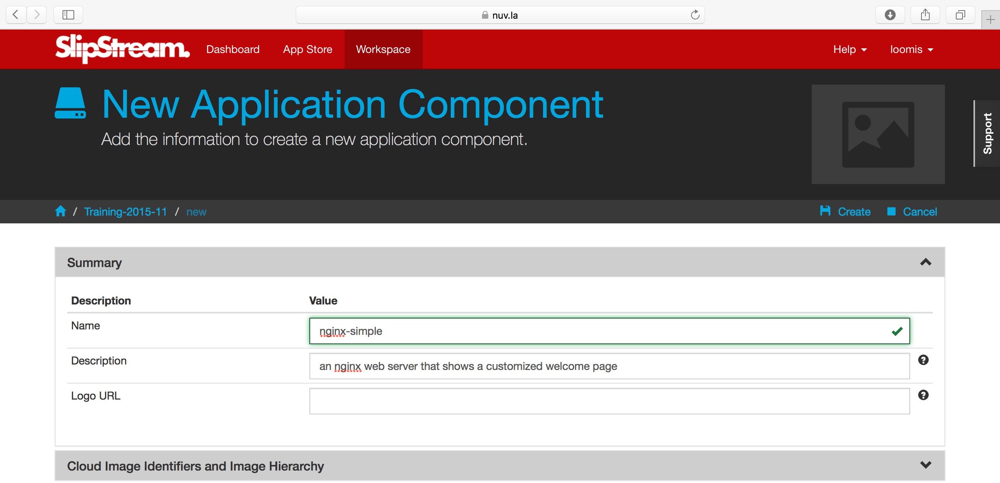
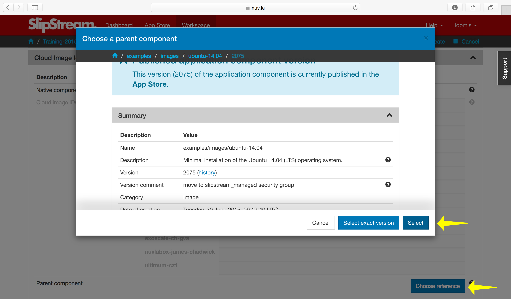
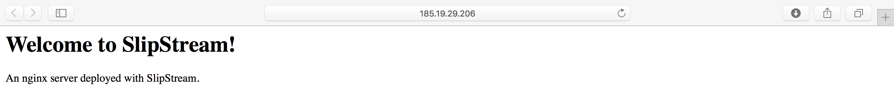
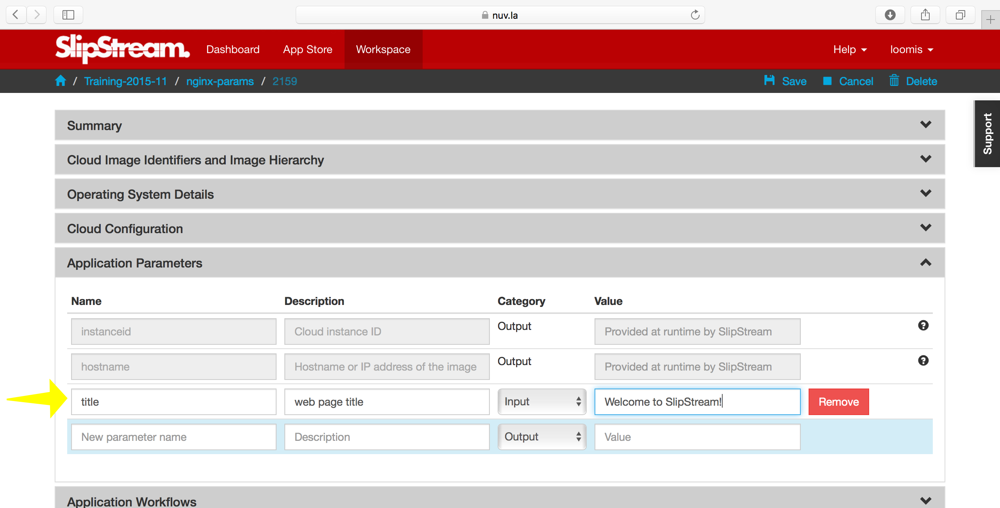
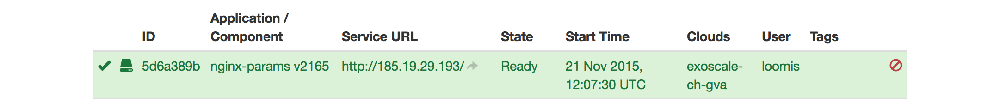
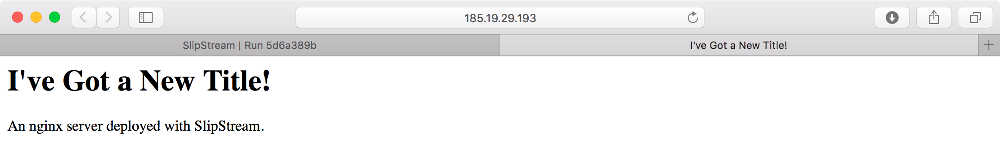

Components Part I
=================

A minimal operating system isn't very useful by itself.  We want to
transform such a simple image into a component running services that
we need for our cloud application.

In this section you'll learn how to:

- Automate the installation and configuration of services,
- Parameterize the component to allow deploy-time configuration, and
- Pass information from the application back to the user.

In doing this you'll also understand:

- How to reference images from components,
- The purpose of the various SlipStream "recipes", and
- When those recipes are executed.

In this chapter, we'll create a web server component that can be
customized when deployed and that protects a "secret" with basic
authentication.

.. important::

   The command line examples throughout the tutorial use Linux bash
   syntax.  If you're using a different shell (csh, PowerShell, etc.),
   you'll need to adjust the syntax accordingly.

   Similarly, the example applications developed in the tutorial are
   uniformly built over the Ubuntu operating system.  This is to
   reduce distractions and make the tutorial as uniform as possible.
   SlipStream supports a wide range of different operating systems,
   including Windows.

Web Server Component
--------------------

It wouldn't be practical to have to log into every deployed virtual
machine to install software and to configure it.  This process needs
to be automated to allow people to concentrate on less tedious tasks
and to ensure that the process is consistent and error-free.

Let's start by creating a new web server component that will
automatically install and configure nginx, a standard web server.

Create Component
~~~~~~~~~~~~~~~~

Navigate to your home project and then click on the menu item to
create a "New component".  You should then see a page that looks like
the following screenshot.

Provide values for the name and description, but don't save the
component yet.

Reference Native Image
~~~~~~~~~~~~~~~~~~~~~~

Open the "Cloud Image Identifiers and Image Hierarchy" section.  At
the bottom of this section we want to click on the button that says
"Choose reference".  This allows us to choose the native image that we
want to use for our component.  When you click the button, you will
see a "chooser" dialog, like in the following screenshot.

Navigate to the ``examples/images/ubuntu-14.04`` and click on the
"Select" button.  This will add the reference to the image
description.  **Do not click on "Create" yet.**

.. warning::

   There are two buttons to choose from in the chooser.  What's the
   difference?

   - **Select**: Chooses the given image and will use the **latest**
     version of the image when the component is deployed.

   - **Select exact version**: Chooses the given image and will always
     use this exact version when deploying the component.

   With the floating version, the component will always take advantage
   of improvements to the referenced image, with a slight possiblity
   of running into breaking changes.

   Locking the version avoids this problem, but you may run into the
   case where the referenced image has been removed by the provider.

   Generally, you will almost always want to choose "Select"!

Add Nginx
~~~~~~~~~

To get our web server installed and running, we need to:

- Install the nginx software
- Configure the nginx server to start automatically, and
- Add our customized web page

To accomplish these tasks we want to add the appropriate "recipes" or
"hooks" to the component definition.  Open the "Application Workflows"
section of the component.  Along the left edge you'll see the set of
recipes that you can add.  They are essentially run in the order that
they are listed.

.. important::

   What type of information do you add to each recipe?  Here is the
   general guide:

   - Pre-install
      This is the first recipe to be executed.  It will be run before
      SlipStream installs anything else on the machine (either the
      SlipStream client or specified packages).  This can be used, for
      instance, to update the package manager configuration on the
      machine or to upgrade the system.

   - Install packages
      This recipe is a list of packages to be installed on the
      machine. SlipStream will use the appropriate package manager for
      the operating system, which normally will also install any
      dependencies.  This only supports Debian and RedHat families of
      operating systems.  If you're using something else
      (e.g. Windows), install packages manually with the
      "Post-install" recipe.

   - Post-install
      This recipe should be used for any **static** configuration of
      the machine.  That is configuration that will never need to be
      changed during the deployment or operation of the machine.

   - Deployment
      Dynamic configuration of the machine should be handled in this
      recipe.  This includes configuration based on the component's
      parameters and this is where one would use SlipStream CLI/API for
      orchestrating the deploment between components.

   - Reporting
      This will be executed when gathering up the reports from the
      deployment. In addition to the usual files, you can add
      additional files to be copied back to the SlipStream server.

   - On VM add
      A recipe which is executed when an application containing the
      component is "scaling up", that is adding new resources.  Ignore
      this recipe for now, you'll learn more about it in the
      application scaling chapter later.

   - On VM remove
      A recipe which is executed when an application containing the
      component is "scaling down", that is removing existing
      resources.  Ignore this recipe for now, you'll learn more about
      it in the application scaling chapter later.

   - Pre-Scale
      Runs on the node instance before scale IaaS action (any vertical (subject
      to implementation by connector) and only horizontal down scaling).
      Ignore this recipe for now, you'll learn more about it in the application
      scaling chapter later.

   - Post-Scale
      Runs on the node instance after scale IaaS action (only after vertical
      scaling (subject to implementation by connector)).  Ignore this recipe
      for now, you'll learn more about it in the application scaling chapter
      later.

Using the recipe for installing the nginx server from before, add the
following to the "Pre-install" recipe::

    #!/bin/bash -xe
    apt-get update -y

which will update the configuration of the package manager.

Then add the package "nginx" to the "Install packages" recipe.  Nginx
is a high-performance web server.

In the "Post-install" recipe, we want to create our customized welcome
page, ensure that the nginx server is started, and that nginx always
starts when the machine boots.  Add the following::

    #!/bin/bash -xe

    # remove default site and create our own
    rm -f /etc/nginx/sites-enabled/default
    cat > /etc/nginx/sites-enabled/mysite <<EOF
    server {
      listen 80 default_server;

      root /var/www/html;
      index index.html;
    }
    EOF

    # customize the welcome page
    mkdir -p /var/www/html
    cat > /var/www/html/index.html <<EOF
    <html>
      <head>
        <title>Welcome to SlipStream!</title>
      </head>

      <body>
        <h1>Welcome to SlipStream!</h1>
        
An nginx server deployed with SlipStream.

      </body>
    </html>
    EOF

    # start web server on boot
    update-rc.d nginx enable

    # ensure web server is running with changes
    service nginx restart

With these definitions you can now click on the "Create" button to
create the component definition.

.. warning::

   All of the recipes must be executable by the underlying operating
   system.  Make sure that you've added the shebang line to all of the
   recipes ``#!/bin/bash -xe`` (or similar)!

.. note::

   Using the "-xe" options on the shebang line helps with debugging
   when there are problems.  The "-x" option will print each line in
   the script to the stdout before executing it.  The "-e" option will
   stop the script on the first error.

You can then click on the "Deploy..." button to deploy the web server
and ensure that it works as expected.  When visiting the URL for the
machine "http\://*host_ip*/", you should see something like the
following screenshot.

Parameterized Web Server
------------------------

It wouldn't be very useful if we had to create a new component
definition every time we wanted to change some behavior: like the
location of a database, password for a server, descriptive text, etc.
We want to parameterize the component to promote reuse.  In this case
we'll keep it simple and parameterize the title of the page.

At the same time, we'd like to provide more feedback (through
SlipStream) about the state of the application and make it easy to
find the deployed web server. We'll improve this in the next version
of the component.

Title Parameter
~~~~~~~~~~~~~~~

Let's begin by defining an input parameter that allows the title to be
specified.  You can copy your previous component (look under the
triangle next to the "Edit" button) or just modify the old one
directly.  Click "Edit" and then go to the "Application Parameters"
section and add an **input** parameter called "title".

If you provide a value here, that will be the default value used when
deploying the component.  If you don't specify anything, then this
will force the user to provide a value.

Now we need to modify the recipes to use the value of this parameter
in the configuration.  Change the welcome page definition in the
"Post-install" recipe to this::

    <html>
      <head>
        <title>__TITLE__</title>
      </head>

      <body>
        <h1>__TITLE__</h1>
        
An nginx server deployed with SlipStream.

      </body>
    </html>

We will then replace "__TITLE__" with the actual parameter value.

Deployment Configuration
~~~~~~~~~~~~~~~~~~~~~~~~

We must still add some deployment-time configuration in the
"Deployment" recipe to take into account the parameter's value.  In
the deployment recipe add the following::

    #!/bin/bash -xe

    # get the value from slipstream
    title="`ss-get title`"

    # replace the title in the welcome page
    sed -i "s/__TITLE__/${title}/g" /var/www/html/index.html

    # provide a link to the webserver through slipstream
    hostname=`ss-get hostname`
    link=http://${hostname}/
    ss-set ss:url.service ${link}

    # provide status information through web UI
    ss-display "Webserver ready on ${link}!"

This uses some magic commands that will be described in the next
section.  There is also some help for these commands below the editor
window in the web interface.

Now you can save the component and deploy it.  When deploying it, you
should see an input parameter in the run dialog.  Change the value so
that you can be sure that it was used in the configuration.  Verify
that it shows up in the welcome page.

In the dashboard, you should see that a service URL has been provided
for the web server.  This makes accessing the service much easier.

You can also see that an informative message has been displayed on the
run page.

And finally, you should also see that the value of your title
parameter has been taken into account.

Run Database
------------

When you deploy a component (or later an application), SlipStream
creates a mini-database of parameters which can be used to pass
information into or out of the running component.

In this run database, there are some global variables that are always
defined.  One of these is the ``ss:url.service`` parameter, which is
the service URL for the deployed component.  The web interface picks
up this value and displays it as a link in the dashboard and run
page.  All of the global variables are prefixed with ``ss:``.

.. note::

   In general, any parameter that starts with "url." will be
   interpreted by the web interface as a link and rendered as such.
   In addition to the service URL, there are also similar ones
   generated by default for SSH.

The ``ss-display`` command is a shortcut to set the ``statecustom``
parameter on a particular machine.  You'll find this in the section
for the machine on the run page.  Notice that the input parameter we
defined for the title, also shows up in the parameters of the machine.

As seen above the ``hostname`` is automatically defined by SlipStream
for each node.  This can reliably be used to recover the hostname of
the machine running the recipe.

The commands such as ``ss-set``, ``ss-get``, etc. are installed
automatically by SlipStream on the machine and can be used in the
deployment recipe.

.. warning::

   The ``ss-*`` commands are installed at the end of the post-install
   recipe.  They **cannot** be used in the recipes that are executed
   earlier.

Secured Web Server
------------------

Enhance the web server to also serve a protected page that can only be
accessed with a username and password.  To do this you need to:

- Create a page that we want to protect,
- Modify the nginx configuration to use basic authentication,
- Create the credentials to access the page.

You'll need a utility from Apache to generate a username and password
for the protected content.  Add the package "apache2-utils" to the
"Install packages" recipe.

In the "Post-install" recipe, update the server configuration::

    cat > /etc/nginx/sites-enabled/mysite <<EOF
    server {
      listen 80 default_server;

      root /var/www/html;
      index index.html;

      location /protected {
        auth_basic "Restricted";
        auth_basic_user_file /etc/nginx/htpasswd;
      }
    }
    EOF

Add an empty password file and create a protected page::

    # create empty password file
    touch /etc/nginx/htpasswd

    # provide a page with a secret
    mkdir -p /var/www/html/protected
    cat > /var/www/html/protected/index.html <<EOF
    <html>
      <head>
        <title>SECRET</title>
      </head>

      <body>
        <h1>SECRET</h1>
        
This is a protected page; username and password required.

      </body>
    </html>
    EOF

Update the deployment script to generate a random password::

    # create an entry in the password file
    username='nginx-user'
    password=`ss-random`
    htpasswd -bc /etc/nginx/htpasswd ${username} ${password}

    # publish this information in slipstream
    ss-set username ${username}
    ss-set password ${password}

Notice that this publishes the username and password as parameters
into SlipStream.  You must define those parameters in the component
definition or the deployment will fail.  Add the "username" and
"password" **output** parameters in the "Application Parameters"
section.

This can now be saved and deployed.  When it is available you should
be able to see the old welcome page and see the secret page at
http\://*host_ip*/protected/ if you provide the username and password.
The values of those will be published in the parameters on the run
page.

.. note::

   As generating a password is fairly common for securing services,
   the SlipStream client provides the ``ss-random`` command to
   facilitate this. Generating a password like this, allows the
   running instance to be accessible only to its owner, while the
   component definition can be shared.

.. admonition:: EXERCISES

   1. Create the simple web server and verify that it works.
   2. Parameterize the web server and verify that you can change the
      title through the input parameter.
   3. Secure a part of the web server and verify that this protection
      works as expected.
