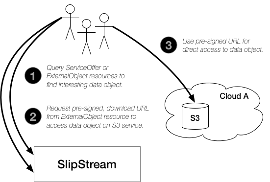

Data Management Model
=====================

The SlipStream multi-cloud object storage provides **Write-Once,
Read-Mostly (WORM) semantics**. That is, a particular object is
created, populated with data, and then remains immutable for the rest
of its lifecycle. This makes strategies for replication and caching
easier to implement.

Model Entities
--------------

The full data management model contains three entities that interact
to provide all the stated benefits:

 - **S3 object storage** on the supported cloud infrastructures,
 - **ExternalObject** resources within SlipStream that provide links
   to the real data objects in the S3 object storage, and
 - **ServiceOffer** resources that optionally provide rich,
   user-defined metadata for an object or set of objects.

For efficiency, all IO operations on a data object occur directly
between the client and the S3 object store containing the object.  In
contrast, the management functions (creating, updating properties, and
deleting) are handled through SlipStream via the standard CIMI CRUD
actions on the data object's ExternalObject and/or ServiceOffer
resource.

Operations
----------

**Accessing a data object** follows the simple, three-step process
shown in the following diagram.

   Data Access Process

The process for **creating data objects** is similarly easy:

 1) Create ExternalObject resource in SlipStream,
 2) Request a pre-signed upload URL,
 3) Upload the data, and
 4) Mark the ExternalObject as "ready".

Here, the explicit state change of the object to "ready" allows the
owner of the object to indicate when the object is ready for
consumption by others.

**Deleting an object** is a single step process that synchonizes the
deletion of the metadata and the actual object within the S3 storage.

Object Metadata
---------------

The metadata for objects is stored in SlipStream, either in
ExternalObject or ServiceOffer resources.

For many, simple use cases, the attributes available on the
ExternalObject resource will be sufficient.  These attributes include
a name, description, simple properties, bucket name, and object name. 

For those use cases that require richer metadata, ServiceOffer
resources can be used together with the ExternalObject resources.  The
open schema of the ServiceOffer resource allows any general or
domain-specific attributes to be associated with the data objects and
the standard CIMI filtering provides rich queries.

Authorization
-------------

Access to objects is controlled through SlipStream ACLs.  Those
users/roles with "modify" access to an object can upload data,
download data, and delete the object.  Those with "view" access can
only download data.  Any authenticated user can create an object.
